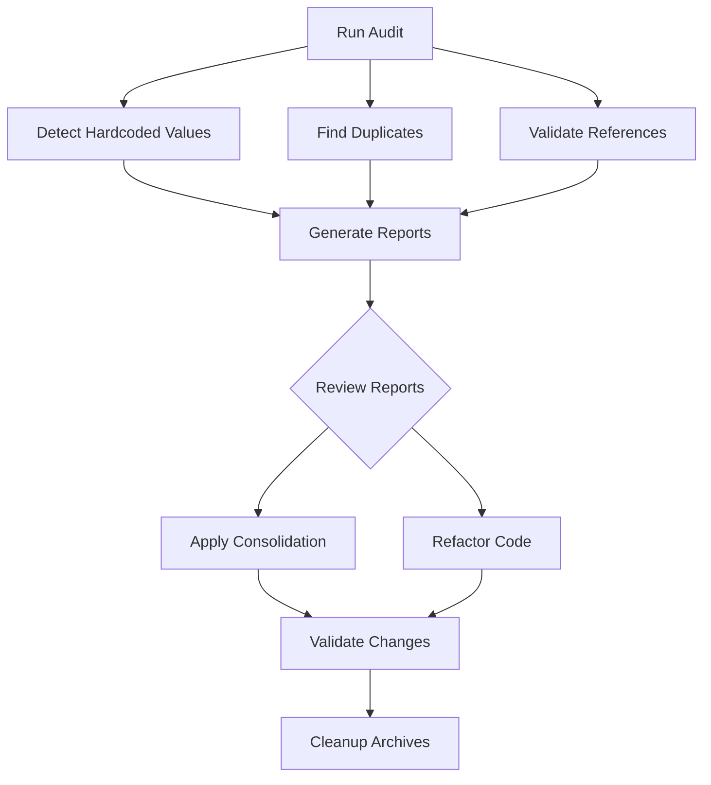

# Configuration Audit System - Index

Complete index of all configuration audit tools, scripts, and documentation.

## 📚 Documentation

### Primary Documentation
- **[CONFIG_AUDIT_README.md](CONFIG_AUDIT_README.md)** - Complete system documentation
- **[CONFIG_AUDIT_QUICKSTART.md](CONFIG_AUDIT_QUICKSTART.md)** - Quick reference guide
- **[CONFIG_AUDIT_INDEX.md](CONFIG_AUDIT_INDEX.md)** - This index

### Related Documentation
- **[CONFIGURATION_MANAGEMENT_IMPLEMENTATION.md](CONFIGURATION_MANAGEMENT_IMPLEMENTATION.md)** - Config management architecture
- **[CALIBRATION_CANONICAL_COHERENCE_ANALYSIS.md](CALIBRATION_CANONICAL_COHERENCE_ANALYSIS.md)** - Calibration methodology
- **[system/config/README.md](system/config/README.md)** - Configuration structure

## 🛠️ Scripts

### Main Scripts

| Script | Purpose | Output |
|--------|---------|--------|
| `scripts/run_config_audit.py` | Master orchestrator - runs complete pipeline | Multiple reports |
| `scripts/audit_calibration_config.py` | AST-based hardcoded value detection | `violations_audit.md` |
| `scripts/consolidate_config.py` | Consolidate configs to canonical structure | `config_consolidation_report.md` |
| `scripts/validate_config_references.py` | Validate code references to config paths | `config_reference_validation.md` |
| `scripts/depurate_config.py` | Automatically fix common issues | `config_depuration_report.md` |

### Usage Examples

```bash
# Full audit pipeline (dry-run)
python scripts/run_config_audit.py --dry-run

# Full audit pipeline (live)
python scripts/run_config_audit.py

# Individual tools
python scripts/audit_calibration_config.py
python scripts/consolidate_config.py --dry-run
python scripts/validate_config_references.py
python scripts/depurate_config.py --apply
```

## 📊 Generated Reports

| Report | Generator | Purpose |
|--------|-----------|---------|
| `violations_audit.md` | `audit_calibration_config.py` | List of hardcoded calibration values |
| `config_consolidation_report.md` | `consolidate_config.py` | File consolidation actions and status |
| `config_reference_validation.md` | `validate_config_references.py` | Code path reference validation |
| `config_audit_summary.md` | `run_config_audit.py` | Unified summary of all audits |
| `config_depuration_report.md` | `depurate_config.py` | Automatic fixes and issues |

## 🏗️ Architecture

### Canonical Configuration Structure

```
system/config/
├── calibration/
│   ├── intrinsic_calibration.json       # PRIMARY: Method calibration scores
│   ├── intrinsic_calibration_rubric.json # Scoring rubric and methodology
│   ├── runtime_layers.json               # Layer maturity baselines
│   └── unit_transforms.json              # Unit transformation rules
├── questionnaire/
│   └── (questionnaire configurations)
└── executor_config.json                  # Executor runtime settings
```

### Archive Structure

```
.archive/legacy_configs_YYYYMMDD/
├── config/
│   └── intrinsic_calibration.json
│       └── intrinsic_calibration.json.metadata.json
└── src/
    └── farfan_pipeline/
        └── core/
            └── calibration/
                └── intrinsic_calibration_rubric.json
                    └── intrinsic_calibration_rubric.json.metadata.json
```

## 🔍 Audit Components

### 1. Hardcoded Value Detection

**Script**: `scripts/audit_calibration_config.py`

**Detection Method**: Python AST parsing

**Patterns Detected**:
- Variable names: `threshold`, `weight`, `score`, `alpha`, `beta`, `prior`, `coefficient`, `factor`, `rate`, `ratio`
- Suspicious float values (0.0 < x < 1.0)
- Suspicious integer values (x > 2)
- Dictionary entries with calibration keys

**Severity Levels**:
- **HIGH**: Critical parameters (thresholds, weights, coefficients)
- **MEDIUM**: Intermediate scores and ratios
- **LOW**: Utility values with limited impact

### 2. Duplicate Configuration Detection

**Script**: `scripts/consolidate_config.py`

**Detection Method**: SHA256 hash comparison

**Identifies**:
- Multiple files with same name
- Files with identical content
- Name collisions with different content

### 3. Reference Validation

**Script**: `scripts/validate_config_references.py`

**Detection Method**: AST + regex pattern matching

**Validates**:
- Legacy path references
- Canonical path usage
- Import statements

### 4. Automatic Depuration

**Script**: `scripts/depurate_config.py`

**Fixes**:
- Legacy path references → canonical paths
- Empty configuration files removal
- JSON formatting normalization
- Validation errors reporting

## 🔄 Workflow

### Standard Audit Workflow



### Phase-by-Phase Approach

#### Phase 1: Audit (Current)
```bash
python scripts/run_config_audit.py --dry-run
```
- Generates all reports
- No changes to files
- Review findings

#### Phase 2: Consolidation
```bash
python scripts/consolidate_config.py
```
- Archives legacy files
- Copies to canonical locations
- Creates metadata

#### Phase 3: Depuration
```bash
python scripts/depurate_config.py --apply
```
- Updates path references
- Normalizes JSON
- Removes empty configs

#### Phase 4: Refactoring
- Manual code updates
- Extract hardcoded values
- Use ConfigManager

#### Phase 5: Validation
```bash
pytest tests/ -v
python scripts/run_config_audit.py --dry-run
```
- Run tests
- Re-audit
- Verify no new violations

#### Phase 6: Cleanup
```bash
rm -rf .archive/legacy_configs_*
```
- Remove archived files after validation period

## 🎯 Quick Reference

### Most Common Tasks

| Task | Command |
|------|---------|
| Full audit | `python scripts/run_config_audit.py --dry-run` |
| Find hardcoded values | `python scripts/audit_calibration_config.py` |
| Fix path references | `python scripts/depurate_config.py --apply` |
| Consolidate configs | `python scripts/consolidate_config.py` |
| Validate references | `python scripts/validate_config_references.py` |

### Most Common Fixes

| Issue | Fix |
|-------|-----|
| Hardcoded threshold | Move to JSON config |
| Legacy path | Update to `system/config/...` |
| Direct file access | Use `ConfigManager` |
| Duplicate config | Use canonical version |

## 📋 Checklists

### Pre-Deployment Checklist

- [ ] Run full audit: `python scripts/run_config_audit.py --dry-run`
- [ ] Review `violations_audit.md`
- [ ] Review `config_consolidation_report.md`
- [ ] Review `config_reference_validation.md`
- [ ] No HIGH severity violations remaining
- [ ] All configs in `system/config/`
- [ ] All code uses canonical paths
- [ ] JSON files validated
- [ ] Integration tests pass

### Post-Refactoring Checklist

- [ ] All hardcoded values extracted
- [ ] ConfigManager used everywhere
- [ ] No legacy path references
- [ ] Tests updated
- [ ] Documentation updated
- [ ] Git committed with clear message
- [ ] Re-run audit confirms clean state

## 🚨 Troubleshooting

### Common Issues

| Issue | Cause | Solution |
|-------|-------|----------|
| SyntaxError during audit | Invalid Python syntax | Fix syntax errors first |
| Duplicate with different content | Configurations diverged | Review both, choose canonical |
| Config not loading | Legacy path reference | Update to canonical path |
| JSON validation fails | Invalid JSON syntax | Fix JSON or regenerate |

### Debug Commands

```bash
# Check for remaining hardcoded values
grep -r "THRESHOLD\|WEIGHT\|SCORE" src/ --include="*.py" | grep "= [0-9]"

# Verify config loading
python -c "from system.config.config_manager import ConfigManager; print(ConfigManager().list_configs())"

# Check for legacy paths
grep -r "config/intrinsic_calibration" src/ --include="*.py"

# Validate JSON syntax
python -m json.tool system/config/calibration/intrinsic_calibration.json
```

## 📈 Metrics

Track these metrics over time:

- Number of hardcoded calibration values
- Number of HIGH severity violations
- Number of duplicate config files
- Number of legacy path references
- JSON validation pass rate

## 🔗 Integration

### CI/CD Integration

Add to `.github/workflows/`:

```yaml
- name: Configuration Audit
  run: |
    python scripts/run_config_audit.py --dry-run
    if [ -f violations_audit.md ]; then
      grep -c "HIGH" violations_audit.md || exit 0
      echo "HIGH severity violations found"
      exit 1
    fi
```

### Pre-commit Hook

Add to `.git/hooks/pre-commit`:

```bash
#!/bin/bash
python scripts/validate_config_references.py
if grep -q "LEGACY" config_reference_validation.md; then
    echo "Legacy config references found. Please update."
    exit 1
fi
```

## 📞 Support

### Getting Help

1. Read documentation in order:
   - `CONFIG_AUDIT_QUICKSTART.md` (5 min)
   - `CONFIG_AUDIT_README.md` (20 min)
   - `CONFIGURATION_MANAGEMENT_IMPLEMENTATION.md` (as needed)

2. Run audit and review reports

3. Check troubleshooting section

4. Review existing issues/PRs

5. Create new issue with:
   - Audit reports attached
   - Steps to reproduce
   - Expected vs actual behavior

### Useful Links

- Configuration Manager: `system/config/config_manager.py`
- Example Usage: `system/config/example_usage.py`
- Calibration Loader: `src/farfan_pipeline/core/calibration/intrinsic_calibration_loader.py`

## 🔐 Security

### Best Practices

- Never commit secrets or keys to configuration files
- Use environment variables for sensitive data
- Validate all configuration inputs
- Sanitize user-provided configuration values
- Regular audit schedule (monthly recommended)

## 📅 Maintenance

### Regular Tasks

- **Weekly**: Monitor for new hardcoded values in PRs
- **Monthly**: Run full audit and review reports
- **Quarterly**: Clean up archived files (after validation)
- **Annually**: Review canonical structure and update docs

### Version Control

- Tag configuration versions: `git tag config-v2.1.0`
- Document breaking changes in CHANGELOG
- Maintain backward compatibility when possible

## 🎓 Learning Resources

### Examples

- Configuration loading: `system/config/example_usage.py`
- AST parsing: `scripts/audit_calibration_config.py`
- Path handling: `scripts/consolidate_config.py`

### Testing

- Unit tests: `tests/test_config_manager.py`
- Integration tests: `tests/integration/test_config_loading.py`

---

Last Updated: 2025-01-03
Version: 1.0.0
