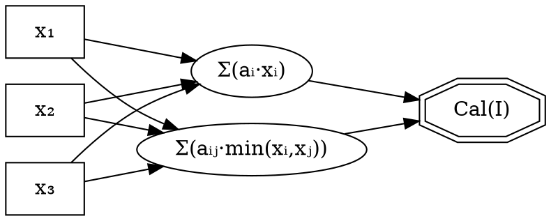

# Phase 4-7: Aggregation Pipeline

## Document Control

| Attribute | Value |
|-----------|-------|
| **Phase ID** | `PHASE-4-7-AGGREGATION-PIPELINE` |
| **Canonical Name** | `phase_4_7_aggregation_pipeline` |
| **Acronym** | AP (Aggregation Pipeline) |
| **Status** | `CANONICAL` |
| **Version** | `2025-12-18` |
| **Pipeline Position** | Phase 3 (Scoring) → **Phase 4-7** → Final Output |

---

## 1. Phase Mission

The **Aggregation Pipeline** transforms **300 scored micro-questions from Phase 3** into a **single holistic MacroScore** through four sequential aggregation stages:

| Logical Phase | Responsibility | Input | Output | Invariant |
|---------------|----------------|-------|--------|-----------|
| **Phase 4** | Dimension Aggregation | 300 ScoredMicroQuestion | 60 DimensionScore (6 dims × 10 PAs) | `len(output) == 60` |
| **Phase 5** | Policy Area Aggregation | 60 DimensionScore | 10 AreaScore | `len(output) == 10` |
| **Phase 6** | Cluster Aggregation (MESO) | 10 AreaScore | 4 ClusterScore | `len(output) == 4` |
| **Phase 7** | Macro Evaluation | 4 ClusterScore | 1 MacroScore | `output is not None` |

---

## 2. Data Flow Architecture

```
┌─────────────────────────────────────────────────────────────────────────────────────────┐
│                    AGGREGATION PIPELINE DATA FLOW                                        │
├─────────────────────────────────────────────────────────────────────────────────────────┤
│                                                                                          │
│  Phase 3 Output                                                                          │
│  ══════════════                                                                          │
│  300 × ScoredMicroQuestion                                                               │
│       │                                                                                  │
│       │ PHASE 4: Dimension Aggregation                                                   │
│       │ ═══════════════════════════════                                                  │
│       │ Group by (policy_area, dimension)                                                │
│       │ Apply dimension weights from signal registry                                     │
│       │ Compute weighted average + uncertainty                                           │
│       ▼                                                                                  │
│  60 × DimensionScore (6 dimensions × 10 policy areas)                                    │
│       │                                                                                  │
│       │ PHASE 5: Policy Area Aggregation                                                 │
│       │ ═════════════════════════════════                                                │
│       │ Group by policy_area                                                             │
│       │ Validate hermeticity (all 6 dimensions present)                                  │
│       │ Apply area-dimension weights                                                     │
│       ▼                                                                                  │
│  10 × AreaScore (PA01–PA10)                                                              │
│       │                                                                                  │
│       │ PHASE 6: Cluster Aggregation (MESO)                                              │
│       │ ═══════════════════════════════════                                              │
│       │ Group by cluster (4 clusters)                                                    │
│       │ Apply adaptive penalty based on dispersion                                       │
│       │ Compute coherence metrics                                                        │
│       ▼                                                                                  │
│  4 × ClusterScore                                                                        │
│       │                                                                                  │
│       │ PHASE 7: Macro Evaluation                                                        │
│       │ ═════════════════════════════                                                    │
│       │ Aggregate all clusters                                                           │
│       │ Compute cross-cutting coherence                                                  │
│       │ Identify systemic gaps                                                           │
│       │ Assess strategic alignment                                                       │
│       ▼                                                                                  │
│  1 × MacroScore (holistic evaluation)                                                    │
│                                                                                          │
└─────────────────────────────────────────────────────────────────────────────────────────┘
```

---

## 3. Constitutional Invariants

| Invariant ID | Specification | Source | Enforcement |
|--------------|---------------|--------|-------------|
| **INV-P4-60** | Phase 4 produces exactly 60 DimensionScores | `aggregation.py::DimensionAggregator.run()` | `validate_phase4_output()` |
| **INV-P5-10** | Phase 5 produces exactly 10 AreaScores | `aggregation.py::AreaPolicyAggregator.run()` | `validate_phase5_output()` |
| **INV-P6-4** | Phase 6 produces exactly 4 ClusterScores | `aggregation.py::ClusterAggregator.run()` | `validate_phase6_output()` |
| **INV-P7-1** | Phase 7 produces exactly 1 MacroScore | `aggregation.py::MacroAggregator.evaluate_macro()` | `validate_phase7_output()` |
| **INV-P4-7-BOUNDS** | All scores ∈ [0.0, 3.0] (3-point scale) | `aggregation.py::AggregationSettings` | Score validation |
| **INV-P4-7-HERMETIC** | Each aggregation level is hermetic (all expected inputs present) | `aggregation_enhancements.py::HermeticityDiagnosis` | Hermeticity validation |
| **INV-P4-7-PROVENANCE** | Every aggregation operation creates provenance node | `aggregation_provenance.py::AggregationDAG` | DAG construction |
| **INV-P4-7-CHOQUET** | Choquet aggregation satisfies boundedness: 0 ≤ Cal(I) ≤ 1 | `choquet_aggregator.py::ChoquetAggregator` | `_validate_boundedness()` |

---

## 4. File Inventory

| File | Purpose | Module Type | Criticality |
|------|---------|-------------|-------------|
| `__init__.py` | Package façade with comprehensive exports | CORE | REQUIRED |
| `aggregation.py` | Core aggregators + dataclasses (98KB) | CORE | **CRITICAL** |
| `choquet_aggregator.py` | Choquet integral implementation | CORE | **CRITICAL** |
| `aggregation_enhancements.py` | Enhanced aggregators with CI, dispersion, hermeticity | ENHANCEMENT | HIGH |
| `aggregation_validation.py` | Phase-specific validation functions | VALIDATION | HIGH |
| `aggregation_provenance.py` | DAG-based provenance tracking, Shapley attribution | PROVENANCE | HIGH |
| `signal_enriched_aggregation.py` | SISAS-aware weight adjustment | SIGNAL | HIGH |
| `adaptive_meso_scoring.py` | Adaptive penalty computation for Phase 6 | ENHANCEMENT | STANDARD |

---

## 5. Orchestrator Execution Transcript

### Entry Point

```
orchestrator._aggregate_results_async(scored_results: list[ScoredMicroQuestion])
```

The orchestrator receives **300 ScoredMicroQuestion** objects from Phase 3 and invokes the aggregation pipeline through `aggregation_integration.py`.

---

### STEP 1: Load Aggregation Settings

```python
settings = AggregationSettings.from_signal_registry(
    signal_registry=self.signal_registry
)

# IF signal_registry is None:
settings = AggregationSettings.from_monolith(
    self.questionnaire_monolith
)

# LOG: "Aggregation settings loaded, source={settings.sisas_source}"
```

**Signal Sources:**
- `sisas_registry` — Signal-driven weights from SISAS registry (preferred)
- `legacy_monolith` — Weights from questionnaire monolith (fallback)

---

### STEP 2: Initialize Aggregators

```python
dimension_aggregator = DimensionAggregator(
    settings=settings,
    signal_registry=self.signal_registry,
    enable_sota_features=True,  # Choquet, UQ, provenance
)

area_aggregator = AreaPolicyAggregator(
    settings=settings,
    signal_registry=self.signal_registry,
)

cluster_aggregator = ClusterAggregator(
    settings=settings,
    signal_registry=self.signal_registry,
)

macro_aggregator = MacroAggregator(settings=settings)
```

---

### STEP 3: Phase 4 — Dimension Aggregation

```python
dimension_scores = await aggregate_dimensions_async(
    scored_results=scored_results,
    aggregator=dimension_aggregator
)
```

**Internal Process:**
1. Convert `ScoredMicroQuestion` → `ScoredResult` (internal format)
2. Group by `(policy_area, dimension)` → 60 groups
3. For each group:
   - Resolve weights from settings
   - Calculate weighted average (or Choquet if SOTA enabled)
   - Compute uncertainty (std, CI)
   - Create `DimensionScore`
   - Add to provenance DAG

**Validation:**
```python
result = validate_phase4_output(dimension_scores, expected_count=60)
if not result.passed:
    raise AggregationValidationError(result.error_message)
```

**Invariant:** `len(dimension_scores) == 60`

---

### STEP 4: Phase 5 — Policy Area Aggregation

```python
area_scores = await aggregate_policy_areas_async(
    dimension_scores=dimension_scores,
    aggregator=area_aggregator
)
```

**Internal Process:**
1. Group by `policy_area` → 10 groups
2. For each group:
   - Validate hermeticity (all 6 dimensions present)
   - If NOT hermetic: `diagnosis = diagnose_hermeticity(...)`
   - Resolve area-dimension weights
   - Calculate weighted average
   - Create `AreaScore`
   - Add to provenance DAG with edges

**Validation:**
```python
result = validate_phase5_output(area_scores, expected_count=10)
if not result.passed:
    raise AggregationValidationError(result.error_message)
```

**Invariant:** `len(area_scores) == 10`

---

### STEP 5: Phase 6 — Cluster Aggregation (MESO)

```python
cluster_scores = aggregate_clusters(
    area_scores=area_scores,
    aggregator=cluster_aggregator
)
```

**Internal Process:**
1. Group by `cluster_id` → 4 groups
2. For each group:
   - Validate cluster hermeticity
   - Compute dispersion metrics (CV, DI, quartiles)
   - Classify scenario: `convergence | moderate | high | extreme`
   - Compute adaptive penalty factor
   - Apply cluster weights
   - Calculate weighted average WITH penalty
   - Analyze coherence
   - Identify weakest area
   - Create `ClusterScore`

**Adaptive Penalty Formula:**
```
penalty_factor = 1.0 - (normalized_std × PENALTY_WEIGHT)
adjusted_score = weighted_score × penalty_factor
```

**Validation:**
```python
result = validate_phase6_output(cluster_scores, expected_count=4)
if not result.passed:
    raise AggregationValidationError(result.error_message)
```

**Invariant:** `len(cluster_scores) == 4`

---

### STEP 6: Phase 7 — Macro Evaluation

```python
macro_score = evaluate_macro(
    cluster_scores=cluster_scores,
    aggregator=macro_aggregator
)
```

**Internal Process:**
1. Calculate macro score from cluster scores
2. Calculate cross-cutting coherence
3. Identify systemic gaps (areas with `INSUFICIENTE`)
4. Assess strategic alignment
5. Apply rubric thresholds for quality level
6. Create `MacroScore`

**Validation:**
```python
result = validate_phase7_output(macro_score)
if not result.passed:
    raise AggregationValidationError(result.error_message)
```

**Invariant:** `macro_score is not None`

---

### STEP 7: Full Pipeline Validation

```python
final_validation = validate_with_contracts(
    dimension_scores=dimension_scores,
    area_scores=area_scores,
    cluster_scores=cluster_scores,
    macro_score=macro_score
)

if not final_validation.passed:
    raise AggregationValidationError(final_validation.error_message)

# LOG: "Full aggregation pipeline validation: PASSED"
```

---

### STEP 8: Convert to Output Format

```python
evaluation_dict = macro_score_to_evaluation(macro_score)
```

**Output Format:**
```python
{
    "score": float,                         # [0.0, 3.0]
    "quality_level": str,                   # "EXCELENTE" | "BUENO" | "ACEPTABLE" | "INSUFICIENTE"
    "cross_cutting_coherence": float,       # [0.0, 1.0]
    "systemic_gaps": list[str],             # Identified gaps
    "strategic_alignment": float,           # [0.0, 1.0]
    "cluster_scores": [...],                # 4 cluster details
    "validation_passed": bool,
    "validation_details": {...}
}
```

---

## 6. Design by Contract

### 6.1 Philosophy

Phase 4-7 aggregation operates under **strict contract enforcement** (Design by Contract, Dura Lex Sed Lex):

1. **Preconditions:** Conditions that MUST hold before a method executes
2. **Postconditions:** Guarantees provided after successful execution
3. **Invariants:** Properties that MUST hold at all times
4. **Failure Modes:** Explicit exceptions for contract violations

### 6.2 Aggregator Contracts

#### DimensionAggregator

**Preconditions:**
- `len(scored_results) == 300` (or multiple of 60 for partial runs)
- `∀ sr: sr.score ∈ [0.0, 1.0]` (normalized Phase 3 output)
- `∀ sr: sr.policy_area, sr.dimension are valid identifiers`

**Postconditions:**
- `len(dimension_scores) == 60` (6 dimensions × 10 policy areas)
- `∀ ds: ds.score ∈ [0.0, 3.0]` (3-point scale)
- `∀ ds: len(ds.contributing_questions) > 0` (traceability)

**Invariants:**
- Weights sum to 1.0 (normalization)
- Provenance node created for each dimension score

**Failure Modes:**
- `AggregationValidationError`: Output count ≠ 60
- `ValueError`: Invalid score range
- `KeyError`: Missing dimension/policy area configuration

#### AreaPolicyAggregator

**Preconditions:**
- `len(dimension_scores) == 60`
- `∀ ds: ds.score ∈ [0.0, 3.0]`

**Postconditions:**
- `len(area_scores) == 10`
- `∀ as: as.score ∈ [0.0, 3.0]`
- `∀ as: as.is_hermetic == True` (all 6 dimensions present)

**Invariants:**
- Each area has exactly 6 dimension scores
- Hermeticity validated

**Failure Modes:**
- `AggregationValidationError`: Output count ≠ 10
- `HermeticityViolation`: Missing dimensions for area

#### ClusterAggregator

**Preconditions:**
- `len(area_scores) == 10`
- `∀ as: as.score ∈ [0.0, 3.0]`

**Postconditions:**
- `len(cluster_scores) == 4`
- `∀ cs: cs.score ∈ [0.0, 3.0]`
- `∀ cs: cs.dispersion_metrics computed`

**Invariants:**
- Adaptive penalty applied based on dispersion
- Coherence metrics computed

**Failure Modes:**
- `AggregationValidationError`: Output count ≠ 4
- `DispersionComputationError`: Invalid dispersion metrics

#### MacroAggregator

**Preconditions:**
- `len(cluster_scores) == 4`
- `∀ cs: cs.score ∈ [0.0, 3.0]`

**Postconditions:**
- `macro_score is not None`
- `macro_score.score ∈ [0.0, 3.0]`
- `macro_score.systemic_gaps identified`

**Invariants:**
- Cross-cutting coherence computed
- Strategic alignment assessed

**Failure Modes:**
- `AggregationValidationError`: Null macro score
- `ValueError`: Invalid score range

#### ChoquetAggregator

**Preconditions:**
- `inputs ∈ [0.0, 1.0]ⁿ` (normalized)
- `Σ(linear_weights) == 1.0`
- `Σ|interaction_terms| ≤ 0.5 × Σ(linear_weights)`

**Postconditions:**
- `result ∈ [min(inputs), max(inputs)]` (boundedness)
- `breakdown.sum() == result` (consistency)

**Invariants:**
- Monotonicity: increasing inputs → non-decreasing output
- Idempotence: all equal inputs → output equals input

**Failure Modes:**
- `CalibrationConfigError`: Invalid weight configuration
- `ValueError`: Input out of bounds

### 6.3 Exception Taxonomy

```
AggregationError (base)
├── AggregationValidationError
│   ├── CountMismatchError
│   ├── BoundsViolationError
│   └── TraceabilityError
├── HermeticityViolation
├── DispersionComputationError
├── CalibrationConfigError
└── ProvenanceConstructionError
```

### 6.4 Verification Strategy

**Unit Tests:** Verify individual aggregator contracts
**Integration Tests:** Verify phase sequencing and composition
**Property Tests:** Verify mathematical invariants (boundedness, monotonicity)
**Contract Tests:** Verify precondition/postcondition enforcement

**Test Coverage:**
- `tests/phase_4_7/test_orchestrator_integration.py` → Sequencing
- `tests/phase_4_7/test_counts_and_bounds.py` → Count contracts
- `tests/phase_4_7/test_choquet_properties.py` → Mathematical properties
- `tests/phase_4_7/test_signal_wiring.py` → Signal integration contracts
- `tests/phase_4_7/test_provenance_dag.py` → Provenance contracts

---

## 7. Contract Signatures

### 7.1 Entry Contract (Phase 3 → Phase 4)

**Contract ID:** `CONTRACT-P4-7-ENTRY`

| Precondition | Specification | Enforcement |
|--------------|---------------|-------------|
| PRE-P4-01 | `len(scored_results) == 300` | Count check |
| PRE-P4-02 | `∀ sr: sr.score ∈ [0.0, 1.0]` | Bounds check |
| PRE-P4-03 | `∀ sr: sr.quality_level ∈ VALID_QUALITY_LEVELS` | Enum check |
| PRE-P4-04 | Signal registry available (optional) | DI check |

### 7.2 Exit Contract (Phase 7 → Output)

**Contract ID:** `CONTRACT-P4-7-EXIT`

| Postcondition | Specification | Enforcement |
|---------------|---------------|-------------|
| POST-P4-01 | `len(dimension_scores) == 60` | `validate_phase4_output()` |
| POST-P4-02 | `len(area_scores) == 10` | `validate_phase5_output()` |
| POST-P4-03 | `len(cluster_scores) == 4` | `validate_phase6_output()` |
| POST-P4-04 | `macro_score is not None` | `validate_phase7_output()` |
| POST-P4-05 | `macro_score.score ∈ [0.0, 3.0]` | Bounds check |
| POST-P4-06 | `∀ cs: cs.coherence ∈ [0.0, 1.0]` | Coherence validation |

---

## 8. Signal Wiring

### 7.1 Signal Flow

```
QuestionnaireSignalRegistry (SISAS)
        │
        │ get_assembly_signals("meso")
        ▼
AggregationSettings.from_signal_registry()
        │
        │ Constructor DI
        ▼
SignalEnrichedAggregator
        │
        │ adjust_aggregation_weights()
        │ analyze_score_dispersion()
        │ select_aggregation_method()
        ▼
Core Aggregators (signal-adjusted weights)
```

### 7.2 Signal Consumption Points

| Module | Signal Source | Consumption Function |
|--------|---------------|---------------------|
| `aggregation.py` | `AggregationSettings` | `_resolve_dimension_weights()` |
| `aggregation.py` | `signal_registry` | `from_signal_registry()` |
| `signal_enriched_aggregation.py` | `QuestionnaireSignalRegistry` | `adjust_aggregation_weights()` |
| `signal_enriched_aggregation.py` | `SignalPack.patterns` | Pattern count check |

---

## 9. Provenance Tracking

### 9.1 DAG Structure

```
LEVEL: micro              LEVEL: dimension         LEVEL: area    LEVEL: cluster   LEVEL: macro
───────────              ────────────────         ───────────    ──────────────   ────────────

┌─────────┐              ┌──────────────┐         ┌────────┐     ┌─────────────┐  ┌───────────┐
│ Q001    │──────────────│ DIM01-PA01   │─────────│ PA01   │─────│ CLUSTER_1   │──│ MACRO     │
│ Q002    │              │              │         │        │     │             │  │           │
│ Q003    │              └──────────────┘         └────────┘     └─────────────┘  │ score     │
│ ...     │                                                                       │ coherence │
└─────────┘                                                                       │ gaps      │
(300)                    (60)                     (10)           (4)              └───────────┘
                                                                                  (1)
```

### 9.2 Attribution

Shapley values computed for feature attribution:
```python
shapley = dag.compute_shapley_attribution("MACRO")
critical_path = dag.get_critical_path("MACRO", top_k=5)
```

---

## 10. Quality Rubric

| Quality Level | Normalized Score Range | Description |
|---------------|------------------------|-------------|
| **EXCELENTE** | ≥ 0.85 | Outstanding policy compliance |
| **BUENO** | ≥ 0.70 | Good compliance with minor gaps |
| **ACEPTABLE** | ≥ 0.55 | Acceptable with improvement areas |
| **INSUFICIENTE** | < 0.55 | Insufficient, requires intervention |

---

## 10. Mathematical Foundations: Choquet Integral

### 10.1 Definition

The **Choquet integral** is a generalization of the weighted average that accounts for interaction between criteria. For normalized inputs x₁, ..., xₙ ∈ [0,1]:

```
Cal(I) = Σᵢ₌₁ⁿ (aᵢ · xᵢ) + Σᵢ<ⱼ (aᵢⱼ · min(xᵢ, xⱼ))
```

Where:
- **xᵢ**: Normalized score for criterion i ∈ [0,1]
- **aᵢ**: Linear weight for criterion i
- **aᵢⱼ**: Interaction weight for criteria pair (i,j)
- **Cal(I)**: Choquet-aggregated score ∈ [0,1]

### 10.2 Formal Properties

**Theorem 1 (Boundedness):** For inputs xᵢ ∈ [0,1] and properly normalized weights, the Choquet integral satisfies:

```
min(x₁, ..., xₙ) ≤ Cal(I) ≤ max(x₁, ..., xₙ)
```

**Proof sketch:** The Choquet integral is bounded by the minimum and maximum input values because it is a convex combination when weights are properly normalized.

**Theorem 2 (Monotonicity):** If xᵢ ≤ yᵢ for all i, then Cal(x) ≤ Cal(y).

**Theorem 3 (Idempotence):** If x₁ = x₂ = ... = xₙ = c, then Cal(I) = c.

### 10.3 Normalization Constraints

To guarantee boundedness:

1. **Linear weights normalized:** Σᵢ aᵢ = 1.0
2. **Interaction constraint:** Σᵢ<ⱼ |aᵢⱼ| ≤ 0.5 × Σᵢ aᵢ
3. **Final clamping:** Cal(I) ∈ [0, 1]

**Enforcement:**
```python
# In ChoquetAggregator.__post_init__
if not abs(sum(self.linear_weights.values()) - 1.0) < 1e-6:
    raise CalibrationConfigError("Linear weights must sum to 1.0")

if sum(abs(v) for v in self.interaction_terms.values()) > 0.5:
    raise CalibrationConfigError("Interaction terms exceed bound")
```

### 10.4 Interaction Interpretation

- **aᵢⱼ > 0**: Positive synergy (criteria reinforce each other)
- **aᵢⱼ < 0**: Negative interaction (criteria substitute)
- **aᵢⱼ = 0**: Independence (reduces to weighted average)

### 10.5 Comparison to Weighted Average

For the special case where all aᵢⱼ = 0:

```
Cal(I) = Σᵢ (aᵢ · xᵢ)  [reduces to weighted average]
```

The Choquet integral generalizes this by adding interaction terms.

### 10.6 Implementation

**Code Location:** `src/canonic_phases/phase_4_7_aggregation_pipeline/choquet_aggregator.py`

**Key Methods:**
- `ChoquetAggregator.calibrate()`: Computes Choquet integral
- `_validate_boundedness()`: Enforces mathematical properties
- `CalibrationResult.breakdown`: Decomposes result into components

**Configuration:**
```python
config = ChoquetConfig(
    interaction_terms={
        ('DIM01', 'DIM02'): 0.15,  # Positive synergy
        ('DIM03', 'DIM04'): -0.10,  # Substitution
    },
    normalization=True  # Enforce normalization
)
```

### 10.7 Academic References

1. Choquet, G. (1954). "Theory of capacities". *Annales de l'institut Fourier*, 5, 131-295.
2. Grabisch, M. (1997). "k-order additive discrete fuzzy measures and their representation". *Fuzzy Sets and Systems*, 92(2), 167-189.
3. Marichal, J.-L. (2000). "An axiomatic approach of the discrete Choquet integral as a tool to aggregate interacting criteria". *IEEE Transactions on Fuzzy Systems*, 8(6), 800-807.

### 10.8 Graphviz Visualization

Choquet aggregation structure can be visualized using Graphviz:



Render with: `dot -Tpng choquet.dot -o choquet.png`

### 10.9 Example Calculation

Given:
- x₁ = 0.7, x₂ = 0.8, x₃ = 0.6
- a₁ = 0.4, a₂ = 0.3, a₃ = 0.3
- a₁₂ = 0.1, a₁₃ = 0.0, a₂₃ = -0.05

Calculation:
```
Linear: 0.4(0.7) + 0.3(0.8) + 0.3(0.6) = 0.28 + 0.24 + 0.18 = 0.70
Interactions: 0.1·min(0.7,0.8) + 0.0·min(0.7,0.6) + (-0.05)·min(0.8,0.6)
            = 0.1(0.7) + 0.0 + (-0.05)(0.6)
            = 0.07 + 0.0 - 0.03 = 0.04
Cal(I) = 0.70 + 0.04 = 0.74
```

Result: 0.74 ∈ [min(0.6), max(0.8)] = [0.6, 0.8] ✓

---

## 12. Compliance Certificates

All requirements are documented and verified through 15 compliance certificates:

| Certificate | Requirement | Status |
|-------------|-------------|--------|
| [CERTIFICATE_01](contracts/certificates/CERTIFICATE_01_PHASE4_COUNT_60.md) | Phase 4 Count = 60 | ✅ ACTIVE |
| [CERTIFICATE_02](contracts/certificates/CERTIFICATE_02_PHASE5_COUNT_10.md) | Phase 5 Count = 10 | ✅ ACTIVE |
| [CERTIFICATE_03](contracts/certificates/CERTIFICATE_03_PHASE6_COUNT_4.md) | Phase 6 Count = 4 | ✅ ACTIVE |
| [CERTIFICATE_04](contracts/certificates/CERTIFICATE_04_PHASE7_COUNT_1.md) | Phase 7 Count = 1 | ✅ ACTIVE |
| [CERTIFICATE_05](contracts/certificates/CERTIFICATE_05_SCORE_BOUNDS.md) | Score Bounds [0.0, 3.0] | ✅ ACTIVE |
| [CERTIFICATE_06](contracts/certificates/CERTIFICATE_06_HERMETICITY.md) | Hermeticity Validation | ✅ ACTIVE |
| [CERTIFICATE_07](contracts/certificates/CERTIFICATE_07_PROVENANCE_DAG.md) | Provenance DAG Generation | ✅ ACTIVE |
| [CERTIFICATE_08](contracts/certificates/CERTIFICATE_08_CHOQUET_BOUNDEDNESS.md) | Choquet Boundedness | ✅ ACTIVE |
| [CERTIFICATE_09](contracts/certificates/CERTIFICATE_09_SIGNAL_INTEGRATION.md) | Signal Integration | ✅ ACTIVE |
| [CERTIFICATE_10](contracts/certificates/CERTIFICATE_10_VALIDATION_HOOKS.md) | Validation Hooks Execution | ✅ ACTIVE |
| [CERTIFICATE_11](contracts/certificates/CERTIFICATE_11_ADAPTIVE_PENALTY.md) | Adaptive Penalty Application | ✅ ACTIVE |
| [CERTIFICATE_12](contracts/certificates/CERTIFICATE_12_DISPERSION_ANALYSIS.md) | Dispersion Analysis | ✅ ACTIVE |
| [CERTIFICATE_13](contracts/certificates/CERTIFICATE_13_UNCERTAINTY_QUANTIFICATION.md) | Uncertainty Quantification | ✅ ACTIVE |
| [CERTIFICATE_14](contracts/certificates/CERTIFICATE_14_DAG_EXPORT.md) | DAG Export (GraphML/PROV-JSON) | ✅ ACTIVE |
| [CERTIFICATE_15](contracts/certificates/CERTIFICATE_15_ORCHESTRATOR_TRANSCRIPT.md) | Orchestrator Transcript Compliance | ✅ ACTIVE |

**Certification Authority:** F.A.R.F.A.N Canonical Phases  
**Next Review:** 2026-06-18

---

## 13. Related Documents

- [PHASE_4_7_RIA_2025-12-18.txt](./PHASE_4_7_RIA_2025-12-18.txt) — Repository Inventory Artifact
- [FORCING_ROUTE.md](./FORCING_ROUTE.md) — Execution constraints
- [../../../docs/choquet_examples/](../../../docs/choquet_examples/) — Choquet integral examples

---

## 14. Changelog

| Date | Version | Change |
|------|---------|--------|
| 2025-12-18 | 1.0.0 | Initial canonical documentation |
