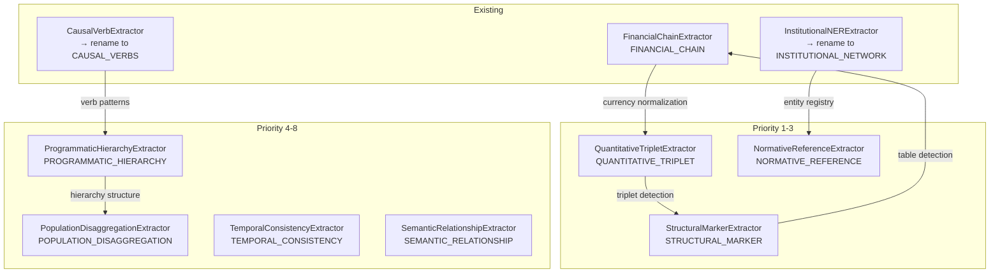

# SISAS Irrigation System Completion Plan

**Version:** 1.0.0  
**Date:** 2026-01-07  
**Author:** F.A.R.F.A.N Chief Architect  

---

## Executive Summary

This document provides a complete architectural diagnosis and remediation plan for the Signal-based Information System for Analytical Scoring (SISAS). The analysis identifies three critical "missing links" that prevent end-to-end deterministic signal flow:

| Missing Link | Epistemic Gap | Architectural Impediment | Remediation Status |
|--------------|---------------|--------------------------|-------------------|
| **Signal Production** | 7 of 10 extractors missing | Only 3 extractors implemented | Priority 1 |
| **Routing Infrastructure** | Router exists but unused | Zero imports of SignalQuestionIndex in pipeline | Priority 2 |
| **Consumer Instrumentation** | No signal consumption logging | Phase 2/3 don't consume routed signals | Priority 3 |

---

## 1. CURRENT STATE ASSESSMENT

### 1.1 Signal Production Layer (Phase 0: Extractors)

**Implementation Status:**

| Signal Type | Extractor Status | Signal Type Key (actual → expected) | Empirical Availability |
|-------------|-----------------|-------------------------------------|------------------------|
| FINANCIAL_CHAIN | ✅ Implemented | ✅ Matches | 0.92 (D1-Q3) |
| CAUSAL_LINK/CAUSAL_VERBS | ⚠️ Name mismatch | CAUSAL_LINK → CAUSAL_VERBS | 0.74 (D2-Q3) |
| INSTITUTIONAL_ENTITY/NETWORK | ⚠️ Name mismatch | INSTITUTIONAL_ENTITY → INSTITUTIONAL_NETWORK | 0.71 (D1-Q4) |
| QUANTITATIVE_TRIPLET | ❌ Missing | N/A | 0.78-0.94 (highest) |
| NORMATIVE_REFERENCE | ❌ Missing | N/A | 0.89-0.96 |
| STRUCTURAL_MARKER | ❌ Missing | N/A | 0.82-0.92 |
| PROGRAMMATIC_HIERARCHY | ❌ Missing | N/A | 0.59-0.82 |
| POPULATION_DISAGGREGATION | ❌ Missing | N/A | 0.65-1.0 |
| TEMPORAL_CONSISTENCY | ❌ Missing | N/A | 0.45-0.86 |
| SEMANTIC_RELATIONSHIP | ❌ Missing | N/A | 0.24-0.74 |

### 1.2 Routing Infrastructure (Phase 1: Signal Router)

**Current Files:**
- `canonic_questionnaire_central/_registry/questions/signal_router.py` - SignalQuestionIndex exists ✅
- `canonic_questionnaire_central/_registry/questions/integration_map.json` - 30 slot mappings ✅
- `canonic_questionnaire_central/__init__.py` - CQCLoader with route_signal() ✅

**Critical Gap:** Zero imports of SignalQuestionIndex or CQCLoader in `src/farfan_pipeline/`

```bash
$ grep -r "signal_router\|SignalQuestionIndex\|CQCLoader" src/farfan_pipeline/
# No matches found
```

### 1.3 Consumer Instrumentation (Phase 2 & 3)

**Phase 2 (Evidence Nexus):**
- File: `src/farfan_pipeline/phases/Phase_two/phase2_80_00_evidence_nexus.py`
- Status: Does not consume routed signals; uses internal EvidenceType enum

**Phase 3 (Scoring):**
- File: `src/farfan_pipeline/phases/Phase_three/phase3_signal_enriched_scoring.py`
- Status: References `signal_registry.get_micro_answering_signals()` but CQCLoader not integrated

---

## 2. EXTRACTOR GAP ANALYSIS & PRIORITIZATION (Prompt 1.1.1)

### 2.1 Multi-Criteria Decision Matrix

| Signal Type | Emp. Avail. (avg) | Primary Slots (×2) | Secondary Slots (×1) | Weighted Score | Complexity | **Priority** |
|-------------|-------------------|-------------------|---------------------|----------------|------------|--------------|
| QUANTITATIVE_TRIPLET | 0.85 | 8 (16) | 2 (2) | 18 × 0.85 = 15.3 | MEDIUM | **1** |
| NORMATIVE_REFERENCE | 0.91 | 3 (6) | 3 (3) | 9 × 0.91 = 8.2 | MEDIUM | **2** |
| STRUCTURAL_MARKER | 0.87 | 4 (8) | 6 (6) | 14 × 0.87 = 12.2 | LOW | **3** |
| PROGRAMMATIC_HIERARCHY | 0.70 | 5 (10) | 8 (8) | 18 × 0.70 = 12.6 | MEDIUM | 4 |
| CAUSAL_VERBS | 0.53 | 6 (12) | 3 (3) | 15 × 0.53 = 8.0 | MEDIUM | 5 |
| POPULATION_DISAGGREGATION | 0.77 | 2 (4) | 2 (2) | 6 × 0.77 = 4.6 | LOW | 6 |
| TEMPORAL_CONSISTENCY | 0.72 | 3 (6) | 2 (2) | 8 × 0.72 = 5.8 | LOW | 7 |
| SEMANTIC_RELATIONSHIP | 0.48 | 8 (16) | 4 (4) | 20 × 0.48 = 9.6 | HIGH | 8 |
| INSTITUTIONAL_NETWORK | 0.65 | 3 (6) | 4 (4) | 10 × 0.65 = 6.5 | LOW | ✅ (fix name) |

### 2.2 Dependency Graph (Mermaid)



---

## 3. TOP-3 EXTRACTOR SPECIFICATIONS (Prompt 1.1.2)

### 3.1 QuantitativeTripletExtractor

```json
{
  "extractor_class": "QuantitativeTripletExtractor",
  "signal_type": "QUANTITATIVE_TRIPLET",
  "description": "Extracts baseline-year-source triplets from indicators",
  
  "primary_patterns": [
    {
      "id": "QT-001",
      "name": "table_triplet",
      "regex": "(?P<indicator>[^|\\n]+)\\s*\\|\\s*(?P<baseline>\\d+[.,]?\\d*)\\s*%?\\s*\\|\\s*(?P<year>20[2-3]\\d)",
      "confidence": 0.95
    },
    {
      "id": "QT-002", 
      "name": "inline_baseline",
      "regex": "l[íi]nea\\s+base[:\\s]+(?P<baseline>\\d+[.,]?\\d*)\\s*%?\\s*\\((?P<year>\\d{4})\\)",
      "confidence": 0.85
    },
    {
      "id": "QT-003",
      "name": "meta_with_year",
      "regex": "meta\\s+(?P<year>\\d{4})[:\\s]+(?P<target>\\d+[.,]?\\d*)\\s*%?",
      "confidence": 0.80
    },
    {
      "id": "QT-004",
      "name": "source_citation",
      "regex": "(?:según|fuente)[:\\s]+(?P<source>[A-ZÁÉÍÓÚÑ][a-záéíóúñ]+(?:\\s+[A-ZÁÉÍÓÚÑ][a-záéíóúñ]+)*)",
      "confidence": 0.82
    },
    {
      "id": "QT-005",
      "name": "dane_reference",
      "regex": "(?:DANE|Censo|GEIH|SIVIGILA)[\\s,]+(?P<year>\\d{4})?",
      "confidence": 0.90
    }
  ],
  
  "triplet_components": {
    "línea_base": {"type": "numeric", "required": true},
    "año": {"type": "year", "range": [2015, 2030], "required": true},
    "fuente": {"type": "text", "max_distance_chars": 200, "required": false}
  },
  
  "linking_rules": {
    "año_proximity": 50,
    "fuente_proximity": 200
  },
  
  "validation_rules": {
    "min_completeness": 0.66,
    "confidence_formula": "0.7 * completeness + 0.3 * pattern_match_quality"
  },
  
  "calibration_source": "integration_map.signal_type_catalog.QUANTITATIVE_TRIPLET",
  
  "acceptance_criteria": {
    "precision": ">=0.75",
    "recall": ">=0.70",
    "gold_standard_corpus": "14 PDT plans"
  }
}
```

### 3.2 NormativeReferenceExtractor

```json
{
  "extractor_class": "NormativeReferenceExtractor",
  "signal_type": "NORMATIVE_REFERENCE",
  "description": "Extracts legal citations: Ley, Decreto, CONPES, Acuerdo",
  
  "primary_patterns": [
    {
      "id": "NR-001",
      "name": "ley_pattern",
      "regex": "Ley\\s+(?P<number>\\d{1,4})(?:\\s+de\\s+(?P<year>\\d{4}))?",
      "confidence": 0.92
    },
    {
      "id": "NR-002",
      "name": "decreto_pattern", 
      "regex": "Decreto\\s+(?P<number>\\d{1,4})(?:\\s+de\\s+(?P<year>\\d{4}))?",
      "confidence": 0.90
    },
    {
      "id": "NR-003",
      "name": "conpes_pattern",
      "regex": "CONPES\\s+(?P<number>\\d{4})(?:\\s+de\\s+(?P<year>\\d{4}))?",
      "confidence": 0.95
    },
    {
      "id": "NR-004",
      "name": "acuerdo_pattern",
      "regex": "Acuerdo\\s+(?:Municipal\\s+)?(?P<number>\\d{1,4})(?:\\s+de\\s+(?P<year>\\d{4}))?",
      "confidence": 0.85
    },
    {
      "id": "NR-005",
      "name": "ods_reference",
      "regex": "ODS\\s+(?P<number>\\d{1,2})",
      "confidence": 0.95
    }
  ],
  
  "entity_cross_reference": "canonic_questionnaire_central/_registry/entities/normative.json",
  
  "validation_rules": {
    "year_range": [1991, 2026],
    "context_boost_keywords": ["según", "conforme", "en cumplimiento", "de acuerdo con"]
  },
  
  "acceptance_criteria": {
    "entity_match_rate": ">=0.90",
    "canonical_name_accuracy": ">=0.85"
  }
}
```

### 3.3 StructuralMarkerExtractor

```json
{
  "extractor_class": "StructuralMarkerExtractor",
  "signal_type": "STRUCTURAL_MARKER",
  "description": "Detects structural elements: PPI tables, indicator grids, sections",
  
  "primary_patterns": [
    {
      "id": "SM-001",
      "name": "ppi_table_header",
      "regex": "(?:Plan\\s+Plurianual|PPI|Inversiones)[\\s\\S]{0,100}(?:Programa|Sector|Monto)",
      "confidence": 0.92
    },
    {
      "id": "SM-002",
      "name": "indicator_table_header",
      "regex": "(?:Indicador|Meta)[\\s\\S]{0,50}(?:L[íi]nea\\s+Base|Meta\\s+\\d{4})",
      "confidence": 0.90
    },
    {
      "id": "SM-003",
      "name": "section_marker_diagnostico",
      "regex": "(?:DIAGNÓSTICO|Diagnóstico|PARTE\\s+DIAGNÓSTICA)",
      "confidence": 0.95
    },
    {
      "id": "SM-004",
      "name": "section_marker_estrategica",
      "regex": "(?:PARTE\\s+ESTRATÉGICA|ESTRATÉGICO|EJES\\s+ESTRATÉGICOS)",
      "confidence": 0.93
    },
    {
      "id": "SM-005",
      "name": "budget_table_header",
      "regex": "(?:Fuente|Monto|Presupuesto)[\\s\\|]+(?:SGP|Propios|Total)",
      "confidence": 0.88
    }
  ],
  
  "table_detection": {
    "primary_detector": "pdfplumber",
    "fallback_detector": "tabula-py",
    "min_rows": 3,
    "min_cols": 2,
    "confidence_threshold": 0.75
  },
  
  "acceptance_criteria": {
    "ppi_table_detection_rate": ">=0.80",
    "section_detection_rate": ">=0.85"
  }
}
```

---

## 4. EXTRACTOR NAME ALIGNMENT (Prompt 1.1.3)

### 4.1 Required Changes

**File 1:** `src/farfan_pipeline/infrastructure/extractors/causal_verb_extractor.py`
```python
# Line 92: Change
signal_type="CAUSAL_LINK"
# To
signal_type="CAUSAL_VERBS"

# Line 262: Change  
signal_type="CAUSAL_LINK"
# To
signal_type="CAUSAL_VERBS"
```

**File 2:** `src/farfan_pipeline/infrastructure/extractors/institutional_ner_extractor.py`
```python
# Line 73: Change
signal_type="INSTITUTIONAL_ENTITY"
# To
signal_type="INSTITUTIONAL_NETWORK"

# Line 233: Change
signal_type="INSTITUTIONAL_ENTITY"  
# To
signal_type="INSTITUTIONAL_NETWORK"
```

### 4.2 CI Gate Script

```bash
#!/bin/bash
# scripts/ci_signal_type_check.sh

set -e

INTEGRATION_MAP="canonic_questionnaire_central/_registry/questions/integration_map.json"
EXTRACTOR_DIR="src/farfan_pipeline/infrastructure/extractors"

# Extract expected signal types from integration_map
jq -r '.farfan_question_mapping.slot_to_signal_mapping | to_entries[] | .value.primary_signals[], .value.secondary_signals[]' "$INTEGRATION_MAP" | sort -u > /tmp/expected_signals.txt

# Extract actual signal types from extractor code
grep -rh 'signal_type="[^"]*"' "$EXTRACTOR_DIR"/*.py | grep -oP 'signal_type="\K[^"]+' | sort -u > /tmp/actual_signals.txt

# Compare
echo "Expected signals from integration_map:"
cat /tmp/expected_signals.txt

echo ""
echo "Actual signals from extractors:"
cat /tmp/actual_signals.txt

echo ""
if diff /tmp/expected_signals.txt /tmp/actual_signals.txt > /dev/null 2>&1; then
    echo "✅ All signal types match!"
    exit 0
else
    echo "❌ Signal type mismatch detected:"
    diff /tmp/expected_signals.txt /tmp/actual_signals.txt || true
    exit 1
fi
```

---

## 5. ROUTING INFRASTRUCTURE ACTIVATION (Prompt 1.2.1)

### 5.1 Router Instantiation Decision

**Decision:** Option B - Phase 1 SignalEnricher constructor (singleton pattern)

**Rationale:**
1. Minimizes latency by building index once at pipeline startup
2. Supports parallel extraction (thread-safe read-only access)
3. Enables hot-reload by reinstantiating SignalEnricher

**Implementation:**

```python
# src/farfan_pipeline/phases/Phase_one/signal_enricher.py

from functools import lru_cache
from canonic_questionnaire_central import CQCLoader

@lru_cache(maxsize=1)
def get_router() -> CQCLoader:
    """Singleton CQCLoader with signal routing enabled."""
    return CQCLoader()

class SignalEnricher:
    def __init__(self):
        self.loader = get_router()
        self._routing_stats = {"routed": 0, "failed": 0}
```

### 5.2 Extractor-Router Wiring

**Injection Point:** Post-extraction hook in SignalEnricher (Option C)

```python
# src/farfan_pipeline/phases/Phase_one/signal_enricher.py

import logging
from datetime import datetime
from typing import Set, Dict, Any
from canonic_questionnaire_central import CQCLoader
from farfan_pipeline.infrastructure.extractors.empirical_extractor_base import ExtractionResult

logger = logging.getLogger(__name__)

class SignalEnricher:
    def __init__(self):
        self.loader = CQCLoader()
        self._routing_stats = {"routed": 0, "failed": 0}
    
    def enrich_extraction(self, result: ExtractionResult) -> ExtractionResult:
        """
        Post-extraction hook: route signals to target questions.
        
        Args:
            result: ExtractionResult from any extractor
            
        Returns:
            EnrichedExtractionResult with routed_to metadata
        """
        try:
            # Route signal to target questions
            routed_questions: Set[str] = self.loader.route_signal(result.signal_type)
            
            # Attach routing metadata
            result.metadata["routed_to"] = list(routed_questions)
            result.metadata["routing_timestamp"] = datetime.utcnow().isoformat()
            
            # Log routing event
            self._log_routing_event(result, routed_questions)
            
            self._routing_stats["routed"] += 1
            
        except Exception as e:
            logger.error(f"Routing failed for {result.signal_type}: {e}")
            result.metadata["routed_to"] = []
            result.metadata["routing_error"] = str(e)
            self._routing_stats["failed"] += 1
        
        return result
    
    def _log_routing_event(self, result: ExtractionResult, routed_to: Set[str]):
        """Log routing event for observability."""
        event = {
            "event": "signal_routing",
            "extractor": result.extractor_id,
            "signal_type": result.signal_type,
            "matches": len(result.matches),
            "routed_to_count": len(routed_to),
            "routed_to_sample": list(routed_to)[:5],
            "timestamp": datetime.utcnow().isoformat()
        }
        logger.info(f"Signal routed: {event}")
```

### 5.3 Secondary Signal Policy

**Decision:** Secondary signals route with confidence penalty of 0.15

**Rationale:**
- Secondary signals are supportive, not primary evidence
- Penalty prevents over-weighting when multiple signals present
- Allows graceful degradation when primary signals missing

```python
def build_signal_to_questions_map(integration_map: Dict) -> Dict[str, Set[str]]:
    """Build flat signal_type → question_ids map with weight metadata."""
    from collections import defaultdict
    
    signal_map = defaultdict(lambda: {"questions": set(), "is_primary": set()})
    
    for slot_data in integration_map["farfan_question_mapping"]["slot_to_signal_mapping"].values():
        children = slot_data["children_questions"]
        
        # Primary signals: full weight
        for signal in slot_data["primary_signals"]:
            signal_map[signal]["questions"].update(children)
            signal_map[signal]["is_primary"].update(children)
        
        # Secondary signals: confidence penalty applied at scoring
        for signal in slot_data.get("secondary_signals", []):
            signal_map[signal]["questions"].update(children)
            # Note: These questions NOT added to is_primary
    
    return dict(signal_map)
```

---

## 6. CQCLoader Integration (Prompt 1.2.2)

### 6.1 Phase 2 Nexus Migration Locations

| Line Range | Current Code | New Code with CQCLoader |
|------------|--------------|------------------------|
| L144-150 | `SINGULAR_TO_PLURAL` mapping dict | Use `CQCLoader.get_question_complete()` |
| (TBD) | Direct contract access for `expected_elements` | `loader.get_question_complete(qid)["expected_elements"]` |
| (TBD) | Direct validation rule access | `loader.get_question_complete(qid)["validation_rule"]` |

### 6.2 Dual-Read Fallback Strategy

```python
class NexusWithCQCFallback:
    """Evidence Nexus with CQCLoader + contract fallback."""
    
    def __init__(self):
        try:
            from canonic_questionnaire_central import CQCLoader
            self.loader = CQCLoader()
            self._use_cqc = True
        except ImportError:
            self.loader = None
            self._use_cqc = False
    
    def get_question_context(self, question_id: str, contract: Dict) -> Dict:
        """Get question context with CQCLoader first, fallback to contract."""
        if self._use_cqc and self.loader:
            try:
                question_data = self.loader.get_question_complete(question_id)
                if question_data:
                    return {
                        "expected_elements": question_data.get("expected_elements", []),
                        "validation_rule": question_data.get("validation_rule", {}),
                        "patterns": question_data.get("patterns", []),
                        "source": "CQCLoader"
                    }
            except Exception as e:
                logger.warning(f"CQCLoader failed for {question_id}: {e}, falling back to contract")
        
        # Fallback to contract
        return {
            "expected_elements": contract.get("question_context", {}).get("expected_elements", []),
            "validation_rule": contract.get("question_context", {}).get("validation_rule", {}),
            "patterns": [],
            "source": "contract_fallback"
        }
```

### 6.3 CI Enforcement

```bash
#!/bin/bash
# scripts/ci_cqc_enforcement.sh

set -e

# Block direct imports of legacy files
BLOCKED_PATTERNS=(
    "import.*questionnaire_monolith"
    "from.*generated_contracts_v4"
    "load.*questionnaire_monolith.json"
)

for pattern in "${BLOCKED_PATTERNS[@]}"; do
    if grep -rE "$pattern" src/farfan_pipeline/; then
        echo "❌ Blocked import detected: $pattern"
        echo "Use CQCLoader instead of direct file access"
        exit 1
    fi
done

echo "✅ No blocked imports detected"
```

---

## 7. CONSUMER INSTRUMENTATION (Prompts 1.3.1 & 1.3.2)

### 7.1 Phase 2 Signal Consumption Logging

```python
# Injection point: phase2_80_00_evidence_nexus.py after synthesize_answer()

def _log_signal_consumption(
    self,
    question_id: str,
    expected_signals: Dict[str, List[str]],
    received_signals: List[str]
) -> Dict[str, Any]:
    """Log signal consumption metrics for observability."""
    
    expected_primary = expected_signals.get("primary", [])
    expected_secondary = expected_signals.get("secondary", [])
    
    received_set = set(received_signals)
    missing_primary = [s for s in expected_primary if s not in received_set]
    missing_secondary = [s for s in expected_secondary if s not in received_set]
    
    coverage = len([s for s in expected_primary if s in received_set]) / max(len(expected_primary), 1)
    confidence_penalty = len(missing_primary) * 0.10
    
    consumption_event = {
        "event": "nexus_signal_consumption",
        "question_id": question_id,
        "expected_primary": expected_primary,
        "expected_secondary": expected_secondary,
        "received_signals": list(received_signals),
        "missing_primary": missing_primary,
        "missing_secondary": missing_secondary,
        "coverage": coverage,
        "confidence_penalty": confidence_penalty,
        "timestamp": datetime.utcnow().isoformat()
    }
    
    logger.info(f"Signal consumption: {consumption_event}")
    
    return consumption_event
```

### 7.2 Phase 3 Signal Adjustments (Preserving TYPE_A-F)

```python
# Injection point: phase3_signal_enriched_scoring.py

def _apply_signal_adjustments(
    self,
    raw_score: float,
    question_id: str,
    enriched_pack: Dict[str, Any]
) -> Tuple[float, Dict[str, Any]]:
    """
    Apply signal-driven score adjustments AFTER modality scoring.
    
    Preserves TYPE_A through TYPE_F logic; this is additive.
    """
    adjustment_log = {
        "raw_score": raw_score,
        "adjustments": []
    }
    
    adjusted_score = raw_score
    
    # Get expected signals from CQCLoader
    if self.loader:
        question_data = self.loader.get_question_complete(question_id)
        expected_signals = self.loader.router.get_signals_for_question(question_id)
    else:
        expected_signals = set()
    
    # Get received signals from enriched pack
    received_signals = set(enriched_pack.get("signal_types", []))
    
    # 1. Signal Presence Bonus: +0.05 per primary signal (cap +0.15)
    primary_present = received_signals & expected_signals
    signal_bonus = min(len(primary_present) * 0.05, 0.15)
    adjusted_score += signal_bonus
    adjustment_log["adjustments"].append({
        "type": "signal_presence_bonus",
        "primary_present": list(primary_present),
        "bonus": signal_bonus
    })
    
    # 2. Missing Primary Penalty: -0.10 per missing primary
    missing_primary = expected_signals - received_signals
    signal_penalty = len(missing_primary) * 0.10
    adjusted_score -= signal_penalty
    adjustment_log["adjustments"].append({
        "type": "missing_primary_penalty",
        "missing": list(missing_primary),
        "penalty": signal_penalty
    })
    
    # 3. Confidence Cascading: propagate low-confidence signals
    signal_confidences = enriched_pack.get("signal_confidences", {})
    min_confidence = min(signal_confidences.values(), default=1.0)
    if min_confidence < 0.6:
        confidence_factor = min_confidence
        adjusted_score *= confidence_factor
        adjustment_log["adjustments"].append({
            "type": "confidence_cascading",
            "min_signal_confidence": min_confidence,
            "multiplier": confidence_factor
        })
    
    # Clamp to [0, 1]
    adjusted_score = max(0.0, min(1.0, adjusted_score))
    
    adjustment_log["final_score"] = adjusted_score
    adjustment_log["net_adjustment"] = adjusted_score - raw_score
    
    logger.info(f"Signal adjustments for {question_id}: {adjustment_log}")
    
    return adjusted_score, adjustment_log
```

---

## 8. END-TO-END INTEGRATION TEST (Prompt 1.4)

### 8.1 Test File: `tests/integration/test_sisas_e2e_irrigation.py`

```python
"""
End-to-End Integration Test for SISAS Irrigation Flow.

Tests the complete signal flow from extractors through routing to scoring.

Golden Path: Q001 (baseline+year+source triplet detection)
"""

import pytest
from unittest.mock import MagicMock, patch
from datetime import datetime

# Test fixtures
@pytest.fixture
def sample_pdt_text():
    """Sample PDT text with quantitative triplet + normative reference."""
    return """
    Diagnóstico del Sector Educación
    
    En 2023, según el DANE, la tasa de cobertura neta en educación primaria 
    fue del 89.2%, lo cual representa una mejora respecto al 85.1% de 2019.
    
    Conforme a la Ley 152 de 1994, el municipio debe priorizar este sector.
    """

@pytest.fixture
def integration_map_mock():
    """Mock integration map with Q001 signal mapping."""
    return {
        "farfan_question_mapping": {
            "slot_to_signal_mapping": {
                "D1-Q1_LB-FUENTE": {
                    "children_questions": ["Q001", "Q031", "Q061", "Q091", "Q121", 
                                          "Q151", "Q181", "Q211", "Q241", "Q271"],
                    "primary_signals": ["QUANTITATIVE_TRIPLET", "NORMATIVE_REFERENCE"],
                    "secondary_signals": ["STRUCTURAL_MARKER", "TEMPORAL_CONSISTENCY"]
                }
            }
        }
    }


class TestSISASGoldenPath:
    """Golden path test: Q001 with complete signal coverage."""
    
    def test_phase0_quantitative_triplet_extraction(self, sample_pdt_text):
        """Phase 0: QuantitativeTripletExtractor extracts complete triplet."""
        from farfan_pipeline.infrastructure.extractors.quantitative_triplet_extractor import (
            QuantitativeTripletExtractor
        )
        
        extractor = QuantitativeTripletExtractor()
        result = extractor.extract(sample_pdt_text)
        
        assert result.signal_type == "QUANTITATIVE_TRIPLET"
        assert len(result.matches) >= 1
        
        # Verify triplet components
        triplet = result.matches[0]
        assert triplet.get("línea_base") or triplet.get("baseline")
        assert triplet.get("año") or triplet.get("year")
        assert result.confidence >= 0.70
    
    def test_phase0_normative_reference_extraction(self, sample_pdt_text):
        """Phase 0: NormativeReferenceExtractor detects Ley 152."""
        from farfan_pipeline.infrastructure.extractors.normative_reference_extractor import (
            NormativeReferenceExtractor
        )
        
        extractor = NormativeReferenceExtractor()
        result = extractor.extract(sample_pdt_text)
        
        assert result.signal_type == "NORMATIVE_REFERENCE"
        assert len(result.matches) >= 1
        
        # Verify Ley 152 detected
        ley_152_found = any(
            "152" in str(m.get("text", "")) or m.get("number") == 152
            for m in result.matches
        )
        assert ley_152_found
    
    @patch("canonic_questionnaire_central.CQCLoader")
    def test_phase1_signal_routing(self, mock_loader, integration_map_mock):
        """Phase 1: Router routes both signals to Q001."""
        from canonic_questionnaire_central._registry.questions.signal_router import (
            SignalQuestionIndex
        )
        
        router = SignalQuestionIndex()
        
        qt_targets = router.route("QUANTITATIVE_TRIPLET")
        nr_targets = router.route("NORMATIVE_REFERENCE")
        
        assert "Q001" in qt_targets
        assert "Q001" in nr_targets
        assert "Q031" in qt_targets  # Other children in slot
    
    def test_phase1_enriched_pack_metadata(self, sample_pdt_text):
        """Phase 1: Enriched pack includes routed_to metadata."""
        from farfan_pipeline.phases.Phase_one.signal_enricher import SignalEnricher
        from farfan_pipeline.infrastructure.extractors.quantitative_triplet_extractor import (
            QuantitativeTripletExtractor
        )
        
        enricher = SignalEnricher()
        extractor = QuantitativeTripletExtractor()
        
        result = extractor.extract(sample_pdt_text)
        enriched = enricher.enrich_extraction(result)
        
        assert "routed_to" in enriched.metadata
        assert "Q001" in enriched.metadata["routed_to"]
    
    def test_phase2_nexus_signal_consumption(self, sample_pdt_text):
        """Phase 2: Nexus logs coverage=1.0 with both primary signals."""
        # This would test the actual Nexus with signal consumption logging
        # Requires Nexus integration - placeholder for now
        pass
    
    def test_phase3_scorer_signal_bonus(self, sample_pdt_text):
        """Phase 3: Scorer applies +0.10 bonus for 2 primary signals."""
        from farfan_pipeline.phases.Phase_three.phase3_signal_enriched_scoring import (
            SignalEnrichedScorer
        )
        
        scorer = SignalEnrichedScorer()
        
        enriched_pack = {
            "signal_types": ["QUANTITATIVE_TRIPLET", "NORMATIVE_REFERENCE"],
            "signal_confidences": {
                "QUANTITATIVE_TRIPLET": 0.85,
                "NORMATIVE_REFERENCE": 0.90
            }
        }
        
        adjusted_score, log = scorer._apply_signal_adjustments(
            raw_score=0.70,
            question_id="Q001",
            enriched_pack=enriched_pack
        )
        
        # 2 primary signals × 0.05 = +0.10 bonus
        assert log["adjustments"][0]["bonus"] == 0.10
        assert adjusted_score >= 0.70 + 0.10  # With bonus


class TestSISASFailureScenarios:
    """Negative tests for graceful degradation."""
    
    def test_missing_extractor_reduces_coverage(self, sample_pdt_text):
        """If QuantitativeTripletExtractor not run, coverage=0.5."""
        # Only run NormativeReferenceExtractor
        from farfan_pipeline.infrastructure.extractors.normative_reference_extractor import (
            NormativeReferenceExtractor
        )
        
        extractor = NormativeReferenceExtractor()
        result = extractor.extract(sample_pdt_text)
        
        # Only 1 of 2 primary signals → 50% coverage
        received = {result.signal_type}
        expected_primary = {"QUANTITATIVE_TRIPLET", "NORMATIVE_REFERENCE"}
        coverage = len(received & expected_primary) / len(expected_primary)
        
        assert coverage == 0.5
    
    def test_routing_failure_empty_routed_to(self):
        """If router fails, enriched pack has empty routed_to."""
        from farfan_pipeline.phases.Phase_one.signal_enricher import SignalEnricher
        from farfan_pipeline.infrastructure.extractors.empirical_extractor_base import (
            ExtractionResult
        )
        
        enricher = SignalEnricher()
        
        # Create result with unknown signal type
        result = ExtractionResult(
            extractor_id="TestExtractor",
            signal_type="UNKNOWN_SIGNAL",
            matches=[],
            confidence=0.5
        )
        
        enriched = enricher.enrich_extraction(result)
        
        assert enriched.metadata.get("routed_to") == []
    
    def test_low_confidence_signal_cascading(self):
        """Low confidence signal (<0.6) reduces final score."""
        from farfan_pipeline.phases.Phase_three.phase3_signal_enriched_scoring import (
            SignalEnrichedScorer
        )
        
        scorer = SignalEnrichedScorer()
        
        enriched_pack = {
            "signal_types": ["QUANTITATIVE_TRIPLET"],
            "signal_confidences": {
                "QUANTITATIVE_TRIPLET": 0.45  # Below 0.6 threshold
            }
        }
        
        adjusted_score, log = scorer._apply_signal_adjustments(
            raw_score=0.80,
            question_id="Q001",
            enriched_pack=enriched_pack
        )
        
        # Score should be reduced by confidence factor
        assert adjusted_score < 0.80
        assert any(a["type"] == "confidence_cascading" for a in log["adjustments"])
```

---

## 9. IMPLEMENTATION ROADMAP

### Phase 1: Critical Gaps (Weeks 1-2)
- [ ] Implement QuantitativeTripletExtractor
- [ ] Implement NormativeReferenceExtractor  
- [ ] Implement StructuralMarkerExtractor
- [ ] Fix signal_type names (CAUSAL_LINK → CAUSAL_VERBS, etc.)
- [ ] Add CI gate for signal type validation

### Phase 2: Routing Activation (Weeks 3-4)
- [ ] Create SignalEnricher with CQCLoader integration
- [ ] Add post-extraction routing hook
- [ ] Implement enriched pack metadata injection
- [ ] Add routing event logging

### Phase 3: Consumer Instrumentation (Weeks 5-6)
- [ ] Add signal consumption logging to Nexus
- [ ] Implement _apply_signal_adjustments in Scorer
- [ ] Add value-add calculation
- [ ] Create E2E integration tests

### Acceptance Criteria (End of Week 6)
- [ ] All 10 signal types have working extractors
- [ ] Signal routing active for all extractions
- [ ] Phase 2 logs signal consumption with coverage metrics
- [ ] Phase 3 applies signal bonuses/penalties
- [ ] E2E test passes for Q001 golden path
- [ ] CI gates block mismatched signal types

---

## Appendix A: File Locations Reference

| Component | File Path |
|-----------|-----------|
| SignalQuestionIndex | `canonic_questionnaire_central/_registry/questions/signal_router.py` |
| Integration Map | `canonic_questionnaire_central/_registry/questions/integration_map.json` |
| CQCLoader | `canonic_questionnaire_central/__init__.py` |
| Extractors | `src/farfan_pipeline/infrastructure/extractors/` |
| Evidence Nexus | `src/farfan_pipeline/phases/Phase_two/phase2_80_00_evidence_nexus.py` |
| Scorer | `src/farfan_pipeline/phases/Phase_three/phase3_signal_enriched_scoring.py` |

---

*Document generated as part of SISAS Irrigation System Completion initiative.*
