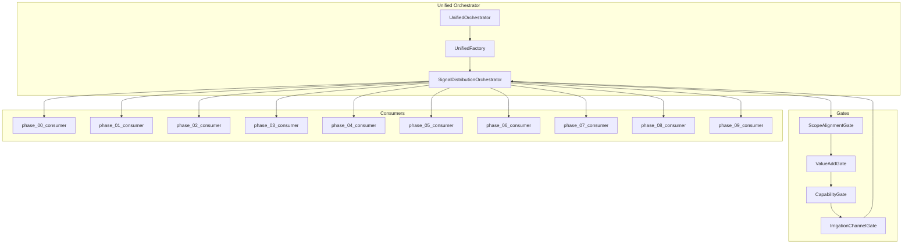
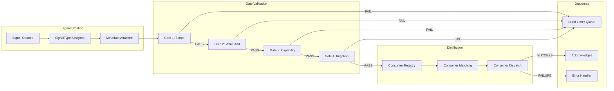
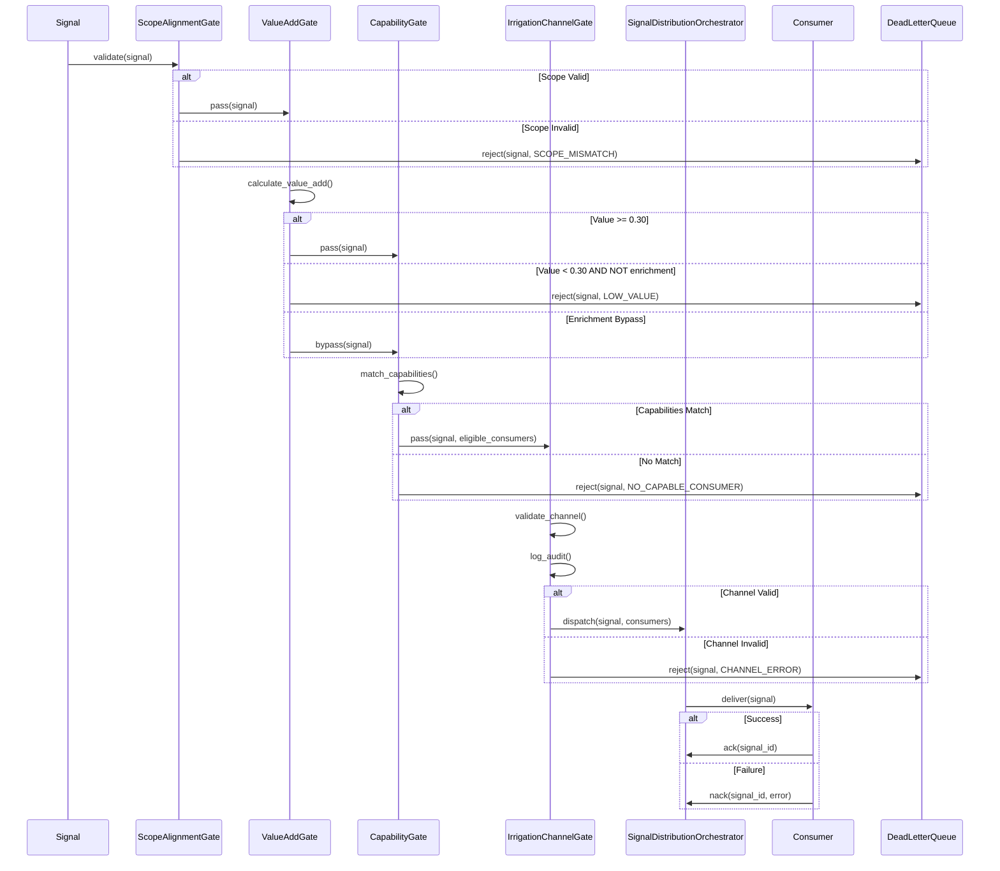
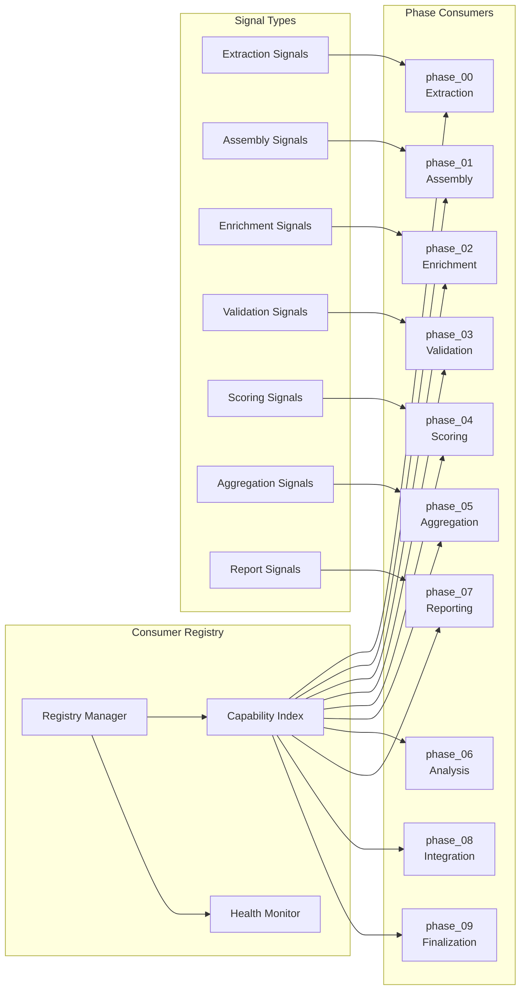

# SISAS Architecture Specification

**Version:** 1.0.0  
**Date:** 2026-01-19  
**Status:** CANONICAL  

---

## 1. Component Hierarchy

The SISAS Unification follows a strict hierarchical component model where the UnifiedOrchestrator serves as the root coordinator, delegating specialized responsibilities to child components.

### 1.1 Component Hierarchy Diagram



### 1.2 Component Descriptions

| Component | Responsibility | Lifecycle |
|-----------|---------------|-----------|
| **UnifiedOrchestrator** | Root coordinator; manages overall execution flow | Singleton per session |
| **UnifiedFactory** | Creates and configures all child components | Created by UO |
| **SignalDistributionOrchestrator** | Routes signals through gates and to consumers | Created by UF |
| **ScopeAlignmentGate** | Validates signal scope matches target consumer | Stateless |
| **ValueAddGate** | Ensures signal provides sufficient information gain | Stateless |
| **CapabilityGate** | Verifies consumer can process signal type | Stateless |
| **IrrigationChannelGate** | Final validation and audit logging | Stateless |
| **phase_XX_consumer** | Phase-specific signal processor | Pooled instances |

---

## 2. Signal Flow

Signals traverse a deterministic path from creation through validation to consumption. The flow guarantees that only valid, value-adding signals reach appropriate consumers.

### 2.1 Signal Flow Diagram



### 2.2 Signal Lifecycle States

| State | Description | Next States |
|-------|-------------|-------------|
| `CREATED` | Signal instantiated with type and payload | `VALIDATING` |
| `VALIDATING` | Passing through gates | `ROUTED`, `REJECTED` |
| `ROUTED` | Matched to consumer(s) | `DISPATCHED` |
| `DISPATCHED` | Sent to consumer | `ACKNOWLEDGED`, `FAILED` |
| `ACKNOWLEDGED` | Successfully processed | Terminal |
| `REJECTED` | Failed gate validation | `DEAD_LETTER` |
| `FAILED` | Consumer processing error | `RETRY`, `DEAD_LETTER` |
| `DEAD_LETTER` | Moved to DLQ | Terminal |

### 2.3 Signal Payload Structure

Each signal carries a standardized payload structure:

```python
@dataclass
class Signal:
    signal_id: str           # UUID v4
    signal_type: SignalType  # One of 17 types
    source_phase: int        # 0-9
    target_scopes: List[str] # PA, dimension, cluster
    payload: Dict[str, Any]  # Type-specific data
    metadata: SignalMetadata # Timestamps, trace IDs
    created_at: datetime
    expires_at: datetime
```

---

## 3. Gate Sequence

The four gates form a validation pipeline where each gate applies specific rules. A signal must pass all gates to reach consumers.

### 3.1 Gate Sequence Diagram



### 3.2 Gate Validation Order

The gates MUST execute in this exact order:

1. **Gate 1 - Scope Alignment:** Ensures signal targets valid scopes (policy areas, dimensions, clusters) that exist in the system.

2. **Gate 2 - Value Add:** Calculates the information gain the signal provides. Signals below 0.30 threshold are rejected unless they are enrichment signals (which bypass this check).

3. **Gate 3 - Capability:** Matches signal type against consumer capabilities. Only consumers declaring support for the signal type are eligible.

4. **Gate 4 - Irrigation Channel:** Performs final validation of the dispatch channel and creates audit records for compliance.

### 3.3 Gate Failure Handling

| Gate | Error Code | Recovery Action |
|------|------------|-----------------|
| Gate 1 | `SCOPE_MISMATCH` | Check scope configuration |
| Gate 1 | `SCOPE_NOT_FOUND` | Update scope registry |
| Gate 2 | `LOW_VALUE` | Enrich signal or discard |
| Gate 2 | `VALUE_CALC_ERROR` | Manual review |
| Gate 3 | `NO_CAPABLE_CONSUMER` | Register capable consumer |
| Gate 3 | `CONSUMER_UNAVAILABLE` | Wait for consumer recovery |
| Gate 4 | `CHANNEL_BLOCKED` | Clear channel blockage |
| Gate 4 | `AUDIT_FAILURE` | Check audit subsystem |

---

## 4. Consumer Registry

The Consumer Registry maintains the authoritative list of all signal consumers, their capabilities, and routing rules.

### 4.1 Consumer Registry Diagram



### 4.2 Registry Operations

| Operation | Description | Complexity |
|-----------|-------------|------------|
| `register(consumer)` | Add consumer to registry | O(1) |
| `deregister(consumer_id)` | Remove consumer from registry | O(1) |
| `find_capable(signal_type)` | Find consumers for signal type | O(log n) |
| `health_check(consumer_id)` | Check consumer health status | O(1) |
| `update_capabilities(consumer_id, caps)` | Modify consumer capabilities | O(k) |

### 4.3 Consumer States

```
REGISTERED → HEALTHY → PROCESSING → HEALTHY
                ↓           ↓
            DEGRADED → UNHEALTHY → DEREGISTERED
```

| State | Description | Accepts Signals |
|-------|-------------|-----------------|
| `REGISTERED` | Consumer added, not yet healthy | No |
| `HEALTHY` | Consumer ready for signals | Yes |
| `PROCESSING` | Consumer handling signal | Yes (queued) |
| `DEGRADED` | Consumer experiencing issues | Yes (reduced rate) |
| `UNHEALTHY` | Consumer failed health checks | No |
| `DEREGISTERED` | Consumer removed | No |

---

## 5. Data Flow Architecture

### 5.1 Horizontal Data Flow

Data flows horizontally through phases, with each phase consuming signals from previous phases and producing signals for subsequent phases.

```
Phase 00 → Phase 01 → Phase 02 → ... → Phase 09
   ↓          ↓          ↓                 ↓
Extract   Assemble   Enrich    ...    Finalize
```

### 5.2 Vertical Signal Propagation

Signals can propagate vertically across scopes:

```
Question Level (Q001-Q300)
         ↓
Policy Area Level (PA01-PA10)
         ↓
Dimension Level (D1-D6)
         ↓
Cluster Level (CL1-CL4)
         ↓
Global Level
```

### 5.3 Backpressure Handling

When consumers cannot keep up with signal volume:

1. **Queue Buffering:** Signals buffer in per-consumer queues (max 1000)
2. **Rate Limiting:** SDO reduces dispatch rate to degraded consumers
3. **Spillover:** Excess signals route to secondary consumers if available
4. **Dead Letter:** Signals exceeding TTL move to DLQ

---

## 6. Deployment Architecture

### 6.1 Single-Node Deployment

For development and small assessments:

```
┌────────────────────────────────────────┐
│           Application Process          │
├────────────────────────────────────────┤
│  UnifiedOrchestrator                   │
│  ├── UnifiedFactory                    │
│  ├── SignalDistributionOrchestrator    │
│  ├── Gates (in-process)                │
│  └── Consumers (in-process threads)    │
└────────────────────────────────────────┘
```

### 6.2 Multi-Process Deployment

For production assessments:

```
┌─────────────────────┐
│ Orchestrator Node   │
│  - UO, UF, SDO      │
│  - Gates            │
└─────────┬───────────┘
          │
    ┌─────┴─────┐
    │  Message  │
    │   Queue   │
    └─────┬─────┘
          │
┌─────────┴─────────┬─────────────────────┐
│                   │                     │
▼                   ▼                     ▼
┌───────────┐ ┌───────────┐       ┌───────────┐
│Consumer 0 │ │Consumer 1 │  ...  │Consumer 9 │
└───────────┘ └───────────┘       └───────────┘
```

---

## 7. Security Architecture

### 7.1 Signal Authentication

All signals carry authentication metadata:

- **Source Verification:** Signals include source component signature
- **Integrity Check:** SHA-256 hash of payload
- **Timestamp Validation:** Signals expire after TTL (default: 5 minutes)

### 7.2 Consumer Authorization

Consumers must present valid credentials:

- **Consumer ID:** Registered identifier
- **API Key:** Per-consumer secret (rotated daily)
- **Capability Proof:** Signed capability manifest

---

*End of Architecture Specification*
