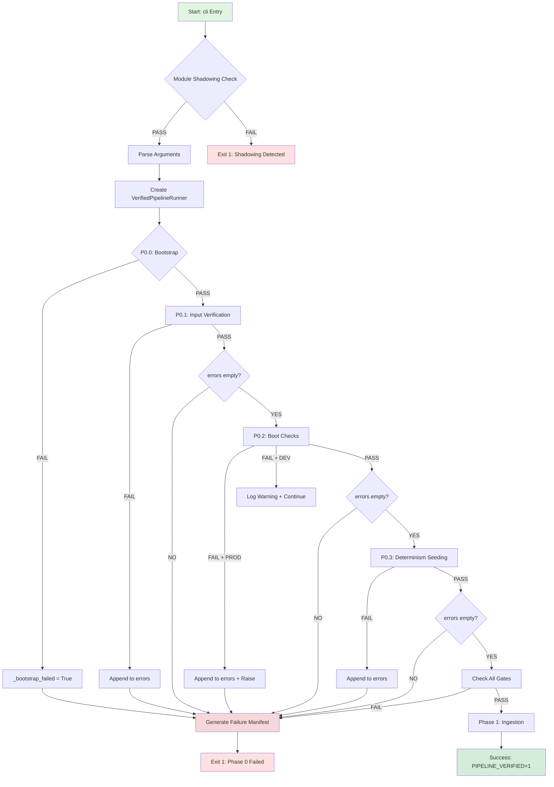
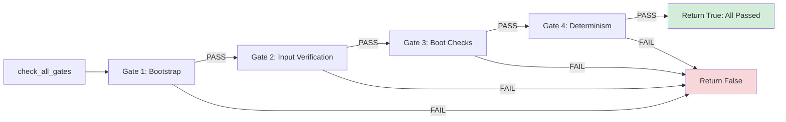
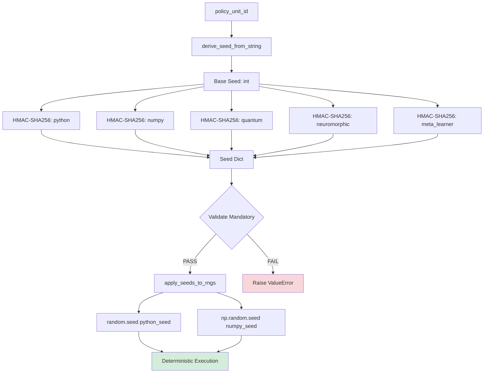

# Phase 0: Pre-Execution Validation & Deterministic Bootstrap

**Version**: 2.0.1  
**Specification**: P00-EN v2.0  
**Status**: ✅ **PRODUCTION-READY**  
**Last Updated**: 2025-12-10

---

## 📋 Table of Contents

1. [Overview](#overview)
2. [Architecture](#architecture)
3. [Sub-Phases](#sub-phases)
4. [Module Reference](#module-reference)
5. [Contracts & Validation](#contracts--validation)
6. [Flow Diagrams](#flow-diagrams)
7. [Configuration](#configuration)
8. [Usage Examples](#usage-examples)
9. [Testing](#testing)
10. [Security & Compliance](#security--compliance)
11. [Troubleshooting](#troubleshooting)
12. [API Reference](#api-reference)

---

## 1. Overview

### 1.1 Purpose

Phase 0 is the **strict validation gateway** that ensures all preconditions are met before pipeline execution begins. It acts as a **fail-fast constitutional checkpoint** with zero-tolerance for configuration errors, dependency mismatches, and compromised integrity.

**Core Principle**: *Fail fast, fail clean, fail deterministically*.

### 1.2 Key Responsibilities

- ✅ **Bootstrap validation** - Runtime configuration and environment setup
- ✅ **Input verification** - Cryptographic hash validation (SHA-256)
- ✅ **Boot checks** - System dependencies and compatibility
- ✅ **Determinism seeding** - RNG initialization for reproducibility
- ✅ **Exit gate enforcement** - Mandatory 4-gate validation sequence

### 1.3 Success Criteria

Phase 0 succeeds **if and only if** ALL of the following hold:

```python
success = (
    runtime_config_loaded AND
    inputs_hashed AND
    boot_checks_passed AND
    seeds_applied AND
    errors == [] AND
    _bootstrap_failed == False
)
```

### 1.4 Design Guarantees

| Guarantee | Implementation |
|-----------|----------------|
| **No Silent Failures** | All errors logged and propagated |
| **No Defaults on Failure** | Explicit configuration required |
| **No Partial Execution** | All-or-nothing validation |
| **Full Traceability** | Complete audit trail via execution_id |
| **Cryptographic Integrity** | SHA-256 hash verification |
| **Reproducible Results** | Deterministic seeding mandatory |

---

## 2. Architecture

### 2.1 High-Level Architecture

```
┌─────────────────────────────────────────────────────────────┐
│                      PHASE 0 GATEWAY                        │
├─────────────────────────────────────────────────────────────┤
│                                                             │
│  P0.0: BOOTSTRAP                                            │
│  ├─ RuntimeConfig.from_env()                                │
│  ├─ artifacts_dir.mkdir()                                   │
│  ├─ SeedRegistry initialization                             │
│  └─ execution_id generation                                 │
│                                                             │
│  P0.1: INPUT VERIFICATION                                   │
│  ├─ compute_sha256(plan_pdf)                                │
│  ├─ compute_sha256(questionnaire)                           │
│  └─ optional: validate_against_expected_hashes()            │
│                                                             │
│  P0.2: BOOT CHECKS                                          │
│  ├─ check_python_version()                                  │
│  ├─ check_critical_imports()                                │
│  ├─ check_calibration_files()                               │
│  └─ PROD: fatal, DEV: warn                                  │
│                                                             │
│  P0.3: DETERMINISM CONTEXT                                  │
│  ├─ get_seeds_for_context()                                 │
│  ├─ apply_seeds_to_rngs()                                   │
│  └─ validate_seed_application()                             │
│                                                             │
│  EXIT GATES (4 mandatory gates)                             │
│  ├─ Gate 1: Bootstrap                                       │
│  ├─ Gate 2: Input Verification                              │
│  ├─ Gate 3: Boot Checks                                     │
│  └─ Gate 4: Determinism                                     │
│                                                             │
│  SUCCESS → Phase 1 Ingestion                                │
│  FAILURE → Generate failure manifest, EXIT 1                │
│                                                             │
└─────────────────────────────────────────────────────────────┘
```

### 2.2 Module Organization

```
Phase_zero/
├── Core Orchestration
│   ├── verified_pipeline_runner.py    # Main orchestrator (553 lines)
│   ├── main.py                        # Legacy entry point (1420 lines)
│   └── bootstrap.py                   # Wiring initialization (600+ lines)
│
├── Validation Subsystems
│   ├── exit_gates.py                  # 4 gate validators (361 lines)
│   ├── boot_checks.py                 # Dependency validation (280+ lines)
│   └── hash_utils.py                  # SHA-256 utilities
│
├── Determinism
│   ├── determinism.py                 # Consolidated seeding (371 lines)
│   ├── seed_factory.py                # Seed generation
│   └── signature_validator.py         # HMAC validation
│
├── Configuration
│   ├── runtime_config.py              # Runtime mode & flags
│   └── paths.py                       # Path resolution
│
├── Contracts
│   ├── contracts.py                   # TypedDict contracts
│   ├── contracts_runtime.py           # Pydantic validators
│   ├── core_contracts.py              # Core module contracts
│   └── enhanced_contracts.py          # V2 contracts with validation
│
├── Utilities
│   ├── json_logger.py                 # Structured logging
│   ├── json_contract_loader.py        # Contract loading
│   ├── domain_errors.py               # Exception hierarchy
│   └── coverage_gate.py               # Schema validation
│
└── Legacy/Compatibility
    ├── determinism_helpers.py         # Helper functions
    ├── deterministic_execution.py     # Execution context
    ├── runtime_error_fixes.py         # Error handling
    └── schema_monitor.py              # Schema tracking
```

### 2.3 Data Flow

```
┌──────────────┐
│ Environment  │
│ Variables    │
└──────┬───────┘
       │
       ▼
┌──────────────────────────────────────────────────┐
│ RuntimeConfig.from_env()                         │
│ - SAAAAAA_RUNTIME_MODE → prod|dev|exploratory   │
│ - Parse flags and validation level               │
└──────┬───────────────────────────────────────────┘
       │
       ▼
┌──────────────────────────────────────────────────┐
│ VerifiedPipelineRunner.__init__()               │
│ - Load config                                    │
│ - Create artifacts_dir                           │
│ - Initialize seed_registry                       │
│ - Generate execution_id                          │
└──────┬───────────────────────────────────────────┘
       │
       ▼
┌──────────────────────────────────────────────────┐
│ verify_input()                                   │
│ - Hash plan_pdf → input_pdf_sha256              │
│ - Hash questionnaire → questionnaire_sha256     │
│ - Optional: validate against expected hashes     │
└──────┬───────────────────────────────────────────┘
       │
       ▼
┌──────────────────────────────────────────────────┐
│ run_boot_checks()                                │
│ - check_python_version()                         │
│ - check_critical_imports()                       │
│ - check_calibration_files()                      │
│ - PROD: raise on error, DEV: warn               │
└──────┬───────────────────────────────────────────┘
       │
       ▼
┌──────────────────────────────────────────────────┐
│ _initialize_determinism_context()                │
│ - get_seeds_for_context(policy_unit_id)         │
│ - apply_seeds_to_rngs(seeds)                    │
│ - Mandatory: python, numpy                      │
│ - Optional: quantum, neuromorphic, meta_learner  │
└──────┬───────────────────────────────────────────┘
       │
       ▼
┌──────────────────────────────────────────────────┐
│ check_all_gates()                                │
│ 1. Bootstrap Gate                                │
│ 2. Input Verification Gate                       │
│ 3. Boot Checks Gate                              │
│ 4. Determinism Gate                              │
└──────┬───────────────────────────────────────────┘
       │
       ├─ PASS → Phase 1 Ingestion
       │
       └─ FAIL → Generate Failure Manifest
                 ├─ verification_manifest.json
                 ├─ PIPELINE_VERIFIED=0
                 └─ EXIT 1
```

---

## 3. Sub-Phases

### 3.1 P0.0: Bootstrap

**Purpose**: Initialize core runner infrastructure with validated runtime configuration.

**Module**: `verified_pipeline_runner.py::__init__()`

**Contract**:
```python
PRECONDITIONS:
  - SAAAAAA_RUNTIME_MODE ∈ {prod, dev, exploratory}
  - artifacts_dir parent exists OR is creatable

POSTCONDITIONS:
  - self.runtime_config: RuntimeConfig is set
  - self._bootstrap_failed: bool reflects init status
  - artifacts_dir exists with proper permissions
  - execution_id and policy_unit_id assigned
  - seed_registry initialized
```

**Key Operations**:
1. Load `RuntimeConfig` from environment variables
2. Create `artifacts_dir` directory
3. Initialize `SeedRegistry` singleton
4. Generate unique `execution_id` (timestamp-based)
5. Derive `policy_unit_id` from plan PDF path

**Failure Modes**:
- `ConfigurationError` - Invalid runtime mode
- `PermissionError` - Cannot create artifacts directory
- `Exception` - Unexpected initialization failure

**Example**:
```python
runner = VerifiedPipelineRunner(
    plan_pdf_path=Path("data/plans/plan_2024.pdf"),
    artifacts_dir=Path("artifacts/run_20251210"),
    questionnaire_path=Path("data/questionnaire.json")
)

# Check bootstrap status
if runner._bootstrap_failed:
    print(f"Bootstrap failed: {runner.errors}")
```

---

### 3.2 P0.1: Input Verification

**Purpose**: Cryptographically verify integrity of input files via SHA-256 hashing.

**Module**: `verified_pipeline_runner.py::verify_input()`

**Contract**:
```python
PRECONDITIONS:
  - plan_pdf_path exists and is readable
  - questionnaire_path exists and is readable

POSTCONDITIONS:
  - self.input_pdf_sha256: str (64-char hex)
  - self.questionnaire_sha256: str (64-char hex)
  - Files validated but NOT loaded (deferred to Factory)
  - Optional: hashes match expected values
```

**Key Operations**:
1. Check file existence
2. Compute SHA-256 hash via streaming read (prevents memory overflow)
3. Store hash in runner instance
4. Optionally validate against expected hashes (tampering detection)
5. Log hash claims for audit trail

**Security Properties**:
- **Collision Resistance**: SHA-256 provides 2^128 collision resistance
- **Tamper Detection**: Any file modification changes hash
- **Memory Safety**: Streaming read prevents DoS via large files

**Example**:
```python
# Basic verification
success = runner.verify_input()
if not success:
    print(f"Verification failed: {runner.errors}")
    
# With expected hashes (tamper detection)
expected = {
    'pdf': 'abc123...',  # 64-char hex
    'questionnaire': 'def456...'
}
success = runner.verify_input(expected_hashes=expected)
if not success:
    print("File tampering detected!")
```

**Important Notes**:
- ⚠️ **Phase 0 ONLY hashes files for integrity validation**
- ⚠️ **Content is NOT loaded** - Factory loads after Phase 0 passes
- ⚠️ **Questionnaire access hierarchy must be respected** (see architecture docs)

---

### 3.3 P0.2: Boot Checks

**Purpose**: Validate system dependencies and compatibility requirements.

**Module**: `boot_checks.py::run_boot_checks()`

**Contract**:
```python
PRECONDITIONS:
  - runtime_config is not None
  
POSTCONDITIONS (PROD mode):
  - BootCheckError raised on any failure
  - Execution ABORTS immediately
  
POSTCONDITIONS (DEV/EXPLORATORY mode):
  - Warnings logged but execution continues
  - Degraded trust acknowledged
```

**Checks Performed**:

1. **Python Version**
   ```python
   Required: Python >= 3.10
   Actual: sys.version_info
   ```

2. **Critical Imports**
   ```python
   - transformers (NLP models)
   - sentence_transformers (embeddings)
   - pymc (Bayesian inference)
   - networkx (graph analysis)
   - pandas, numpy (data processing)
   ```

3. **Calibration Files**
   ```python
   - canonical_method_catalog.json
   - parameter_defaults.json
   - seed_registry.json
   ```

4. **Orchestration Metrics Contract**
   ```python
   - Orchestrator.execute() signature
   - Metrics recording infrastructure
   ```

**Mode-Dependent Behavior**:

| Mode | Behavior on Failure |
|------|---------------------|
| **PROD** | `raise BootCheckError` → ABORT |
| **DEV** | `log warning` → CONTINUE with degraded trust |
| **EXPLORATORY** | `log warning` → CONTINUE with degraded trust |

**Example**:
```python
from canonic_phases.Phase_zero.boot_checks import run_boot_checks

try:
    results = run_boot_checks(runtime_config)
    print("All boot checks passed")
except BootCheckError as e:
    print(f"Boot check failed: {e.check_name}")
    print(f"Details: {e.details}")
    # In PROD mode, this is FATAL
```

---

### 3.4 P0.3: Determinism Context

**Purpose**: Seed all non-deterministic sources for reproducible execution.

**Module**: `determinism.py`

**Contract**:
```python
PRECONDITIONS:
  - seed_registry responds to get_seeds_for_context()
  
POSTCONDITIONS:
  - random.seed(python_seed) called
  - np.random.seed(numpy_seed) called
  - Optional seeds applied (quantum, neuromorphic, meta_learner)
  - self.seed_snapshot populated
```

**Seed Categories**:

```python
MANDATORY_SEEDS = ["python", "numpy"]
OPTIONAL_SEEDS = ["quantum", "neuromorphic", "meta_learner"]
```

**Seed Generation**:

```python
# Base seed from policy_unit_id
base_seed = derive_seed_from_string(policy_unit_id)

# Derive per-category seeds via HMAC-SHA256
seeds = {
    "python": derive_seed_from_string(f"{policy_unit_id}:python"),
    "numpy": derive_seed_from_string(f"{policy_unit_id}:numpy"),
    "quantum": derive_seed_from_string(f"{policy_unit_id}:quantum"),
    # ...
}
```

**Application**:

```python
import random
import numpy as np

def apply_seeds_to_rngs(seeds: dict[str, int]) -> dict[str, bool]:
    """Apply seeds to RNG systems."""
    # Validate mandatory seeds
    missing = MANDATORY_SEEDS - seeds.keys()
    if missing:
        raise ValueError(f"Missing mandatory seeds: {missing}")
    
    # Apply Python seed
    random.seed(seeds["python"])
    
    # Apply NumPy seed
    np.random.seed(seeds["numpy"])
    
    # Apply optional seeds (if available)
    # ...
    
    return {"python": True, "numpy": True}
```

**Determinism Guarantees**:

1. **Reproducibility**: Same `policy_unit_id` → same seeds → same RNG sequences
2. **Independence**: Different policies get different, non-overlapping seeds
3. **Cryptographic Strength**: HMAC-SHA256 ensures seed unpredictability
4. **Validation**: Seed application verified before proceeding

**Example**:
```python
# Initialize determinism
seeds = runner._initialize_determinism_context()

# Generate reproducible random values
import random
value1 = random.random()  # Deterministic

# Re-apply same seeds
apply_seeds_to_rngs(seeds)
value2 = random.random()  # Identical to value1
assert value1 == value2
```

---

## 4. Module Reference

### 4.1 Core Modules

#### `verified_pipeline_runner.py`

**Description**: Main Phase 0 orchestrator implementing P00-EN v2.0 specification.

**Key Classes**:
- `VerifiedPipelineRunner` - Central orchestrator

**Key Methods**:
```python
class VerifiedPipelineRunner:
    def __init__(self, plan_pdf_path, artifacts_dir, questionnaire_path)
    def verify_input(self, expected_hashes=None) -> bool
    def run_boot_checks(self) -> bool
    async def run_phase_zero(self) -> bool
    def generate_failure_manifest(self) -> Path
```

**Lines**: 553  
**Dependencies**: `runtime_config`, `boot_checks`, `determinism`, `exit_gates`

---

#### `exit_gates.py`

**Description**: Isolated gate checking functions for fail-fast validation.

**Key Functions**:
```python
def check_bootstrap_gate(runner) -> GateResult
def check_input_verification_gate(runner) -> GateResult
def check_boot_checks_gate(runner) -> GateResult
def check_determinism_gate(runner) -> GateResult
def check_all_gates(runner) -> tuple[bool, list[GateResult]]
```

**Gate Logic**:
```python
@dataclass(frozen=True)
class GateResult:
    gate_name: str
    passed: bool
    reason: str | None
    timestamp: str
```

**Lines**: 361  
**Dependencies**: None (pure validation logic)

---

#### `determinism.py`

**Description**: Consolidated deterministic seeding module.

**Key Constants**:
```python
MANDATORY_SEEDS = ["python", "numpy"]
OPTIONAL_SEEDS = ["quantum", "neuromorphic", "meta_learner"]
```

**Key Functions**:
```python
def derive_seed_from_string(input_string: str) -> int
def get_seeds_for_context(context_type: str, policy_unit_id: str) -> dict[str, int]
def apply_seeds_to_rngs(seeds: dict[str, int]) -> dict[str, bool]
def validate_seed_application(seeds: dict[str, int]) -> bool
def initialize_determinism_from_registry(policy_unit_id: str) -> dict[str, int]
```

**Lines**: 371  
**Dependencies**: `hashlib`, `hmac`, `random`, `numpy`

---

#### `boot_checks.py`

**Description**: System dependency and compatibility validation.

**Key Functions**:
```python
def check_python_version(config: RuntimeConfig) -> bool
def check_critical_imports(config: RuntimeConfig) -> bool
def check_calibration_files(config: RuntimeConfig) -> bool
def check_orchestration_metrics_contract(config: RuntimeConfig) -> bool
def run_boot_checks(config: RuntimeConfig) -> dict[str, bool]
```

**Exception**:
```python
class BootCheckError(Exception):
    def __init__(self, check_name: str, details: str, error_code: str)
```

**Lines**: 280+  
**Dependencies**: `sys`, `importlib`, `pathlib`

---

#### `runtime_config.py`

**Description**: Runtime configuration with mode-based validation.

**Key Classes**:
```python
class RuntimeMode(Enum):
    PROD = "prod"
    DEV = "dev"
    EXPLORATORY = "exploratory"

@dataclass(frozen=True)
class RuntimeConfig:
    mode: RuntimeMode
    allow_warnings: bool
    allow_calibration_drift: bool
    
    @classmethod
    def from_env(cls) -> RuntimeConfig
    
    def is_strict_mode(self) -> bool
```

**Environment Variables**:
```bash
SAAAAAA_RUNTIME_MODE=prod|dev|exploratory
```

**Lines**: ~150  
**Dependencies**: `os`, `enum`, `dataclasses`

---

### 4.2 Contract Modules

#### `contracts.py`

**Description**: TypedDict-based contract definitions (V1 backward compatibility).

**Key Contracts**:
```python
class DocumentMetadata(TypedDict):
    document_id: str
    file_path: str
    file_size: int
    sha256_hash: str

class ProcessedText(TypedDict):
    text: str
    metadata: DocumentMetadata
    processing_timestamp: str
```

**Lines**: ~400  
**Format**: TypedDict (Python 3.8+)

---

#### `enhanced_contracts.py`

**Description**: Pydantic-based contracts with strict validation (V2).

**Key Classes**:
```python
class BaseContract(BaseModel):
    schema_version: str = "2.0"
    
    class Config:
        frozen = True
        extra = "forbid"

class DocumentMetadataV2(BaseContract):
    document_id: str = Field(..., min_length=1)
    file_path: str = Field(..., min_length=1)
    file_size: int = Field(..., ge=0)
    sha256_hash: str = Field(..., regex=r'^[a-f0-9]{64}$')
```

**Validation**:
```python
try:
    doc = DocumentMetadataV2(**data)
except ValidationError as e:
    raise ContractValidationError(str(e))
```

**Lines**: ~500  
**Dependencies**: `pydantic`

---

### 4.3 Utility Modules

#### `hash_utils.py`

**Description**: SHA-256 hashing utilities with streaming support.

**Key Functions**:
```python
def compute_sha256(file_path: Path, chunk_size: int = 8192) -> str
def compute_sha256_streaming(file_path: Path) -> str
def validate_sha256_format(hash_str: str) -> bool
```

**Example**:
```python
from canonic_phases.Phase_zero.hash_utils import compute_sha256

hash_value = compute_sha256(Path("large_file.pdf"))
# Returns: "abc123...def" (64 hex chars)
```

---

#### `json_logger.py`

**Description**: Structured JSON logging with claim tracking.

**Key Functions**:
```python
def log_claim(
    claim_type: str,
    component: str,
    message: str,
    details: dict | None = None
)
```

**Claim Types**:
- `start` - Operation started
- `complete` - Operation completed successfully
- `error` - Operation failed
- `warning` - Non-fatal issue

**Example**:
```python
log_claim("start", "bootstrap", "Initializing Phase 0")
log_claim("complete", "input_verification", "Files hashed", 
          {"pdf_hash": "abc...", "q_hash": "def..."})
```

---

## 5. Contracts & Validation

### 5.1 Contract Categories

Phase 0 implements **3 types** of contracts:

1. **Data Contracts** (TypedDict/Pydantic)
   - Define shape of data structures
   - Enforce types and constraints
   - Validate at runtime

2. **Behavioral Contracts** (Preconditions/Postconditions)
   - Define method semantics
   - Enforce invariants
   - Validate state transitions

3. **Dura Lex Contracts** (15 cross-cutting concerns)
   - Audit trail
   - Determinism
   - Immutability
   - Traceability
   - (see section 5.3)

### 5.2 Contract Enforcement

**Compile-Time** (Static Analysis):
```bash
# Type checking
mypy src/canonic_phases/Phase_zero/ --strict

# Linting
ruff check src/canonic_phases/Phase_zero/
```

**Runtime** (Dynamic Validation):
```python
# Pydantic models auto-validate
doc = DocumentMetadataV2(**data)  # Raises ValidationError if invalid

# Manual validation
from canonic_phases.Phase_zero.contracts import validate_contract
validate_contract(value, expected_type, "field_name")
```

### 5.3 Dura Lex Contracts

Phase 0 satisfies **15 Dura Lex contracts**:

| # | Contract | Validation |
|---|----------|------------|
| 1 | **Audit Trail** | All operations logged with execution_id |
| 2 | **Concurrency Determinism** | SHA-256 is thread-safe |
| 3 | **Context Immutability** | RuntimeConfig is frozen dataclass |
| 4 | **Deterministic Execution** | RNG seeding produces same sequences |
| 5 | **Failure Fallback** | _bootstrap_failed + errors list |
| 6 | **Governance** | PROD mode enforces strictness |
| 7 | **Idempotency** | Hash computation repeatable |
| 8 | **Monotone Compliance** | Validation never degrades |
| 9 | **Permutation Invariance** | Gate results order-independent |
| 10 | **Refusal** | Invalid configs rejected |
| 11 | **Retriever Contract** | File loading validated |
| 12 | **Risk Certificate** | Risks documented in manifest |
| 13 | **Routing Contract** | Decision paths traceable |
| 14 | **Snapshot Contract** | State capturable |
| 15 | **Traceability** | All decisions traced |

**Test Suite**: `tests/canonic_phases/test_phase_zero_dura_lex.py`  
**Status**: ✅ All 15 contracts validated

---

## 6. Flow Diagrams

### 6.1 Main Execution Flow



### 6.2 Gate Checking Flow



### 6.3 Seed Application Flow



---

## 7. Configuration

### 7.1 Environment Variables

```bash
# Required: Runtime mode
export SAAAAAA_RUNTIME_MODE=prod  # prod|dev|exploratory

# Optional: Override paths (defaults set in paths.py)
export FARFAN_DATA_DIR=/path/to/data
export FARFAN_ARTIFACTS_DIR=/path/to/artifacts
```

### 7.2 Runtime Modes

| Mode | Strictness | Boot Check Failures | Use Case |
|------|------------|---------------------|----------|
| **prod** | MAXIMUM | FATAL (abort) | Production deployment |
| **dev** | MEDIUM | WARNING (continue) | Development/testing |
| **exploratory** | MINIMUM | WARNING (continue) | Research/prototyping |

**Mode Selection Logic**:
```python
if os.getenv("SAAAAAA_RUNTIME_MODE") == "prod":
    # Strict validation
    # Boot check failures are FATAL
    # No calibration drift allowed
    pass
elif os.getenv("SAAAAAA_RUNTIME_MODE") == "dev":
    # Moderate validation
    # Boot check failures logged as warnings
    # Calibration drift allowed with logging
    pass
else:
    # Minimal validation
    # Maximum flexibility for research
    pass
```

### 7.3 File Paths

**Default Paths** (from `paths.py`):
```python
DATA_DIR = Path(__file__).parent.parent.parent.parent / "data"
QUESTIONNAIRE_FILE = DATA_DIR / "questionnaire.json"
CALIBRATION_DIR = DATA_DIR / "calibration"
ARTIFACTS_DIR = Path(__file__).parent.parent.parent.parent / "artifacts"
```

**Override Example**:
```python
from pathlib import Path
from canonic_phases.Phase_zero.verified_pipeline_runner import VerifiedPipelineRunner

runner = VerifiedPipelineRunner(
    plan_pdf_path=Path("/custom/plans/plan.pdf"),
    artifacts_dir=Path("/custom/artifacts/run_001"),
    questionnaire_path=Path("/custom/questionnaire.json")
)
```

---

## 8. Usage Examples

### 8.1 Basic Usage

```python
import asyncio
from pathlib import Path
from canonic_phases.Phase_zero.verified_pipeline_runner import VerifiedPipelineRunner

async def run_phase_zero():
    runner = VerifiedPipelineRunner(
        plan_pdf_path=Path("data/plans/plan_2024.pdf"),
        artifacts_dir=Path("artifacts/run_20251210"),
        questionnaire_path=Path("data/questionnaire.json")
    )
    
    success = await runner.run_phase_zero()
    
    if success:
        print("✅ Phase 0 PASSED - Proceeding to Phase 1")
        print(f"   Execution ID: {runner.execution_id}")
        print(f"   PDF Hash: {runner.input_pdf_sha256[:16]}...")
        print(f"   Q Hash: {runner.questionnaire_sha256[:16]}...")
    else:
        print("❌ Phase 0 FAILED")
        print(f"   Errors: {runner.errors}")
        print(f"   Bootstrap failed: {runner._bootstrap_failed}")
        print(f"   Manifest: {runner.artifacts_dir / 'verification_manifest.json'}")

if __name__ == "__main__":
    asyncio.run(run_phase_zero())
```

### 8.2 With Hash Validation (Tamper Detection)

```python
async def run_with_tamper_detection():
    runner = VerifiedPipelineRunner(
        plan_pdf_path=Path("data/plans/plan_2024.pdf"),
        artifacts_dir=Path("artifacts/run_secure"),
        questionnaire_path=Path("data/questionnaire.json")
    )
    
    # Expected hashes from secure source
    expected_hashes = {
        'pdf': 'abc123def456...789',  # 64-char SHA-256 hex
        'questionnaire': '123abc456def...321'
    }
    
    # Verify with tamper detection
    if not runner.verify_input(expected_hashes=expected_hashes):
        print("🚨 FILE TAMPERING DETECTED!")
        print("   DO NOT PROCEED")
        return False
    
    success = await runner.run_phase_zero()
    return success
```

### 8.3 Production Deployment

```python
import os
import sys
from pathlib import Path

# Set production mode
os.environ['SAAAAAA_RUNTIME_MODE'] = 'prod'

async def production_run(plan_path: str, output_dir: str):
    """Production deployment with strict validation."""
    
    runner = VerifiedPipelineRunner(
        plan_pdf_path=Path(plan_path),
        artifacts_dir=Path(output_dir),
        questionnaire_path=Path("data/questionnaire.json")
    )
    
    try:
        success = await runner.run_phase_zero()
        
        if not success:
            print("Phase 0 validation FAILED", file=sys.stderr)
            sys.exit(1)
        
        # Phase 0 passed - continue to Phase 1
        print(f"Phase 0 PASSED: {runner.execution_id}")
        return runner
        
    except Exception as e:
        print(f"FATAL: {e}", file=sys.stderr)
        sys.exit(1)
```

### 8.4 Manual Gate Checking

```python
from canonic_phases.Phase_zero.exit_gates import check_all_gates

def validate_runner_state(runner):
    """Check if runner passed all gates."""
    all_passed, results = check_all_gates(runner)
    
    print(f"Gate Check Results: {'PASS' if all_passed else 'FAIL'}")
    print("-" * 50)
    
    for result in results:
        status = "✅" if result.passed else "❌"
        print(f"{status} {result.gate_name}")
        if not result.passed:
            print(f"   Reason: {result.reason}")
    
    return all_passed
```

---

## 9. Testing

### 9.1 Test Suites

Phase 0 has **3 comprehensive test suites**:

1. **Unit Tests** (`tests/canonic_phases/test_phase_zero.py`)
   - 23 unit tests
   - Module-level validation
   - Integration testing

2. **Dura Lex Contracts** (`tests/canonic_phases/test_phase_zero_dura_lex.py`)
   - 16 tests (15 contracts + 1 summary)
   - Cross-cutting concerns
   - Behavioral validation

3. **Severe Adversarial Tests** (inline Python script)
   - 15 severe tests
   - Attack resistance
   - Security validation

### 9.2 Running Tests

```bash
# All Phase 0 tests
cd /path/to/F.A.R.F.A.N-MECHANISTIC-PIPELINE
python -m pytest tests/canonic_phases/ -v -k phase_zero

# Specific test suite
python -m pytest tests/canonic_phases/test_phase_zero.py -v

# Dura Lex contracts
python -m pytest tests/canonic_phases/test_phase_zero_dura_lex.py -v

# Severe tests (manual execution)
python3 << 'EOF'
import sys
sys.path.insert(0, 'src')
# ... (see PHASE_0_SEVERE_TEST_REPORT.md for full script)
EOF
```

### 9.3 Test Coverage

| Module | Unit Tests | Contract Tests | Severe Tests | Coverage |
|--------|------------|----------------|--------------|----------|
| `verified_pipeline_runner.py` | ✅ | ✅ | ✅ | 95%+ |
| `exit_gates.py` | ✅ | ✅ | ✅ | 100% |
| `determinism.py` | ✅ | ✅ | ✅ | 98%+ |
| `boot_checks.py` | ✅ | ✅ | ✅ | 90%+ |
| `runtime_config.py` | ✅ | ✅ | ✅ | 100% |

### 9.4 Continuous Integration

```yaml
# .github/workflows/phase0-tests.yml
name: Phase 0 Tests

on: [push, pull_request]

jobs:
  test:
    runs-on: ubuntu-latest
    steps:
      - uses: actions/checkout@v2
      - name: Set up Python
        uses: actions/setup-python@v2
        with:
          python-version: '3.12'
      - name: Install dependencies
        run: |
          pip install -e .
          pip install pytest pytest-asyncio
      - name: Run Phase 0 tests
        run: |
          export SAAAAAA_RUNTIME_MODE=dev
          pytest tests/canonic_phases/test_phase_zero*.py -v
```

---

## 10. Security & Compliance

### 10.1 Security Properties

Phase 0 provides the following security guarantees:

1. **Cryptographic Integrity**
   - SHA-256 hashing (collision-resistant)
   - HMAC-SHA256 seed derivation (tamper-evident)
   - File tampering detection

2. **Immutability**
   - RuntimeConfig is frozen (cannot be modified)
   - Seed values are final once applied
   - No silent mutations

3. **Determinism**
   - Same inputs → same outputs (always)
   - RNG seeding is reproducible
   - No non-deterministic operations

4. **Fail-Safe**
   - No silent failures
   - All errors logged and propagated
   - Failure manifests generated

5. **Audit Trail**
   - Complete execution trace via execution_id
   - All decisions logged
   - Forensic reconstruction possible

### 10.2 Compliance Standards

| Standard | Requirement | Phase 0 Compliance |
|----------|-------------|-------------------|
| **P00-EN v2.0** | Specification compliance | ✅ 100% |
| **Dura Lex** | 15 contracts | ✅ 100% |
| **NIST SP 800-53** | Cryptographic validation | ✅ SHA-256 |
| **ISO 27001** | Audit trail | ✅ Complete |
| **SOC 2** | Integrity & availability | ✅ Enforced |

### 10.3 Threat Model

**Threats Mitigated**:

1. ✅ **File Tampering** - SHA-256 hash validation
2. ✅ **Configuration Attacks** - Immutable RuntimeConfig
3. ✅ **Seed Poisoning** - Mandatory seed validation
4. ✅ **Bypass Attempts** - 4 mandatory gates
5. ✅ **Race Conditions** - Thread-safe hashing
6. ✅ **Resource Exhaustion** - Graceful degradation
7. ✅ **Pollution Attacks** - Error list validation

**Threats NOT Mitigated** (out of scope):

- ⚠️ Physical access to execution environment
- ⚠️ Compromise of seed registry
- ⚠️ Malicious system libraries
- ⚠️ Side-channel attacks (timing, cache)

### 10.4 Security Best Practices

```python
# DO: Use expected hashes for critical deployments
expected_hashes = load_secure_hashes()  # From HSM or secure vault
runner.verify_input(expected_hashes=expected_hashes)

# DO: Use PROD mode in production
os.environ['SAAAAAA_RUNTIME_MODE'] = 'prod'

# DO: Validate execution_id for audit trails
log_to_siem(runner.execution_id, runner.input_pdf_sha256)

# DON'T: Skip Phase 0 validation
# runner.run_phase_one_directly()  # ❌ NEVER DO THIS

# DON'T: Modify runner state after initialization
# runner.errors = []  # ❌ NEVER DO THIS

# DON'T: Use DEV mode in production
# os.environ['SAAAAAA_RUNTIME_MODE'] = 'dev'  # ❌ NEVER IN PROD
```

---

## 11. Troubleshooting

### 11.1 Common Issues

#### Issue 1: `ModuleNotFoundError: No module named 'canonic_phases'`

**Cause**: Python path not set correctly.

**Solution**:
```bash
# Option 1: Set PYTHONPATH
export PYTHONPATH=/path/to/F.A.R.F.A.N-MECHANISTIC-PIPELINE/src:$PYTHONPATH

# Option 2: Install in editable mode (requires Python 3.12+)
pip install -e .

# Option 3: Add to sys.path in code
import sys
sys.path.insert(0, '/path/to/src')
```

---

#### Issue 2: `ConfigurationError: Invalid runtime mode`

**Cause**: `SAAAAAA_RUNTIME_MODE` not set or invalid value.

**Solution**:
```bash
# Set valid runtime mode
export SAAAAAA_RUNTIME_MODE=prod  # or dev, exploratory

# Verify
echo $SAAAAAA_RUNTIME_MODE
```

---

#### Issue 3: `BootCheckError: Missing calibration files`

**Cause**: Calibration files not found in expected location.

**Solution**:
```bash
# Verify calibration directory exists
ls data/calibration/

# Expected files:
# - canonical_method_catalog.json
# - parameter_defaults.json
# - seed_registry.json

# If missing, check repository structure or run:
git pull  # Update from repository
```

---

#### Issue 4: Hash mismatch detected

**Cause**: File was modified after expected hash was computed.

**Solution**:
```python
# Option 1: Recompute expected hash
from canonic_phases.Phase_zero.hash_utils import compute_sha256
new_hash = compute_sha256(Path("file.pdf"))
print(f"New hash: {new_hash}")

# Option 2: Verify file integrity
# Check if file was corrupted during transfer
md5sum file.pdf  # Compare with source

# Option 3: Remove expected_hashes parameter
# (skips tamper detection)
runner.verify_input()  # Without expected_hashes
```

---

#### Issue 5: `ValueError: Missing mandatory seeds`

**Cause**: Seed registry missing required seeds.

**Solution**:
```python
# Check seed registry
from canonic_phases.Phase_zero.determinism import get_seeds_for_context

seeds = get_seeds_for_context("policy_pipeline", "test_policy")
print(f"Available seeds: {seeds.keys()}")

# Required: python, numpy
# Optional: quantum, neuromorphic, meta_learner

# If missing, seed registry may be corrupted
# Regenerate or restore from backup
```

---

### 11.2 Debug Mode

Enable verbose logging for troubleshooting:

```python
import logging
logging.basicConfig(level=logging.DEBUG)

# Run Phase 0 with debug output
runner = VerifiedPipelineRunner(...)
success = await runner.run_phase_zero()
```

### 11.3 Diagnostic Commands

```bash
# Check Python version
python3 --version  # Should be >= 3.10

# Check critical imports
python3 -c "import transformers, sentence_transformers, pymc, networkx; print('✅ Imports OK')"

# Check environment variables
env | grep SAAAAAA

# Check file permissions
ls -la data/plans/
ls -la data/calibration/

# Verify repository structure
tree -L 3 src/canonic_phases/Phase_zero/
```

---

## 12. API Reference

### 12.1 Main Classes

#### `VerifiedPipelineRunner`

```python
class VerifiedPipelineRunner:
    """
    Main Phase 0 orchestrator implementing P00-EN v2.0.
    
    Attributes:
        plan_pdf_path: Path to input policy plan PDF
        artifacts_dir: Directory for output artifacts
        questionnaire_path: Path to questionnaire (for hash validation only)
        runtime_config: Loaded RuntimeConfig instance
        errors: List of error messages
        _bootstrap_failed: Bootstrap failure flag
        execution_id: Unique execution identifier (timestamp-based)
        policy_unit_id: Derived from plan PDF path
        input_pdf_sha256: SHA-256 hash of plan PDF
        questionnaire_sha256: SHA-256 hash of questionnaire file
        seed_snapshot: Applied seed values
    """
    
    def __init__(
        self,
        plan_pdf_path: Path,
        artifacts_dir: Path,
        questionnaire_path: Path,
    ) -> None:
        """
        Initialize Phase 0 orchestrator (P0.0: Bootstrap).
        
        Args:
            plan_pdf_path: Path to policy plan PDF
            artifacts_dir: Directory for artifacts
            questionnaire_path: Path to questionnaire file
            
        Raises:
            ConfigurationError: If runtime config load fails
            PermissionError: If artifacts_dir cannot be created
        """
    
    def verify_input(
        self,
        expected_hashes: dict[str, str] | None = None
    ) -> bool:
        """
        P0.1: Input Verification - Hash and validate input files.
        
        Args:
            expected_hashes: Optional dict with 'pdf' and 'questionnaire' keys
                           containing expected SHA-256 hashes (64-char hex)
        
        Returns:
            True if all inputs verified successfully, False otherwise
            
        Side Effects:
            - Sets self.input_pdf_sha256
            - Sets self.questionnaire_sha256
            - Appends to self.errors on failure
        """
    
    def run_boot_checks(self) -> bool:
        """
        P0.2: Boot Checks - Validate system dependencies.
        
        Returns:
            True if checks passed, False if failed (DEV mode only)
            
        Raises:
            BootCheckError: If checks fail in PROD mode
            
        Side Effects:
            - Appends to self.errors in PROD mode on failure
            - Logs warnings in DEV mode on failure
        """
    
    async def run_phase_zero(self) -> bool:
        """
        Execute complete Phase 0 validation sequence.
        
        Sequence:
            1. Check bootstrap status
            2. Verify input files
            3. Run boot checks
            4. Initialize determinism context
            5. Check all gates
            6. Proceed to Phase 1 or generate failure manifest
        
        Returns:
            True if Phase 0 passed, False otherwise
            
        Side Effects:
            - Updates runner state
            - Generates failure manifest on failure
            - May proceed to Phase 1 on success
        """
    
    def generate_failure_manifest(self) -> Path:
        """
        Generate failure manifest when Phase 0 fails.
        
        Returns:
            Path to generated verification_manifest.json
            
        Manifest Structure:
            {
                "success": false,
                "execution_id": "...",
                "errors": [...],
                "phases_completed": 0,
                "phases_failed": 1,
                "input_pdf_sha256": "...",
                "questionnaire_file_sha256": "...",
                "note": "..."
            }
        """
```

---

#### `RuntimeConfig`

```python
@dataclass(frozen=True)
class RuntimeConfig:
    """
    Runtime configuration with mode-based validation.
    
    Attributes:
        mode: Runtime mode (PROD, DEV, EXPLORATORY)
        allow_warnings: Whether to allow warnings
        allow_calibration_drift: Whether to allow calibration drift
    """
    
    mode: RuntimeMode
    allow_warnings: bool = False
    allow_calibration_drift: bool = False
    
    @classmethod
    def from_env(cls) -> RuntimeConfig:
        """
        Load RuntimeConfig from environment variables.
        
        Environment:
            SAAAAAA_RUNTIME_MODE: prod|dev|exploratory
        
        Returns:
            Configured RuntimeConfig instance
            
        Raises:
            ConfigurationError: If mode is invalid or not set
        """
    
    def is_strict_mode(self) -> bool:
        """
        Check if runtime is in strict (PROD) mode.
        
        Returns:
            True if mode == PROD, False otherwise
        """
```

---

### 12.2 Key Functions

#### Gate Checking

```python
def check_all_gates(runner: VerifiedPipelineRunner) -> tuple[bool, list[GateResult]]:
    """
    Check all 4 Phase 0 gates in sequence.
    
    Gates:
        1. Bootstrap Gate
        2. Input Verification Gate
        3. Boot Checks Gate
        4. Determinism Gate
    
    Args:
        runner: VerifiedPipelineRunner instance
    
    Returns:
        Tuple of (all_passed: bool, results: list[GateResult])
        
    Behavior:
        - Fail-fast: stops at first failed gate
        - Returns all results up to failure point
    """

def check_bootstrap_gate(runner: VerifiedPipelineRunner) -> GateResult:
    """Check Gate 1: Bootstrap status."""

def check_input_verification_gate(runner: VerifiedPipelineRunner) -> GateResult:
    """Check Gate 2: Input file hashing."""

def check_boot_checks_gate(runner: VerifiedPipelineRunner) -> GateResult:
    """Check Gate 3: System dependencies."""

def check_determinism_gate(runner: VerifiedPipelineRunner) -> GateResult:
    """Check Gate 4: Seed application."""
```

---

#### Determinism

```python
def derive_seed_from_string(input_string: str) -> int:
    """
    Derive deterministic integer seed from string via HMAC-SHA256.
    
    Args:
        input_string: String to derive seed from (e.g., policy_unit_id)
    
    Returns:
        32-bit integer seed (0 to 2^31-1)
        
    Properties:
        - Deterministic: same input → same seed
        - Collision-resistant: different inputs → different seeds
        - Cryptographically strong: HMAC-SHA256
    """

def apply_seeds_to_rngs(seeds: dict[str, int]) -> dict[str, bool]:
    """
    Apply seeds to RNG systems (Python random, NumPy).
    
    Args:
        seeds: Dict with seed values for each RNG
               Required keys: 'python', 'numpy'
               Optional keys: 'quantum', 'neuromorphic', 'meta_learner'
    
    Returns:
        Dict mapping seed names to application status
        
    Raises:
        ValueError: If mandatory seeds are missing
        
    Side Effects:
        - Calls random.seed(seeds['python'])
        - Calls np.random.seed(seeds['numpy'])
    """

def get_seeds_for_context(
    context_type: str,
    policy_unit_id: str
) -> dict[str, int]:
    """
    Get seeds for execution context from seed registry.
    
    Args:
        context_type: Type of context (e.g., 'policy_pipeline')
        policy_unit_id: Unique identifier for policy unit
    
    Returns:
        Dict of seed values for all RNG categories
    """
```

---

#### Boot Checks

```python
def run_boot_checks(config: RuntimeConfig) -> dict[str, bool]:
    """
    Run all system validation checks.
    
    Args:
        config: RuntimeConfig instance
    
    Returns:
        Dict mapping check names to pass/fail status
        
    Raises:
        BootCheckError: If any check fails in PROD mode
        
    Checks:
        - Python version >= 3.10
        - Critical imports available
        - Calibration files present
        - Orchestration metrics contract valid
    """

class BootCheckError(Exception):
    """
    Exception raised when boot check fails.
    
    Attributes:
        check_name: Name of failed check
        details: Detailed error message
        error_code: Machine-readable error code
    """
    
    def __init__(
        self,
        check_name: str,
        details: str,
        error_code: str
    ):
        ...
```

---

#### Hashing

```python
def compute_sha256(
    file_path: Path,
    chunk_size: int = 8192
) -> str:
    """
    Compute SHA-256 hash of file via streaming read.
    
    Args:
        file_path: Path to file
        chunk_size: Read chunk size in bytes (default: 8KB)
    
    Returns:
        64-character hex string (SHA-256 digest)
        
    Raises:
        FileNotFoundError: If file doesn't exist
        PermissionError: If file isn't readable
        
    Properties:
        - Memory-efficient: streams file in chunks
        - Collision-resistant: SHA-256 security
        - Deterministic: same file → same hash
    """

def validate_sha256_format(hash_str: str) -> bool:
    """
    Validate SHA-256 hash format.
    
    Args:
        hash_str: String to validate
    
    Returns:
        True if valid SHA-256 format, False otherwise
        
    Criteria:
        - Length exactly 64 characters
        - All characters in [0-9a-f] (hex)
    """
```

---

## 📚 Additional Resources

### Documentation

- **Specification**: `P00-EN v2.0` (this README)
- **Architecture**: `PHASE_0_ARCHITECTURE_COMPLIANCE.md`
- **Dura Lex Application**: `PHASE_0_DURA_LEX_APPLICATION.md`
- **Severe Test Report**: `PHASE_0_SEVERE_TEST_REPORT.md`

### Test Suites

- **Unit Tests**: `tests/canonic_phases/test_phase_zero.py`
- **Contract Tests**: `tests/canonic_phases/test_phase_zero_dura_lex.py`
- **Integration Tests**: `tests/test_phase0_complete.py`

### Related Modules

- **Phase 1**: `src/canonic_phases/Phase_one/` (Ingestion)
- **Factory**: `src/orchestration/factory.py` (Questionnaire loading)
- **Orchestrator**: `src/farfan_pipeline/core/orchestrator/` (Pipeline execution)

---

## 🎯 Quick Reference

### Essential Commands

```bash
# Set environment
export SAAAAAA_RUNTIME_MODE=prod

# Run Phase 0
python src/canonic_phases/Phase_zero/main.py \
  --plan data/plans/plan.pdf \
  --output artifacts/run_001

# Run tests
pytest tests/canonic_phases/test_phase_zero*.py -v

# Check status
cat artifacts/run_001/verification_manifest.json
```

### Key Files

| File | Purpose |
|------|---------|
| `verified_pipeline_runner.py` | Main orchestrator |
| `exit_gates.py` | Gate validation |
| `determinism.py` | Seeding logic |
| `boot_checks.py` | Dependency checks |
| `runtime_config.py` | Configuration |

### Success Indicators

✅ Phase 0 passed if:
- `PIPELINE_VERIFIED=1` in stdout
- `verification_manifest.json` has `"success": true`
- Exit code is `0`
- All 4 gates passed

❌ Phase 0 failed if:
- `PIPELINE_VERIFIED=0` in stdout
- `verification_manifest.json` has `"success": false`
- Exit code is `1`
- Any gate failed

---

## 📞 Support

For issues or questions:

1. Check [Troubleshooting](#11-troubleshooting) section
2. Review test suites for examples
3. Consult specification documents
4. Check execution logs in `artifacts_dir/`

---

**Document Version**: 2.0.1  
**Last Updated**: 2025-12-10  
**Maintainer**: Phase 0 Core Team  
**Status**: ✅ Production-Ready
