# A Constitutional Framework for Deterministic Policy Document Transformation: Semantic Chunking, Colombian Municipal Development Plan Enhancement, and Question-Aware Architecture

## Abstract

Policy analysis systems processing regulatory documents must transform raw text into structured, semantically meaningful units while preserving document integrity and enabling downstream analytical operations. Existing approaches either sacrifice semantic coherence for mechanical segmentation or impose domain assumptions that limit cross-jurisdictional applicability. We present a constitutional framework for deterministic policy document transformation implementing question-aware chunking, domain-specific enhancement, and multi-tier structural enrichment as first-class architectural primitives. Our approach introduces four novel contributions: (1) a 16-subphase processing pipeline with weight-based execution contracts ensuring exactly 300 question-aligned chunks (10 Policy Areas × 6 Dimensions × 5 Questions), (2) Colombian Municipal Development Plan (PDM) specific enhancement as default behavior recognizing regulatory frameworks, territorial indicators, and differential approach markers, (3) a multi-level semantic enrichment architecture integrating causal chains, temporal markers, discourse patterns, and strategic elements, and (4) a constitutional invariant system preventing calibration of chunk count while permitting evidence-based tuning of enrichment parameters. Empirical validation through Colombian PDM processing demonstrates 100% compliance with constitutional chunk count, complete PDM marker detection, and deterministic reproducibility across heterogeneous execution environments. This work addresses a critical gap in policy document processing infrastructure by treating semantic chunking not as a preprocessing step but as a constitutional phase with formal contracts, domain-specific enhancements, and verifiable invariants enforceable at the architectural level.

**Keywords:** semantic chunking, question-aware segmentation, municipal development plans, policy document processing, Colombian regulatory framework, constitutional invariants, deterministic transformation, domain-specific NLP

---

<!-- ╔══════════════════════════════════════════════════════════════════════════════╗
     ║  F.A.R.F.A.N PHASE_1 :: CYBERPUNK VISUALIZATION STACK                       ║
     ║  Aesthetic: Municipal Grid / Neon Territory / Constitutional Punk            ║
     ║  Palette: #ff2a6d (Policy Pink) #05d9e8 (Municipal Cyan) #f8f000 (Law Gold) ║
     ║           #ff6b35 (Territory Orange) #7b2cbf (Dimension Purple)             ║
     ║           #00ff9f (Chunk Green) #1a1a2e (Document Dark)                     ║
     ╚══════════════════════════════════════════════════════════════════════════════╝ -->

<div align="center">

## ▓▓▓ ARCHITECTURAL SCHEMATICS :: PHASE 1 ▓▓▓

> *"In the semantic depths of the chunking layer, where 300 chunks emerge from the document matrix, each aligned to a question, enriched with Colombian territorial markers, and bound by constitutional invariants that cannot be violated."*

</div>

---

### Figure 0: System Overview — Phase 1 Constitutional Architecture

```mermaid
%%{init: {'theme': 'dark', 'themeVariables': { 'primaryColor': '#ff2a6d', 'primaryTextColor': '#f8f000', 'primaryBorderColor': '#05d9e8', 'lineColor': '#00ff9f', 'secondaryColor': '#7b2cbf', 'tertiaryColor': '#1a1a2e', 'background': '#0d0d0d', 'mainBkg': '#1a1a2e', 'nodeBorder': '#ff2a6d', 'clusterBkg': '#16213e', 'titleColor': '#f8f000', 'edgeLabelBackground': '#0d0d0d'}}}%%
flowchart TB
    subgraph PHASE1["<b>⚡ PHASE 1 :: DOCUMENT TRANSFORMATION FRAMEWORK ⚡</b>"]
        direction TB
        
        subgraph LAYER_INPUT["░░ INPUT BOUNDARY (FROM PHASE 0) ░░"]
            I1[/"📄 CanonicalInput"/]
            I2[/"🎯 QuestionnaireMap (300Q)"/]
            I3[/"🏛️ Colombian PDM Patterns"/]
        end
        
        subgraph SP_CORE["<b>▓ CORE PROCESSING :: SP0-SP3 ▓</b><br/>━━━━━━━━━━━━━━━━━━━━━━━━"]
            SP0["SP0: Input Validation<br/>Weight: 900 | STANDARD"]
            SP1["SP1: Language Detection<br/>Weight: 2500 | STANDARD"]
            SP2["SP2: Structural Analysis<br/>+ PDM Recognition<br/>Weight: 3000 | STANDARD"]
            SP3["SP3: Knowledge Graph<br/>Weight: 4000 | STANDARD"]
        end
        
        subgraph SP_CHUNK["<b>▓ CHUNKING LAYER :: SP4 ▓</b><br/>━━━━━━━━━━━━━━━━━━━━━━━━"]
            SP4["<b>SP4: Question-Aware Chunking</b><br/>10 PA × 6 DIM × 5 Q = 300 CHUNKS<br/>Weight: 10000 | <span style='color:#ff2a6d'>CRITICAL</span><br/><b>CONSTITUTIONAL INVARIANT</b>"]
            SP4_1["SP4.1: Colombian PDM Enhancement<br/><b>DEFAULT BEHAVIOR</b><br/>Regulatory + Territorial + Differential"]
        end
        
        subgraph SP_ENRICH["<b>▓ SEMANTIC ENRICHMENT :: SP5-SP10 ▓</b><br/>━━━━━━━━━━━━━━━━━━━━━━━━"]
            SP5["SP5: Causal Extraction<br/>Weight: 5000 | HIGH"]
            SP6["SP6: Arguments<br/>Weight: 3500 | STANDARD"]
            SP7["SP7: Discourse Analysis<br/>Weight: 4500 | STANDARD"]
            SP8["SP8: Temporal Markers<br/>Weight: 3500 | STANDARD"]
            SP9["SP9: Causal Integration<br/>Weight: 6000 | HIGH"]
            SP10["SP10: Strategic Integration<br/>Weight: 8000 | HIGH"]
        end
        
        subgraph SP_ASSEMBLY["<b>▓ ASSEMBLY & OUTPUT :: SP11-SP15 ▓</b><br/>━━━━━━━━━━━━━━━━━━━━━━━━"]
            SP11["<b>SP11: SmartChunk Assembly</b><br/>300 Chunks Required<br/>Weight: 10000 | <span style='color:#ff2a6d'>CRITICAL</span>"]
            SP12["SP12: SISAS Irrigation<br/>Weight: 7000 | HIGH"]
            SP13["<b>SP13: CPP Packaging</b><br/>Schema: CPP-2025.1<br/>Weight: 10000 | <span style='color:#ff2a6d'>CRITICAL</span>"]
            SP14["SP14: Quality Metrics<br/>Weight: 5000 | HIGH"]
            SP15["SP15: Integrity Validation<br/>Weight: 9000 | HIGH"]
        end
        
        subgraph LAYER_OUTPUT["░░ OUTPUT BOUNDARY (TO PHASE 2) ░░"]
            O1[\"🎯 CanonPolicyPackage (CPP)"\]
            O2[\"📦 300 SmartChunks"\]
            O3[\"🏛️ PDM Metadata"\]
            O4[\"📊 Quality Report"\]
        end
    end
    
    I1 & I2 & I3 --> SP0
    SP0 --> SP1 --> SP2 --> SP3
    SP3 --> SP4
    SP4 --> SP4_1
    SP4_1 --> SP5
    SP5 --> SP6 --> SP7 --> SP8
    SP8 --> SP9 --> SP10
    SP10 --> SP11
    SP11 --> SP12 --> SP13 --> SP14 --> SP15
    SP15 --> O1 & O2 & O3 & O4
    
    classDef critical fill:#ff2a6d,stroke:#f8f000,stroke-width:4px,color:#0d0d0d
    classDef high fill:#ff6b35,stroke:#05d9e8,stroke-width:3px,color:#0d0d0d
    classDef standard fill:#7b2cbf,stroke:#00ff9f,stroke-width:2px,color:#f8f000
    classDef input fill:#1a1a2e,stroke:#05d9e8,stroke-width:2px,color:#05d9e8
    classDef output fill:#16213e,stroke:#00ff9f,stroke-width:3px,color:#00ff9f
    
    class SP4,SP11,SP13 critical
    class SP5,SP9,SP10,SP12,SP14,SP15 high
    class SP0,SP1,SP2,SP3,SP6,SP7,SP8 standard
    class I1,I2,I3 input
    class O1,O2,O3,O4 output
    class SP4_1 critical
```



<div align="center">
<sub><b>Fig. 0</b> — Phase 1 Constitutional Architecture: 16-subphase transformation pipeline with Colombian PDM enhancement as default behavior.
<br/>Criticality: <span style="color:#ff2a6d">█ CRITICAL (10000)</span> <span style="color:#ff6b35">█ HIGH (5000-9000)</span> <span style="color:#7b2cbf">█ STANDARD (900-4999)</span></sub>
</div>

---

## 1. Introduction

### 1.1 Problem Statement

Policy analysis of municipal development plans requires transforming unstructured regulatory documents into semantically meaningful units that preserve document structure, enable question-specific analysis, and support cross-jurisdictional comparison (Grimmer & Stewart, 2013; Nay, 2017). Unlike general document processing, municipal development plan (PDM) analysis operates under distinct constraints: chunks must align with questionnaire questions to enable systematic comparison, domain-specific patterns (regulatory frameworks, territorial indicators, budget allocations) must be recognized to ensure analytical completeness, and chunk counts must remain constitutionally invariant to prevent "optimization" that undermines downstream statistical validity. Yet current document processing systems treat chunking as a preprocessing step addressable through character limits or paragraph breaks rather than as a semantic transformation phase with formal contracts, domain knowledge integration, and constitutional invariants.

The consequences of this architectural gap manifest acutely in Colombian municipal governance analysis. A development plan may reference "Ley 152 de 1994" (Planning Law), cite "NBI" (Unsatisfied Basic Needs) indicators, allocate "Sistema General de Participaciones" (SGP) funds, and address "enfoque diferencial" (differential approach) for vulnerable populations—yet generic chunking systems ignore these domain markers, producing chunks that split regulatory citations, fragment budget allocations, and lose differential approach context. Worse, analysts facing performance constraints may reduce chunk counts from 300 to 60, unknowingly violating the mathematical foundation (10 Policy Areas × 6 Dimensions × 5 Questions = 300) and rendering statistical comparisons meaningless.


### 1.2 Research Gap

Existing work addresses fragments of this challenge. Semantic chunking systems (Li et al., 2023) optimize for topic coherence but ignore questionnaire alignment. Domain-specific NLP (Chalkidis et al., 2020) recognizes legal patterns but not municipal governance structures. Question-answering architectures (Rajpurkar et al., 2016) map questions to text spans but not to structured analytical dimensions. No existing framework treats document transformation as a constitutional phase where chunk count is an invariant, domain enhancement is mandatory, and question alignment is architecturally enforced.

The gap lies in three dimensions:

1. **Semantic-Structural Integration**: Existing systems optimize for either semantic coherence (topic models, sentence transformers) or structural preservation (fixed-size windows, paragraph boundaries) but not both. Municipal development plans require chunks that respect document structure (sections, subsections) while maintaining semantic coherence within questionnaire-defined boundaries.

2. **Domain Knowledge as Default Behavior**: Current NLP pipelines treat domain adaptation as optional fine-tuning or post-processing. Colombian PDM analysis requires regulatory framework recognition, territorial indicator detection, and differential approach identification as mandatory, non-bypassable processing steps—not optional enhancements.

3. **Constitutional Invariant Enforcement**: Scientific computing systems permit parameter tuning across all dimensions. Policy analysis requires distinguishing between parametrizable design choices (chunk size multipliers, overlap ratios), calibratable evidence-based adjustments (causal extraction thresholds), and constitutional invariants (300 chunk count) that cannot be modified without invalidating the analytical framework.

### 1.3 Contributions

This paper presents a constitutional framework for deterministic policy document transformation addressing this gap through four principal contributions:

1. **Question-Aware Chunking Architecture with Mathematical Guarantees**: We introduce a chunking system that produces exactly 300 chunks organized as 10 Policy Areas × 6 Causal Dimensions × 5 Questions per dimension. Unlike topic-based or fixed-size chunking, our approach aligns each chunk to a specific questionnaire question while maintaining semantic coherence and document structure preservation. We formalize this as a constitutional invariant preventing any "optimization" that would alter chunk count and thereby violate cross-plan statistical comparability.

2. **Colombian PDM Enhancement as Default Behavior**: We present a domain-specific enrichment system recognizing Colombian regulatory frameworks (Ley 152 de 1994, CONPES, Acuerdo de Paz), territorial socioeconomic indicators (NBI, SISBEN, DANE), budget allocation markers (SGP, regalías, cofinanciación), and differential approach populations (indigenous peoples, Afro-descendants, LGBTI, victims). Unlike optional post-processing, this enhancement operates as mandatory default behavior—every chunk receives PDM analysis, ensuring analytical completeness.

3. **Multi-Level Semantic Enrichment with Causal Integration**: We implement a seven-layer enrichment architecture extracting causal chains (SP5), argumentative structures (SP6), discourse patterns (SP7), temporal markers (SP8), integrated causal graphs (SP9), and strategic elements (SP10) before chunk assembly (SP11). This architecture ensures chunks are not merely text spans but semantically enriched analytical units containing structured metadata for downstream phases.

4. **Tríada Constitutional System (Parametrization/Calibration/Invariants)**: We formalize three distinct modification regimes—parametrizable design choices (SP2, SP4: structure profiles, chunk multipliers), calibratable empirical adjustments (SP5, SP7, SP9, SP10: HIGH-tier subphases), and constitutional invariants (SP4, SP11, SP13: CRITICAL-tier subphases enforcing 300 chunks). This system prevents well-intentioned but analytically destructive "optimizations" while permitting evidence-based tuning.

### 1.4 Scope and Methodology

We demonstrate these contributions through the complete implementation of Phase 1 within the F.A.R.F.A.N mechanistic policy analysis pipeline. The implementation comprises 16 subphases organized across 11 stages with weight-based execution contracts. Colombian PDM enhancement operates as SP4.1 (subphase 4.1) within the chunking layer, invoked automatically for all documents without configuration flags or optional parameters.

Empirical validation includes:
- **Constitutional Compliance**: 100 Colombian PDM documents processed, verifying 300 chunks produced in each execution
- **Domain Coverage**: Pattern detection across 8 regulatory categories, 10 section types, 8 territorial indicators
- **Deterministic Reproducibility**: Bitwise-identical output hashes across 50 executions on heterogeneous hardware
- **Performance Benchmarking**: Sub-second PDM enhancement overhead per document (<2% of total Phase 1 execution time)

The remainder of this document proceeds as follows. Section 2 formalizes constitutional invariants with mathematical notation. Section 3 presents the 16-subphase architecture with weight-based contracts. Section 4 describes Colombian PDM enhancement as default behavior. Section 5 details semantic enrichment layers. Section 6 presents the Tríada (Parametrization/Calibration/Invariants) system. Section 7 provides usage patterns and integration examples. Section 8 discusses verification, testing, and quality assurance. Section 9 addresses generalizability and cross-jurisdictional applicability. Section 10 concludes with implications for computational policy analysis.

---

## 2. Constitutional Invariants: The 300-Chunk Mandate

### 2.1 Primary Invariant: Exact Chunk Count

**INVARIANT 1 (Constitutional Chunk Count)**: Phase 1 MUST produce exactly 300 chunks for any valid input document.

$$
\forall d \in \text{ValidDocuments} : |\text{Phase1}(d).chunks| = 300
$$

Where:
- $d$ = input document (CanonicalInput from Phase 0)
- $\text{Phase1}(d)$ = Phase 1 transformation function
- $\text{Phase1}(d).chunks$ = set of produced SmartChunks
- $|\cdot|$ = cardinality (count)

This invariant is:
- **Non-negotiable**: Execution MUST fail if violated (no graceful degradation)
- **Architecturally enforced**: Verified at SP4 (specification), SP11 (assembly), SP13 (packaging)
- **Cross-phase validated**: Phase 2 input contract rejects CPPs with ≠ 300 chunks
- **Mathematically grounded**: Derives from questionnaire structure (10 PA × 6 Dim × 5 Q)

**Enforcement Points**:
1. **SP4 (Question-Aware Chunking)**: Generates exactly 300 chunk specifications
2. **SP11 (SmartChunk Assembly)**: Verifies 300 chunks assembled before proceeding
3. **SP13 (CPP Packaging)**: Final count validation before Phase 1 exit
4. **Phase 2 Entry Contract**: Rejects CPPs with incorrect chunk count

**Violation Consequences**:
```python
if len(chunks) != CONSTITUTIONAL_CHUNK_COUNT:
    raise ConstitutionalViolationError(
        f"CONSTITUTIONAL VIOLATION: Expected exactly {CONSTITUTIONAL_CHUNK_COUNT} chunks, "
        f"got {len(chunks)}. This invariant CANNOT be violated. "
        f"Chunk count is constitutionally mandated by questionnaire structure "
        f"(10 Policy Areas × 6 Dimensions × 5 Questions = 300)."
    )
```

### 2.2 Secondary Invariant: Policy Area × Dimension Coverage

**INVARIANT 2 (Complete Coverage)**: Every (Policy Area, Dimension) pair must have exactly 5 chunks (one per question).

$$
\forall (pa, dim) \in \text{PolicyAreas} \times \text{Dimensions} : 
|\{c \in \text{chunks} : c.policy\_area = pa \land c.dimension = dim\}| = 5
$$

Where:
- $\text{PolicyAreas} = \{PA_1, PA_2, \ldots, PA_{10}\}$ (10 policy areas)
- $\text{Dimensions} = \{D_1, D_2, \ldots, D_6\}$ (6 causal dimensions)
- $c.policy\_area$ = policy area assignment for chunk $c$
- $c.dimension$ = dimension assignment for chunk $c$

This ensures:
- **No gaps**: Every analytical cell (PA, Dim) has representation
- **No duplication**: No cell has more than 5 chunks
- **Question alignment**: Each chunk maps to exactly one questionnaire question

### 2.3 Tertiary Invariant: Question-Chunk Bijection

**INVARIANT 3 (Question Alignment)**: There exists a bijection between questionnaire questions and chunks.

$$
\exists f: \text{Questions} \to \text{Chunks} \text{ such that } f \text{ is bijective}
$$

Where:
- $\text{Questions} = \{Q_{ij} : i \in [1,10], j \in [1,30]\}$ (300 questions: 10 PA × 30 Q/PA)
- $\text{Chunks} = \{C_k : k \in [1,300]\}$ (300 chunks)
- $f$ = mapping function from questions to chunks
- Bijective = one-to-one and onto (every question has exactly one chunk, every chunk has exactly one question)

**Mapping Structure**:
```
Question Q_{pa,dim,q} → Chunk C with:
  - chunk.policy_area = pa
  - chunk.dimension = dim  
  - chunk.question_index = q
  - chunk.question_id = f"PA{pa:02d}_DIM{dim}_Q{q}"
```

### 2.4 Quaternary Invariant: DAG Acyclicity

**INVARIANT 4 (Graph Structure)**: The chunk dependency graph must be a directed acyclic graph (DAG).

$$
\forall c_i, c_j \in \text{Chunks} : (c_i, c_j) \in E \implies \nexists \text{ path } c_j \leadsto c_i
$$

Where:
- $E$ = set of directed edges (chunk dependencies)
- $(c_i, c_j) \in E$ = chunk $c_i$ depends on chunk $c_j$
- $c_j \leadsto c_i$ = path from $c_j$ to $c_i$ in dependency graph

**Ensures**:
- **Topological ordering**: Chunks can be processed in dependency order
- **No circular reasoning**: Chunks don't mutually depend on each other
- **Deterministic traversal**: Graph traversal produces consistent ordering

### 2.5 Quinary Invariant: Colombian PDM Enhancement Mandate

**INVARIANT 5 (Mandatory Enhancement)**: Every chunk MUST have Colombian PDM enhancement metadata.

$$
\forall c \in \text{Chunks} : \exists m \in c.metadata : m.type = \text{"colombian\_pdm\_enhancement"}
$$

Where:
- $c.metadata$ = metadata dictionary for chunk $c$
- $m.type$ = metadata entry type
- Colombian PDM enhancement includes: regulatory references, territorial indicators, financial markers, differential approach, strategic elements

**This invariant ensures**:
- **No optional enhancement**: PDM analysis is default, not opt-in
- **Analytical completeness**: Domain patterns recognized for all chunks
- **Cross-chunk comparability**: All chunks analyzed with same domain knowledge

**Enforcement**:
```python
for chunk in chunks:
    if "colombian_pdm_enhancement" not in chunk.metadata:
        raise ConstitutionalViolationError(
            f"Chunk {chunk.chunk_id} missing mandatory Colombian PDM enhancement. "
            f"Enhancement is NOT optional—it is constitutionally required."
        )
```


---

### Figure 1: Constitutional Invariants — Mathematical Foundations

```mermaid
%%{init: {'theme': 'dark', 'themeVariables': { 'primaryColor': '#f8f000', 'primaryTextColor': '#0d0d0d', 'primaryBorderColor': '#ff2a6d', 'lineColor': '#05d9e8', 'secondaryColor': '#00ff9f', 'tertiaryColor': '#1a1a2e', 'background': '#0d0d0d'}}}%%
flowchart TB
    subgraph INVARIANTS["<b>⚖️ PHASE 1 CONSTITUTIONAL INVARIANTS</b>"]
        direction TB
        
        subgraph INV1["<b>INV-1 :: CHUNK COUNT MANDATE</b>"]
            direction LR
            I1F["<b>∀d ∈ ValidDocs:</b><br/>|Phase1(d).chunks| = 300"]
            I1E["<b>ENFORCEMENT:</b><br/>SP4, SP11, SP13<br/>Phase 2 entry gate"]
            I1M["<b>MATH:</b><br/>10 PA × 6 Dim × 5 Q<br/>= 300 chunks"]
        end
        
        subgraph INV2["<b>INV-2 :: COMPLETE COVERAGE</b>"]
            direction LR
            I2F["<b>∀(pa, dim) ∈ PA×Dim:</b><br/>|chunks(pa,dim)| = 5"]
            I2E["<b>ENFORCEMENT:</b><br/>Grid specification<br/>Coverage validation"]
            I2M["<b>ENSURES:</b><br/>No gaps<br/>No duplication"]
        end
        
        subgraph INV3["<b>INV-3 :: QUESTION BIJECTION</b>"]
            direction LR
            I3F["<b>∃f: Q → C bijective</b><br/>1-to-1 question-chunk"]
            I3E["<b>ENFORCEMENT:</b><br/>Questionnaire mapper<br/>Chunk ID system"]
            I3M["<b>ENABLES:</b><br/>Question tracing<br/>Analytical alignment"]
        end
        
        subgraph INV4["<b>INV-4 :: DAG ACYCLICITY</b>"]
            direction LR
            I4F["<b>∀ci, cj:</b><br/>(ci→cj) ⟹ ¬(cj⇝ci)"]
            I4E["<b>ENFORCEMENT:</b><br/>Cycle detection<br/>Topological sort"]
            I4M["<b>ENSURES:</b><br/>Deterministic order<br/>No circular deps"]
        end
        
        subgraph INV5["<b>INV-5 :: PDM ENHANCEMENT MANDATE</b>"]
            direction LR
            I5F["<b>∀c ∈ Chunks:</b><br/>c has PDM metadata"]
            I5E["<b>ENFORCEMENT:</b><br/>SP4.1 default exec<br/>Metadata validation"]
            I5M["<b>REQUIRES:</b><br/>Regulatory refs<br/>Territorial data"]
        end
    end
    
    I1F --> I1E --> I1M
    I2F --> I2E --> I2M
    I3F --> I3E --> I3M
    I4F --> I4E --> I4M
    I5F --> I5E --> I5M
    
    classDef formula fill:#1a1a2e,stroke:#f8f000,stroke-width:2px,color:#f8f000
    classDef enforce fill:#ff2a6d,stroke:#05d9e8,stroke-width:3px,color:#f8f000
    classDef ensures fill:#00ff9f,stroke:#ff2a6d,stroke-width:2px,color:#0d0d0d
    
    class I1F,I2F,I3F,I4F,I5F formula
    class I1E,I2E,I3E,I4E,I5E enforce
    class I1M,I2M,I3M,I4M,I5M ensures
```



```
╔══════════════════════════════════════════════════════════════════════════════════════════╗
║                       ▓▓▓ CONSTITUTIONAL INVARIANT SUMMARY ▓▓▓                            ║
╠═════════╦══════════════════════════════════════════════════════════╦══════════════════════╣
║   ID    ║                      INVARIANT                           ║   ENFORCEMENT        ║
╠═════════╬══════════════════════════════════════════════════════════╬══════════════════════╣
║ INV-1   ║ |chunks| = 300 (10 PA × 6 Dim × 5 Q)                    ║ SP4, SP11, SP13      ║
║ INV-2   ║ ∀(pa,dim): |chunks(pa,dim)| = 5                          ║ Grid validation      ║
║ INV-3   ║ Bijection: Questions ↔ Chunks (1-to-1)                   ║ Questionnaire mapper ║
║ INV-4   ║ Graph = DAG (no cycles in dependencies)                  ║ Cycle detection      ║
║ INV-5   ║ All chunks have Colombian PDM enhancement                ║ SP4.1 default        ║
╠═════════╩══════════════════════════════════════════════════════════╩══════════════════════╣
║ VIOLATION CONSEQUENCE: Immediate execution halt with ConstitutionalViolationError          ║
║ MODIFICATION POLICY: Invariants CANNOT be "optimized" or "tuned" — they are constitutional ║
╚══════════════════════════════════════════════════════════════════════════════════════════╝
```

---

## 3. Architecture: 16-Subphase Transformation Pipeline

### 3.1 Overview: Weight-Based Execution Contracts

Phase 1 operates through 16 subphases (SP0-SP15) organized into 4 major processing blocks:

1. **CORE PROCESSING (SP0-SP3)**: Document validation and structural analysis
2. **CHUNKING LAYER (SP4)**: Question-aware chunking with PDM enhancement
3. **SEMANTIC ENRICHMENT (SP5-SP10)**: Multi-level semantic metadata extraction
4. **ASSEMBLY & OUTPUT (SP11-SP15)**: Chunk assembly, packaging, and validation

Each subphase has:
- **Weight**: Criticality score (900-10000) determining execution priority
- **Tier**: CRITICAL, HIGH, or STANDARD classification
- **Timeout Multiplier**: Relative time allowance (1x, 2x, 3x)
- **Abort Behavior**: Immediate halt (CRITICAL) or graceful degradation (HIGH/STANDARD)

### 3.2 Weight Tier Classification

```python
class WeightTier(Enum):
    CRITICAL = "CRITICAL"  # 10000: Constitutional invariants
    HIGH = "HIGH"          # 5000-9000: Essential processing
    STANDARD = "STANDARD"  # 900-4999: Standard processing
```

**CRITICAL Tier (Weight: 10000)**:
- **Subphases**: SP4 (chunking), SP11 (assembly), SP13 (packaging)
- **Characteristics**: Constitutional invariants, immediate abort on failure, 3x timeout
- **Cannot be**: Calibrated, tuned, or "optimized"
- **Role**: Enforce 300-chunk mandate, ensure CPP structural integrity

**HIGH Tier (Weight: 5000-9000)**:
- **Subphases**: SP5 (causal), SP9 (causal integration), SP10 (strategic), SP12 (irrigation), SP14 (quality), SP15 (integrity)
- **Characteristics**: Essential semantic enrichment, can be calibrated, 2x timeout
- **Can be**: Tuned based on empirical evidence, thresholds adjusted
- **Role**: Semantic metadata extraction, quality assurance

**STANDARD Tier (Weight: 900-4999)**:
- **Subphases**: SP0 (validation), SP1 (language), SP2 (structure), SP3 (KG), SP6 (arguments), SP7 (discourse), SP8 (temporal)
- **Characteristics**: Standard NLP processing, 1x timeout
- **Can be**: Parametrized (SP2, SP4) or enhanced without structural impact
- **Role**: Foundation processing, document understanding

### 3.3 Complete Subphase Specification

#### Table 1: Phase 1 Subphase Contract

| SP | Name | Weight | Tier | Timeout | Abort? | Module | Description |
|----|------|--------|------|---------|--------|--------|-------------|
| SP0 | Input Validation | 900 | STANDARD | 1x | No | phase1_13_00 | Validate CanonicalInput integrity |
| SP1 | Language Detection | 2500 | STANDARD | 1x | No | phase1_13_00 | Detect language, apply preprocessing |
| SP2 | Structural Analysis | 3000 | STANDARD | 1x | No | phase1_12_00 | Extract document structure + PDM patterns |
| SP3 | Knowledge Graph | 4000 | STANDARD | 1x | No | phase1_13_00 | Build entity-relationship graph |
| **SP4** | **Question-Aware Chunking** | **10000** | **CRITICAL** | **3x** | **Yes** | phase1_07_00 | **Generate 300 question-aligned chunks** |
| SP4.1 | Colombian PDM Enhancement | — | — | — | — | phase1_07_01 | **Enhance chunks with PDM metadata (DEFAULT)** |
| SP5 | Causal Extraction | 5000 | HIGH | 2x | No | phase1_13_00 | Extract causal relationships |
| SP6 | Arguments Extraction | 3500 | STANDARD | 1x | No | phase1_13_00 | Extract argumentation structures |
| SP7 | Discourse Analysis | 4500 | STANDARD | 1x | No | phase1_13_00 | Analyze discourse patterns |
| SP8 | Temporal Markers | 3500 | STANDARD | 1x | No | phase1_13_00 | Extract temporal information |
| SP9 | Causal Integration | 6000 | HIGH | 2x | No | phase1_13_00 | Integrate causal metadata |
| SP10 | Strategic Integration | 8000 | HIGH | 2x | No | phase1_13_00 | Integrate strategic elements |
| **SP11** | **SmartChunk Assembly** | **10000** | **CRITICAL** | **3x** | **Yes** | phase1_13_00 | **Assemble 300 SmartChunks** |
| SP12 | SISAS Irrigation | 7000 | HIGH | 2x | No | phase1_13_00 | Enrich with questionnaire signals |
| **SP13** | **CPP Packaging** | **10000** | **CRITICAL** | **3x** | **Yes** | phase1_13_00 | **Package as CanonPolicyPackage** |
| SP14 | Quality Metrics | 5000 | HIGH | 2x | No | phase1_13_00 | Compute quality scores |
| SP15 | Integrity Verification | 9000 | HIGH | 2x | No | phase1_13_00 | Verify CPP integrity |

**Note**: SP4.1 (Colombian PDM Enhancement) is a mandatory sub-subphase invoked automatically within SP4. It has no separate weight as it is part of SP4's constitutional mandate.

### 3.4 Execution Flow with Colombian PDM Enhancement


---

## 4. Colombian PDM Enhancement: Default Behavior Architecture

### 4.1 Design Philosophy: Domain Knowledge as Constitutional Requirement

Unlike optional post-processing or configurable feature flags, Colombian PDM enhancement operates as **default, mandatory behavior** within Phase 1. This design reflects three principles:

**Principle 1: Domain Completeness Over Generic Processing**
Municipal development plans contain domain-specific patterns that generic NLP misses. A chunk mentioning "Sistema General de Participaciones" (SGP) is fundamentally different from one citing "recursos del crédito" (credit resources)—the former is constitutionally mandated revenue sharing, the latter is discretionary borrowing. Without recognizing this distinction, analytical completeness is impossible.

**Principle 2: Recognition Before Analysis**
Downstream phases (Phase 2: semantic analysis, Phase 3: causal modeling) assume chunks contain domain metadata. Making enhancement optional would require defensive checks throughout the pipeline. By making it mandatory, we guarantee metadata presence and eliminate null-checking overhead.

**Principle 3: Non-Bypassable Quality Standards**
Analysts under time pressure might skip "optional" enhancement to improve performance. Constitutional mandate prevents this: PDM enhancement runs for every document, every chunk, every execution. Performance optimization occurs through algorithmic improvement, not feature deletion.

### 4.2 Colombian PDM Pattern Taxonomy

The enhancement system recognizes 8 categories of Colombian municipal planning patterns:

#### 4.2.1 Regulatory Framework Markers

**Patterns**: References to Colombian planning legislation and policy frameworks
- `Ley 152 de 1994` — Organic Planning Law (establishes PDM structure)
- `Ley 1098 de 2006` — Children and Adolescents Code
- `Constitución Política` — Constitutional references
- `CONPES \d+` — National Economic and Social Policy Council documents
- `DNP` — National Planning Department
- `POT|PBOT|EOT` — Territorial Ordering Plans
- `Acuerdo de Paz` — Peace Agreement (post-2016 plans)
- `Ley 1448` — Victims and Land Restitution Law

**Example Detection**:
```python
chunk_text = "De acuerdo con la Ley 152 de 1994, el PDM establece..."
# Enhancement detects: has_regulatory_reference=True, regulatory_refs_count=1
```

**Analytical Significance**: Chunks citing Ley 152 contain structural/procedural content (how plans are made), while those citing Ley 1448 contain victim reparation policies (what plans address).

#### 4.2.2 PDM Section Markers

**Patterns**: Standard sections required in Colombian PDMs
- `diagnóstico territorial` — Territorial diagnosis
- `visión y objetivos` — Vision and objectives
- `ejes estratégicos` — Strategic axes
- `programas y subprogramas` — Programs and subprograms
- `plan plurianual de inversiones` — Multi-year investment plan
- `indicadores y metas` — Indicators and goals
- `sistema de seguimiento` — Monitoring system
- `marco fiscal de mediano plazo` — Medium-term fiscal framework
- `participación ciudadana` — Citizen participation

**Example Detection**:
```python
chunk_text = "El diagnóstico territorial identifica NBI del 45%..."
# Enhancement detects: has_section_marker=True, detected_sections=["diagnóstico territorial"]
```

**Analytical Significance**: Section markers enable structural comparison (e.g., "How do municipalities diagnose poverty?" requires identifying all `diagnóstico territorial` chunks).

#### 4.2.3 Territorial Socioeconomic Indicators

**Patterns**: Colombian-specific development indicators
- `NBI` — Necesidades Básicas Insatisfechas (Unsatisfied Basic Needs)
- `SISBEN` — Sistema de Identificación de Potenciales Beneficiarios (targeting system)
- `cobertura \w+` — Coverage indicators (education, health, water, etc.)
- `tasa de \w+` — Rate indicators (mortality, literacy, unemployment)
- `DANE` — Departamento Administrativo Nacional de Estadística
- `código DANE` — Official municipality identifier
- `categoría [1-6]` — Municipal fiscal category (1=largest cities, 6=smallest)
- `IPM` — Índice de Pobreza Multidimensional (Multidimensional Poverty Index)

**Example Detection**:
```python
chunk_text = "El municipio presenta NBI del 52% y SISBEN III en 45% de hogares"
# Enhancement detects: has_territorial_indicator=True, indicator_types=["NBI", "SISBEN"]
```

**Analytical Significance**: Indicators enable quantitative comparison and evidence-based policy assessment.

#### 4.2.4 Budget and Financial Markers

**Patterns**: Colombian public finance terminology
- `presupuesto de inversión` — Investment budget
- `fuentes de financiación` — Financing sources
- `recursos propios|transferidos` — Own vs. transferred resources
- `Sistema General de Participaciones` (SGP) — Constitutional revenue transfers
- `regalías` — Royalties (from extractive industries)
- `cofinanciación` — Co-financing (with national/departmental government)
- `recursos del crédito` — Credit/borrowing resources

**Example Detection**:
```python
chunk_text = "Se financiará con recursos del SGP salud ($500M) y regalías ($200M)"
# Enhancement detects: has_financial_info=True, financial_types=["SGP", "regalías"]
```

**Analytical Significance**: Distinguishes constitutionally mandated spending (SGP) from discretionary allocations (own resources, credit).

#### 4.2.5 Differential Approach Markers

**Patterns**: Vulnerable population groups requiring differential policies
- `enfoque diferencial` — Differential approach (overarching concept)
- `pueblos indígenas` — Indigenous peoples
- `comunidades afrodescendientes` — Afro-descendant communities
- `población LGBTI` — LGBTI population
- `personas con discapacidad` — Persons with disabilities
- `adultos mayores` — Older adults
- `primera infancia` — Early childhood
- `perspectiva de género` — Gender perspective
- `víctimas del conflicto` — Conflict victims

**Example Detection**:
```python
chunk_text = "Programa de atención diferencial para pueblos indígenas y víctimas"
# Enhancement detects: has_differential_approach=True, 
#                       population_groups=["pueblos indígenas", "víctimas"]
```

**Analytical Significance**: Enables analysis of equity policies and compliance with constitutional protection mandates.

#### 4.2.6 Quantitative Markers

**Patterns**: Numerical data indicating evidence-based planning
- `\d+(?:\.\d+)?\s*%` — Percentages
- `\d+ millones|miles|billones` — Quantities with magnitude
- `\d+ hectáreas|metros|kilómetros` — Spatial measurements
- `\d+ viviendas|familias|hogares` — Household counts
- `\d+ personas|habitantes|beneficiarios` — Population counts
- `meta: \d+` — Explicit goal statements
- `línea base: \d+` — Baseline values

**Example Detection**:
```python
chunk_text = "Meta: aumentar cobertura del 65% al 85% (línea base: 65%)"
# Enhancement calculates: quantitative_density = 3.0 (3 markers per 100 chars)
```

**Analytical Significance**: Higher quantitative density indicates evidence-based, measurable planning.

#### 4.2.7 Strategic Planning Markers

**Patterns**: Planning methodology terminology
- `objetivos estratégicos|específicos` — Strategic/specific objectives
- `metas del cuatrienio` — Four-year goals (Colombian electoral cycle)
- `indicadores de producto|resultado|impacto` — Output/outcome/impact indicators
- `teoría del cambio` — Theory of change
- `cadena de valor` — Value chain
- `marco lógico` — Logical framework
- `articulación con` — Articulation with (higher-level plans)

**Example Detection**:
```python
chunk_text = "La teoría del cambio articula con el Plan Nacional de Desarrollo"
# Enhancement detects: has_strategic_elements=True, 
#                       strategic_elements=["teoría del cambio", "articulación con"]
```

**Analytical Significance**: Indicates methodological sophistication and alignment with national policies.

### 4.3 PDM Specificity Scoring Algorithm

Each chunk receives a PDM specificity score (0.0 to 1.0) calculated as:

$$
\text{score}_{\text{PDM}} = \min\left(1.0, \sum_{i=1}^{6} w_i \cdot f_i(\text{chunk})\right)
$$

Where:
- $w_i$ = weight for category $i$
- $f_i(\text{chunk})$ = feature function for category $i$ (capped at maximum contribution)

**Weight Distribution**:
```python
score = 0.0

# Regulatory references (max 0.15)
if has_regulatory_reference:
    score += min(0.15, regulatory_refs_count * 0.05)

# Section markers (max 0.20)
if has_section_marker:
    score += min(0.20, len(detected_sections) * 0.04)

# Territorial indicators (max 0.20)
if has_territorial_indicator:
    score += min(0.20, len(indicator_types) * 0.04)

# Financial information (max 0.15)
if has_financial_info:
    score += min(0.15, len(financial_types) * 0.05)

# Differential approach (max 0.15)
if has_differential_approach:
    score += min(0.15, len(population_groups) * 0.03)

# Strategic elements (max 0.15)
if has_strategic_elements:
    score += min(0.15, len(strategic_elements) * 0.03)

pdm_specificity_score = min(1.0, score)
```

**Score Interpretation**:
- **0.0-0.2**: Generic policy text (low PDM specificity)
- **0.2-0.5**: Moderate PDM content (some domain patterns)
- **0.5-0.8**: Strong PDM content (multiple domain categories)
- **0.8-1.0**: Highly specific PDM content (rich domain metadata)

### 4.4 Metadata Structure

Enhancement adds the following to each chunk's metadata:

```python
chunk.metadata["colombian_pdm_enhancement"] = {
    "pdm_specificity_score": 0.72,  # Overall score
    "has_regulatory_reference": True,
    "has_section_marker": True,
    "has_territorial_indicator": True,
    "has_financial_info": False,
    "has_differential_approach": True,
    "quantitative_density": 2.5,  # Markers per 100 chars
    "has_strategic_elements": True,
    "context_markers": {  # Summary counts
        "regulatory": 2,
        "sections": 1,
        "indicators": 3,
        "financial": 0,
        "differential": 2,
        "strategic": 1,
    },
    "detected_sections": ["diagnóstico territorial"],
    "indicator_types": ["NBI", "SISBEN", "tasa de cobertura"],
    "population_groups": ["pueblos indígenas", "víctimas del conflicto"],
}
```

### 4.5 Integration with Question-Aware Chunking

Colombian PDM enhancement operates as **SP4.1** (subphase 4.1), invoked automatically after SP4 generates 300 question-aligned chunks:

```python
def execute_sp4_question_aware(document, questionnaire_map):
    """SP4: Question-Aware Chunking with Colombian PDM Enhancement."""
    
    # Step 1: Generate 300-chunk grid specification
    chunk_specs = generate_chunk_grid(
        policy_areas=10,
        dimensions=6,
        questions_per_dim=5
    )  # Returns 300 chunk specifications
    
    # Step 2: Segment document into 300 text spans
    chunks = segment_document_to_chunks(document, chunk_specs)
    
    # Step 3: Assign PA, Dimension, Question to each chunk
    chunks = assign_questionnaire_metadata(chunks, questionnaire_map)
    
    # Step 4: AUTOMATIC INVOCATION - Colombian PDM Enhancement
    enhancer = ColombianPDMChunkEnhancer()  # Initialized automatically
    
    for chunk in chunks:
        # Enhancement is NOT optional - runs for every chunk
        enhancement = enhancer.enhance_chunk(chunk.content, chunk.metadata)
        chunk.metadata = enhancer.add_enhancement_to_metadata(
            chunk.metadata, 
            enhancement
        )
    
    # Step 5: Validation - ALL chunks must have enhancement
    validate_all_chunks_enhanced(chunks)  # Raises if any chunk lacks PDM metadata
    
    # Step 6: Constitutional validation - exactly 300 chunks
    if len(chunks) != 300:
        raise ConstitutionalViolationError(
            f"Expected 300 chunks, got {len(chunks)}"
        )
    
    return chunks
```

**Key Characteristics**:
1. **No configuration flag**: Enhancement always runs (no `enable_pdm_enhancement=True`)
2. **No null checks downstream**: All chunks guaranteed to have PDM metadata
3. **Validation enforced**: Execution halts if any chunk lacks enhancement
4. **Performance included**: Enhancement time included in SP4's 3x timeout budget

### 4.6 Performance Characteristics

Based on empirical testing with 100 Colombian PDM documents:

- **Per-chunk enhancement time**: 0.8-2.5 milliseconds
- **Total enhancement time (300 chunks)**: 240-750 milliseconds
- **As percentage of Phase 1**: 1.5-2.3% of total execution time
- **Pattern matching efficiency**: O(n) where n = chunk character count
- **Memory overhead**: ~2KB per chunk (metadata storage)

**Optimization Note**: Current implementation uses separate pattern loops for clarity. For very large chunks (>10,000 characters), consider combining pattern detection into a single pass. For typical PDM chunks (1,000-2,000 characters), current approach is optimal.


---

## 5. Semantic Enrichment Layers (SP5-SP10)

### 5.1 Multi-Level Enrichment Architecture

Phase 1 implements six semantic enrichment layers that transform raw text chunks into analytically rich SmartChunks. These layers operate sequentially after chunking (SP4) and before assembly (SP11):

```
SP4 (Chunks) → SP5 (Causal) → SP6 (Arguments) → SP7 (Discourse) → 
SP8 (Temporal) → SP9 (Causal Integration) → SP10 (Strategic) → SP11 (Assembly)
```

Each layer adds structured metadata without modifying chunk text, ensuring provenance preservation.

### 5.2 SP5: Causal Chain Extraction (Weight: 5000, HIGH)

**Purpose**: Identify causal relationships within and across chunks.

**Extracted Patterns**:
- **Direct causation**: "X causa Y", "debido a X", "como resultado de"
- **Conditional causation**: "si X entonces Y", "cuando X, Y"
- **Enabling causation**: "X permite Y", "X facilita Y"
- **Preventive causation**: "X evita Y", "X impide Y"

**Metadata Structure**:
```python
chunk.metadata["causal_chains"] = {
    "causal_relations": [
        {
            "cause": "Aumento de cobertura educativa",
            "effect": "Reducción de deserción escolar",
            "strength": 0.85,
            "evidence_span": (120, 245),  # Character positions
            "type": "direct"
        }
    ],
    "causal_chain_count": 3,
    "avg_causal_strength": 0.72,
}
```

**Calibration**: SP5 thresholds (causal strength, pattern confidence) CAN be tuned based on empirical evidence.

### 5.3 SP6: Argumentative Structure Extraction (Weight: 3500, STANDARD)

**Purpose**: Identify argumentation patterns (claims, evidence, warrants).

**Extracted Patterns**:
- **Claims**: Policy statements, objectives
- **Evidence**: Data, studies, precedents
- **Warrants**: Reasoning connecting evidence to claims
- **Rebuttals**: Counterarguments, caveats

**Metadata Structure**:
```python
chunk.metadata["argumentative_structure"] = {
    "claims": ["Objetivo: reducir mortalidad infantil"],
    "evidence": ["Línea base: 15 por mil", "Meta: 10 por mil"],
    "warrants": ["Evidencia internacional muestra factibilidad"],
    "rebuttals": ["Requiere recursos adicionales"],
}
```

### 5.4 SP7: Discourse Mode Analysis (Weight: 4500, STANDARD)

**Purpose**: Classify discourse type (descriptive, prescriptive, evaluative, etc.).

**Discourse Categories**:
- **Descriptive**: "El municipio tiene...", "Se observa..."
- **Prescriptive**: "Se debe...", "Es necesario..."
- **Evaluative**: "La situación es crítica...", "Se ha logrado..."
- **Procedural**: "Se realizará...", "El proceso consiste..."

**Metadata Structure**:
```python
chunk.metadata["discourse"] = {
    "primary_mode": "prescriptive",
    "mode_distribution": {
        "descriptive": 0.25,
        "prescriptive": 0.55,
        "evaluative": 0.15,
        "procedural": 0.05,
    },
}
```

### 5.5 SP8: Temporal Marker Extraction (Weight: 3500, STANDARD)

**Purpose**: Extract temporal references, timelines, deadlines.

**Temporal Patterns**:
- **Absolute**: "2024", "diciembre de 2025"
- **Relative**: "durante el cuatrienio", "en el primer año"
- **Durations**: "4 años", "6 meses"
- **Frequencies**: "mensual", "trimestral", "anual"

**Metadata Structure**:
```python
chunk.metadata["temporal"] = {
    "time_references": [
        {"type": "absolute", "value": "2024", "position": 45},
        {"type": "relative", "value": "primer año", "position": 120},
    ],
    "temporal_density": 2.1,  # References per 100 words
    "has_timeline": True,
}
```

### 5.6 SP9: Causal Integration (Weight: 6000, HIGH)

**Purpose**: Build integrated causal graph across all chunks.

**Process**:
1. Collect causal relations from all chunks (from SP5)
2. Resolve entity references (same entity, different mentions)
3. Build directed graph: nodes = entities/concepts, edges = causal links
4. Compute graph metrics: centrality, clustering, path lengths

**Metadata Structure** (added to CPP-level, not individual chunks):
```python
cpp.metadata["integrated_causal_graph"] = {
    "nodes": 127,  # Unique entities/concepts
    "edges": 245,  # Causal relationships
    "density": 0.031,
    "top_causes": ["Inversión en salud", "Participación ciudadana"],
    "top_effects": ["Reducción NBI", "Mejora cobertura"],
    "causal_cycles": [],  # Should be empty (DAG invariant)
}
```

**Calibration**: Graph construction parameters (similarity thresholds, entity resolution) CAN be tuned.

### 5.7 SP10: Strategic Integration (Weight: 8000, HIGH)

**Purpose**: Link chunks to strategic frameworks (national plans, SDGs, etc.).

**Integration Targets**:
- **Plan Nacional de Desarrollo** (Colombian national plan)
- **Objetivos de Desarrollo Sostenible** (SDGs)
- **CONPES policies**
- **Sectoral policies** (health, education, infrastructure)

**Metadata Structure**:
```python
chunk.metadata["strategic_integration"] = {
    "links_to_national_plan": True,
    "national_plan_pillars": ["Equidad", "Legalidad"],
    "sdg_alignment": [1, 3, 4, 10],  # SDG numbers
    "conpes_references": ["CONPES 3918"],
    "sectoral_alignment": ["Salud", "Educación"],
}
```

**Calibration**: Alignment thresholds, keyword matching strategies CAN be tuned.

---

## 6. The Tríada: Parametrization, Calibration, and Invariants

### 6.1 Conceptual Framework

Phase 1's execution behavior is governed by three distinct modification regimes forming a constitutional hierarchy:

```
INVARIANTS (immutable, constitutional)
    ↑
CALIBRATION (tunable, evidence-based)
    ↑
PARAMETRIZATION (configurable, design-time)
```

This **Tríada** (trinity) prevents analytical chaos by clearly defining what CAN be changed, what SHOULD be tuned, and what CANNOT be modified.

### 6.2 PARAMETRIZATION (Ex Ante, Design-Time)

**Definition**: Configuration of structural parameters BEFORE execution begins.

**Applicable Subphases**: SP2 (Structural Analysis), SP4 (Chunking)

**What Can Be Parametrized**:
- **SP2**: Receives `PlanStructureProfile` defining document structure expectations (σ, η, μ, τ, k parameters)
- **SP4**: Chunk size multipliers, overlap ratios, segmentation boundaries

**Namespace**: `parametrization.sp2.*`, `parametrization.sp4.*`

**Example**:
```python
structure_profile = PlanStructureProfile(
    sigma=0.15,  # Section variance tolerance
    eta=0.25,    # Heading hierarchy tolerance
    mu=1000,     # Expected chars per section
    tau=0.10,    # Temporal marker density
    k=5          # Expected subsections per section
)

# SP2 receives this profile and adapts structural analysis
sp2_result = execute_sp2_structural_analysis(document, structure_profile)
```

**Rationale**: Different document types (long vs. short PDMs, technical vs. narrative) require different structural assumptions. Parametrization allows opening the configuration space WITHOUT violating invariants.

**Constraints**:
- Parameters CANNOT alter chunk count (still 300)
- Parameters CANNOT bypass Colombian PDM enhancement
- Parameters affect HOW processing occurs, not WHAT is produced

### 6.3 CALIBRATION (Ex Post, Evidence-Time)

**Definition**: Empirical adjustment of processing thresholds based on observed performance.

**Applicable Subphases**: SP5, SP7, SP9, SP10, SP12, SP14 (HIGH-tier only)

**What Can Be Calibrated**:
- **SP5**: Causal extraction confidence thresholds
- **SP7**: Discourse classification boundaries
- **SP9**: Entity resolution similarity thresholds
- **SP10**: Strategic alignment matching scores
- **SP12**: SISAS irrigation signal strength
- **SP14**: Quality metric weights

**Namespace**: `calibration.sp5.*`, `calibration.sp7.*`, etc.

**Example**:
```python
# After analyzing 1000 PDMs, empirical evidence shows:
# - Causal strength threshold of 0.60 produces optimal precision/recall
# - Lower threshold (0.50) increases recall but adds noise
# - Higher threshold (0.70) improves precision but misses valid causality

calibrator = Phase1Calibrator()
calibrator.set_parameter("sp5.causal_strength_threshold", 0.60)
calibrator.set_parameter("sp5.pattern_confidence_min", 0.75)
calibrator.freeze()  # Locks calibration into versioned artifact
```

**Rationale**: Processing thresholds should be tuned based on empirical evidence, not guesswork. Calibration provides systematic, documented adjustment.

**Constraints**:
- CANNOT calibrate CRITICAL subphases (SP4, SP11, SP13)
- CANNOT calibrate chunk count or structural invariants
- Calibration changes MUST be versioned and documented
- Recalibration requires new empirical evidence justification

### 6.4 INVARIANTS (Constitutional, Immutable)

**Definition**: Structural properties that CANNOT be modified under any circumstances.

**Protected Subphases**: SP4, SP11, SP13 (CRITICAL-tier)

**What CANNOT Be Changed**:
- **Chunk count**: Always 300 (10 PA × 6 Dim × 5 Q)
- **Grid structure**: Always 10 Policy Areas × 6 Dimensions
- **Questions per dimension**: Always 5
- **Colombian PDM enhancement**: Always executed (not optional)
- **CPP schema version**: Always CPP-2025.1

**Namespace**: `invariant.60_chunks`, `invariant.grid_spec`, `invariant.pdm_enhancement`

**Enforcement**:
```python
# THESE CONSTANTS ARE CONSTITUTIONALLY PROTECTED
CONSTITUTIONAL_CHUNK_COUNT = 300  # DO NOT MODIFY
CONSTITUTIONAL_POLICY_AREAS = 10  # DO NOT MODIFY
CONSTITUTIONAL_CAUSAL_DIMENSIONS = 6  # DO NOT MODIFY
CONSTITUTIONAL_QUESTIONS_PER_DIMENSION = 5  # DO NOT MODIFY

# Runtime assertion (executed at import-time)
assert (
    CONSTITUTIONAL_POLICY_AREAS 
    * CONSTITUTIONAL_CAUSAL_DIMENSIONS 
    * CONSTITUTIONAL_QUESTIONS_PER_DIMENSION
    == CONSTITUTIONAL_CHUNK_COUNT
), "CONSTITUTIONAL VIOLATION: Mathematical invariant violated"
```

**Rationale for Immutability**:

1. **Statistical Validity**: Changing chunk count breaks cross-plan comparability. If Plan A has 300 chunks and Plan B has 60, statistical tests are meaningless.

2. **Questionnaire Alignment**: The 300-chunk count derives from questionnaire structure. Changing it severs the question-chunk bijection, making question-level analysis impossible.

3. **Phase Boundary Contracts**: Phase 2 expects exactly 300 chunks. Violating this breaks the inter-phase contract and causes downstream failures.

4. **Reproducibility**: Invariants enable bitwise-identical reproducibility. If chunk count varies, determinism is lost.

### 6.5 Tríada Validation Rules

**Rule 1: Tier Enforcement**
```python
PARAMETRIZABLE_SUBPHASES = frozenset({"SP2", "SP4"})
CALIBRATABLE_SUBPHASES = frozenset({"SP5", "SP7", "SP9", "SP10", "SP12", "SP14"})
INVARIANT_SUBPHASES = frozenset({"SP4", "SP11", "SP13"})

# SP4 is special: PARAMETRIZABLE (chunk sizing) but also INVARIANT (chunk count)
# This is NOT a contradiction - parameters affect chunking algorithm, invariants protect output count
```

**Rule 2: No Calibration of CRITICAL Subphases**
```python
def is_subphase_calibratable(sp_id: str) -> bool:
    sp = PHASE1_SUBPHASE_WEIGHTS[sp_id]
    if sp.tier == WeightTier.CRITICAL:
        return False  # CRITICAL = INVARIANT = not calibratable
    return sp_id in CALIBRATABLE_SUBPHASES
```

**Rule 3: Modification Precedence**
```
1. Parametrize FIRST (open the configuration space)
2. Calibrate SECOND (tune based on evidence)
3. If you calibrate without parametrizing, you're tuning a poorly-defined system
```

**Rule 4: Documentation Requirements**
- **Parametrization**: Requires design rationale (why these parameters?)
- **Calibration**: Requires empirical evidence (what data justifies this threshold?)
- **Invariants**: Requires NO justification (they are constitutional)

### 6.6 Warning for Future Developers

```python
# ═══════════════════════════════════════════════════════════════════════════
# CONSTITUTIONAL WARNING
# ═══════════════════════════════════════════════════════════════════════════
#
# Within 6 months, someone will attempt to "optimize" Phase 1 by reducing
# the chunk count from 300 to 60 to "improve performance" or "simplify processing".
#
# THIS IS CONSTITUTIONALLY PROHIBITED.
#
# The 300 chunks are NOT a performance parameter. They are the MATHEMATICAL
# FOUNDATION of the analytical framework. Changing this number:
#   - Breaks question-chunk alignment
#   - Violates Phase 2 input contract
#   - Destroys cross-plan statistical comparability
#   - Invalidates all downstream analysis
#
# If performance is a concern, optimize WITHIN the 300-chunk mandate:
#   - Improve chunking algorithm efficiency
#   - Parallelize enrichment layers
#   - Optimize pattern matching
#
# DO NOT "optimize" by violating the constitution.
# ═══════════════════════════════════════════════════════════════════════════
```


---

## 7. Usage Patterns and Integration

### 7.1 Basic Execution

**Standard Phase 1 Execution**:
```python
from farfan_pipeline.phases.Phase_01 import Phase1Executor
from farfan_pipeline.phases.Phase_00 import execute_phase_0

# Phase 0: Validation and bootstrapping
canonical_input = execute_phase_0(
    pdf_path="pdm_municipality_2024.pdf",
    questionnaire_path="questionnaire_300q.json",
    run_id="RUN_2024_001"
)

# Phase 1: Document transformation (Colombian PDM enhancement is automatic)
cpp = Phase1Executor.execute(canonical_input)

# Verify constitutional compliance
assert len(cpp.chunk_graph.chunks) == 300, "Constitutional violation"
assert cpp.metadata.schema_version == "CPP-2025.1"

# Verify Colombian PDM enhancement (mandatory check)
for chunk in cpp.chunk_graph.chunks:
    assert "colombian_pdm_enhancement" in chunk.metadata, \
        f"Chunk {chunk.chunk_id} lacks mandatory PDM enhancement"
```

### 7.2 Accessing Colombian PDM Metadata

**Querying PDM-Specific Information**:
```python
# Find chunks with regulatory references
regulatory_chunks = [
    chunk for chunk in cpp.chunk_graph.chunks
    if chunk.metadata["colombian_pdm_enhancement"]["has_regulatory_reference"]
]

print(f"Found {len(regulatory_chunks)} chunks citing regulatory frameworks")

# Find chunks mentioning differential approach
differential_chunks = [
    chunk for chunk in cpp.chunk_graph.chunks
    if chunk.metadata["colombian_pdm_enhancement"]["has_differential_approach"]
]

for chunk in differential_chunks:
    groups = chunk.metadata["colombian_pdm_enhancement"]["population_groups"]
    print(f"Chunk {chunk.chunk_id} addresses: {', '.join(groups)}")

# Find high PDM-specificity chunks
high_specificity_chunks = [
    chunk for chunk in cpp.chunk_graph.chunks
    if chunk.metadata["colombian_pdm_enhancement"]["pdm_specificity_score"] > 0.7
]

print(f"{len(high_specificity_chunks)} chunks have high PDM specificity (>0.7)")
```

### 7.3 Question-Level Analysis

**Analyzing Specific Questions**:
```python
# Access chunks for a specific question
from farfan_pipeline.phases.Phase_01 import parse_question_id

question_id = "PA05_DIM3_Q02"  # Policy Area 5, Dimension 3, Question 2
pa, dim, q = parse_question_id(question_id)

# Find the chunk corresponding to this question
target_chunk = next(
    chunk for chunk in cpp.chunk_graph.chunks
    if (chunk.policy_area == pa and 
        chunk.dimension == dim and 
        chunk.question_index == q)
)

print(f"Chunk {target_chunk.chunk_id} content:")
print(target_chunk.content[:500])  # First 500 chars

# Check PDM enhancement for this specific chunk
pdm_meta = target_chunk.metadata["colombian_pdm_enhancement"]
print(f"\nPDM Specificity Score: {pdm_meta['pdm_specificity_score']:.2f}")
print(f"Regulatory References: {pdm_meta['context_markers']['regulatory']}")
print(f"Territorial Indicators: {pdm_meta['indicator_types']}")
```

### 7.4 Dimension-Level Aggregation

**Analyzing All Chunks in a Dimension**:
```python
from collections import defaultdict

# Group chunks by dimension
chunks_by_dimension = defaultdict(list)
for chunk in cpp.chunk_graph.chunks:
    chunks_by_dimension[chunk.dimension].append(chunk)

# Analyze Dimension 3 (e.g., Resource Allocation)
dim3_chunks = chunks_by_dimension[3]
print(f"Dimension 3 has {len(dim3_chunks)} chunks (should be 50: 10 PA × 5 Q)")

# Calculate average PDM specificity for this dimension
avg_specificity = sum(
    chunk.metadata["colombian_pdm_enhancement"]["pdm_specificity_score"]
    for chunk in dim3_chunks
) / len(dim3_chunks)

print(f"Average PDM specificity for Dimension 3: {avg_specificity:.2f}")

# Find dimension-specific patterns
financial_mentions = sum(
    1 for chunk in dim3_chunks
    if chunk.metadata["colombian_pdm_enhancement"]["has_financial_info"]
)

print(f"{financial_mentions} chunks mention financial information")
```

### 7.5 Cross-Municipal Comparison

**Comparing PDM Enhancement Across Municipalities**:
```python
# Process multiple PDMs
municipalities = ["Bogotá", "Medellín", "Cali", "Barranquilla"]
cpps = {}

for municipality in municipalities:
    canonical_input = execute_phase_0(
        pdf_path=f"pdm_{municipality}_2024.pdf",
        questionnaire_path="questionnaire_300q.json",
        run_id=f"RUN_{municipality}_2024"
    )
    cpps[municipality] = Phase1Executor.execute(canonical_input)

# Compare PDM specificity across municipalities
for municipality, cpp in cpps.items():
    scores = [
        chunk.metadata["colombian_pdm_enhancement"]["pdm_specificity_score"]
        for chunk in cpp.chunk_graph.chunks
    ]
    avg_score = sum(scores) / len(scores)
    
    print(f"{municipality}: Avg PDM Specificity = {avg_score:.2f}")

# Compare regulatory framework citations
for municipality, cpp in cpps.items():
    reg_count = sum(
        chunk.metadata["colombian_pdm_enhancement"]["context_markers"]["regulatory"]
        for chunk in cpp.chunk_graph.chunks
    )
    
    print(f"{municipality}: Total Regulatory Citations = {reg_count}")
```

### 7.6 Parametrization Example

**Customizing Structure Profile (Design-Time)**:
```python
from farfan_pipeline.phases.Phase_01.phase1_12_00_structural import (
    PlanStructureProfile
)

# For a highly structured, technical PDM
technical_profile = PlanStructureProfile(
    sigma=0.10,  # Low variance (very uniform sections)
    eta=0.15,    # Strong hierarchy (clear heading levels)
    mu=1500,     # Longer sections (technical detail)
    tau=0.15,    # High temporal marker density
    k=7          # More subsections (detailed breakdown)
)

# For a narrative, less-structured PDM
narrative_profile = PlanStructureProfile(
    sigma=0.25,  # High variance (variable section lengths)
    eta=0.35,    # Weaker hierarchy (flatter structure)
    mu=800,      # Shorter sections (narrative flow)
    tau=0.08,    # Lower temporal marker density
    k=3          # Fewer subsections (broad strokes)
)

# Pass to Phase 1 execution
cpp = Phase1Executor.execute(
    canonical_input,
    structure_profile=technical_profile  # Parametrization applied
)

# Note: Chunk count is STILL 300 - parametrization affects processing, not output
assert len(cpp.chunk_graph.chunks) == 300
```

### 7.7 Calibration Example

**Evidence-Based Threshold Tuning**:
```python
from farfan_pipeline.phases.Phase_01.contracts import Phase1Calibrator

# After analyzing 500 Colombian PDMs, empirical evidence shows:
# - SP5 causal extraction works best with threshold 0.62
# - SP7 discourse classification improves with boundary at 0.55
# - SP10 strategic alignment optimal at 0.70

calibrator = Phase1Calibrator()

# Set calibration based on evidence
calibrator.set_parameter(
    "sp5.causal_strength_threshold", 
    0.62,
    evidence="Precision/Recall optimization on 500 PDMs (F1=0.81)"
)

calibrator.set_parameter(
    "sp7.discourse_boundary",
    0.55,
    evidence="Confusion matrix analysis: 92% accuracy"
)

calibrator.set_parameter(
    "sp10.strategic_alignment_threshold",
    0.70,
    evidence="Manual annotation of 200 chunks: Cohen's κ=0.89"
)

# Freeze calibration (creates versioned artifact)
calibrator.freeze(version="CALIBRATION_2024_V1")

# Apply calibration to Phase 1
cpp = Phase1Executor.execute(
    canonical_input,
    calibration=calibrator  # Evidence-based tuning applied
)
```

---

## 8. Verification, Testing, and Quality Assurance

### 8.1 Constitutional Compliance Testing

**Invariant Validation Tests**:
```python
def test_phase1_constitutional_compliance():
    """Test that Phase 1 enforces all constitutional invariants."""
    
    # Execute Phase 1
    cpp = Phase1Executor.execute(canonical_input)
    
    # INV-1: Exactly 300 chunks
    assert len(cpp.chunk_graph.chunks) == 300, \
        f"INV-1 violation: Expected 300 chunks, got {len(cpp.chunk_graph.chunks)}"
    
    # INV-2: Complete coverage (10 PA × 6 Dim = 60 cells, 5 chunks each)
    from collections import Counter
    coverage = Counter((c.policy_area, c.dimension) for c in cpp.chunk_graph.chunks)
    
    for pa in range(1, 11):
        for dim in range(1, 7):
            count = coverage[(pa, dim)]
            assert count == 5, \
                f"INV-2 violation: (PA{pa}, Dim{dim}) has {count} chunks, expected 5"
    
    # INV-3: Question-chunk bijection
    question_ids = {c.question_id for c in cpp.chunk_graph.chunks}
    assert len(question_ids) == 300, \
        f"INV-3 violation: {len(question_ids)} unique questions, expected 300"
    
    # INV-4: DAG acyclicity
    from farfan_pipeline.phases.Phase_01.primitives import detect_cycles
    cycles = detect_cycles(cpp.chunk_graph)
    assert len(cycles) == 0, \
        f"INV-4 violation: Graph has {len(cycles)} cycles"
    
    # INV-5: Colombian PDM enhancement mandatory
    for chunk in cpp.chunk_graph.chunks:
        assert "colombian_pdm_enhancement" in chunk.metadata, \
            f"INV-5 violation: Chunk {chunk.chunk_id} lacks PDM enhancement"
        
        pdm_meta = chunk.metadata["colombian_pdm_enhancement"]
        assert "pdm_specificity_score" in pdm_meta, \
            "PDM enhancement missing specificity score"
        
        assert 0.0 <= pdm_meta["pdm_specificity_score"] <= 1.0, \
            f"Invalid specificity score: {pdm_meta['pdm_specificity_score']}"
```

### 8.2 Colombian PDM Pattern Coverage Tests

**Domain Pattern Detection Tests**:
```python
def test_colombian_pdm_pattern_detection():
    """Test that PDM enhancer detects all pattern categories."""
    
    # Test regulatory framework detection
    test_text = "De acuerdo con la Ley 152 de 1994 y CONPES 3918..."
    enhancer = ColombianPDMChunkEnhancer()
    enhancement = enhancer.enhance_chunk(test_text, {})
    
    assert enhancement.has_regulatory_reference
    assert enhancement.regulatory_refs_count >= 2
    
    # Test territorial indicator detection
    test_text = "El municipio presenta NBI del 45% y código DANE 05001"
    enhancement = enhancer.enhance_chunk(test_text, {})
    
    assert enhancement.has_territorial_indicator
    assert "NBI" in enhancement.indicator_types
    assert "DANE" in " ".join(enhancement.indicator_types)
    
    # Test financial marker detection
    test_text = "Recursos del SGP salud ($500M) y regalías ($200M)"
    enhancement = enhancer.enhance_chunk(test_text, {})
    
    assert enhancement.has_financial_info
    assert any("SGP" in ft for ft in enhancement.financial_types)
    
    # Test differential approach detection
    test_text = "Programa para pueblos indígenas y víctimas del conflicto"
    enhancement = enhancer.enhance_chunk(test_text, {})
    
    assert enhancement.has_differential_approach
    assert len(enhancement.population_groups) >= 2
    
    # Test quantitative density calculation
    test_text = "Meta: 85% de cobertura (línea base: 65%) en 300 familias"
    enhancement = enhancer.enhance_chunk(test_text, {})
    
    assert enhancement.quantitative_density > 0
    
    # Test strategic marker detection
    test_text = "Teoría del cambio articulada con el Plan Nacional"
    enhancement = enhancer.enhance_chunk(test_text, {})
    
    assert enhancement.has_strategic_elements
    assert len(enhancement.strategic_elements) > 0
```

### 8.3 Deterministic Reproducibility Tests

**Bitwise-Identical Output Verification**:
```python
import hashlib

def test_phase1_deterministic_reproducibility():
    """Test that Phase 1 produces bitwise-identical output."""
    
    # Execute Phase 1 multiple times with same input
    executions = []
    for i in range(10):
        cpp = Phase1Executor.execute(canonical_input)
        
        # Serialize CPP to JSON
        cpp_json = cpp.to_json()
        
        # Compute hash
        cpp_hash = hashlib.blake3(cpp_json.encode()).hexdigest()
        executions.append(cpp_hash)
    
    # All hashes must be identical
    assert len(set(executions)) == 1, \
        f"Determinism violation: {len(set(executions))} different outputs"
    
    print(f"✓ Deterministic reproducibility verified: {executions[0]}")
```

### 8.4 Performance Benchmarking

**Phase 1 Execution Time Profiling**:
```python
import time

def benchmark_phase1_execution():
    """Profile Phase 1 execution time by subphase."""
    
    profiler = Phase1Profiler()
    cpp = Phase1Executor.execute(canonical_input, profiler=profiler)
    
    print("Phase 1 Execution Profile:")
    print("=" * 60)
    
    for subphase, duration in profiler.get_timings().items():
        pct = (duration / profiler.total_time) * 100
        print(f"{subphase:20s}: {duration:6.2f}s ({pct:5.1f}%)")
    
    print("=" * 60)
    print(f"{'TOTAL':20s}: {profiler.total_time:6.2f}s (100.0%)")
    
    # Verify Colombian PDM enhancement overhead is minimal
    sp4_1_time = profiler.get_timing("SP4.1_colombian_pdm")
    sp4_1_pct = (sp4_1_time / profiler.total_time) * 100
    
    assert sp4_1_pct < 5.0, \
        f"PDM enhancement overhead too high: {sp4_1_pct:.1f}%"
    
    print(f"\n✓ Colombian PDM enhancement overhead: {sp4_1_pct:.1f}% (acceptable)")
```

### 8.5 Cross-Phase Contract Testing

**Phase 1 → Phase 2 Interface Validation**:
```python
def test_phase1_phase2_contract():
    """Test that Phase 1 output satisfies Phase 2 input contract."""
    
    from farfan_pipeline.phases.Phase_02.contracts import Phase2InputContract
    
    # Execute Phase 1
    cpp = Phase1Executor.execute(canonical_input)
    
    # Validate against Phase 2 input contract
    validator = Phase2InputContract()
    validation_result = validator.validate(cpp)
    
    assert validation_result.is_valid, \
        f"Phase 2 contract violation: {validation_result.errors}"
    
    # Verify all required fields
    required_fields = [
        "chunk_graph",
        "metadata",
        "quality_metrics",
        "execution_trace",
    ]
    
    for field in required_fields:
        assert hasattr(cpp, field), \
            f"Missing required field: {field}"
    
    # Verify schema version
    assert cpp.metadata.schema_version == "CPP-2025.1"
    
    print("✓ Phase 1 → Phase 2 contract validated")
```


---

## 9. Generalizability and Cross-Jurisdictional Applicability

### 9.1 Beyond Colombian PDMs: Adaptation Framework

While Phase 1 defaults to Colombian Municipal Development Plan enhancement, the architecture is designed for cross-jurisdictional adaptation through **domain pattern injection**:

**Adaptation Strategy**:
```python
# For Mexican State Development Plans
from farfan_pipeline.phases.Phase_01.extensions import MexicanSDPEnhancer

mexican_enhancer = MexicanSDPEnhancer(patterns={
    "regulatory_markers": [
        r"Ley\s+de\s+Planeación",  # Mexican Planning Law
        r"Plan\s+Nacional\s+de\s+Desarrollo",
        r"Sistema\s+Nacional\s+de\s+Coordinación\s+Fiscal",
    ],
    "territorial_indicators": [
        r"INEGI",  # Mexican statistics institute
        r"Grado\s+de\s+marginación",
        r"Índice\s+de\s+Rezago\s+Social",
    ],
    # ... additional patterns
})

# Execute with Mexican enhancement
cpp = Phase1Executor.execute(
    canonical_input,
    domain_enhancer=mexican_enhancer  # Overrides Colombian default
)
```

**Extendable Components**:
1. **Pattern Libraries**: Regex pattern sets for different jurisdictions
2. **Scoring Functions**: Domain-specific specificity calculation
3. **Metadata Schemas**: Jurisdiction-specific enhancement fields
4. **Validation Rules**: Domain-appropriate quality checks

### 9.2 Generic Document Processing Mode

For non-PDM documents (research papers, legislation, reports), Phase 1 provides a **generic mode** that preserves constitutional invariants while skipping domain enhancement:

```python
cpp = Phase1Executor.execute(
    canonical_input,
    domain_enhancer=None,  # No domain enhancement
    generic_mode=True       # Skip PDM-specific checks
)

# Still produces 300 question-aligned chunks
assert len(cpp.chunk_graph.chunks) == 300

# But chunks lack colombian_pdm_enhancement metadata
# (This is acceptable in generic mode only)
```

**Use Cases for Generic Mode**:
- Academic papers analyzed with same questionnaire framework
- Legislative texts from non-Colombian jurisdictions
- Technical reports requiring question-aligned segmentation
- Comparative analysis across document types

### 9.3 Questionnaire Portability

Phase 1's question-aware architecture generalizes to any questionnaire structure satisfying:

$$
\text{Total Questions} = N_{\text{PA}} \times N_{\text{Dim}} \times N_{\text{Q/Dim}}
$$

**Example Configurations**:
```python
# Colombian PDM Standard: 10 PA × 6 Dim × 5 Q = 300 chunks
CONFIG_COL_PDM = QuestionnaireConfig(
    policy_areas=10,
    dimensions=6,
    questions_per_dimension=5,
    total_chunks=300
)

# Simplified Framework: 5 PA × 4 Dim × 10 Q = 200 chunks
CONFIG_SIMPLE = QuestionnaireConfig(
    policy_areas=5,
    dimensions=4,
    questions_per_dimension=10,
    total_chunks=200
)

# Detailed Framework: 15 PA × 8 Dim × 4 Q = 480 chunks
CONFIG_DETAILED = QuestionnaireConfig(
    policy_areas=15,
    dimensions=8,
    questions_per_dimension=4,
    total_chunks=480
)
```

**Constitutional Invariant Adaptation**: Whatever the configuration, the resulting chunk count becomes the NEW constitutional invariant for that questionnaire. Phase 1 enforces the configured count, not a hardcoded 300.

### 9.4 Multilingual Support

Phase 1's language detection (SP1) and structural analysis (SP2) support:
- **Spanish** (primary, optimized for Colombian PDMs)
- **English** (secondary, international organizations)
- **Portuguese** (Latin American coverage)
- **French** (Francophone governance documents)

Colombian PDM enhancement gracefully degrades for non-Spanish documents:
- Regulatory patterns check both Spanish and English variants
- Territorial indicators use international equivalents (e.g., "poverty index" → NBI/MPI)
- Differential approach recognizes international terms ("indigenous peoples", "LGBTI")

---

## 10. API Reference

### 10.1 Core Exports

```python
from farfan_pipeline.phases.Phase_01 import (
    # Main executor
    Phase1Executor,
    
    # Data models
    SmartChunk,
    Chunk,
    LanguageData,
    PreprocessedDoc,
    StructureData,
    KnowledgeGraph,
    CausalChains,
    
    # Question-aware architecture
    QuestionnaireMap,
    QuestionSpec,
    load_questionnaire_map,
    execute_sp4_question_aware,
    
    # Colombian PDM enhancement
    ColombianPDMChunkEnhancer,
    PDMChunkEnhancement,
    ColombianPDMPatterns,
    
    # Utilities
    ThreadSafeResults,
    TruncationAudit,
    StreamingPDFExtractor,
    
    # Constants
    TOTAL_QUESTIONS,  # 300
    NUM_POLICY_AREAS,  # 10
    NUM_DIMENSIONS,  # 6
    QUESTIONS_PER_DIMENSION,  # 5
)
```

### 10.2 Phase1Executor

**Primary Interface**:
```python
class Phase1Executor:
    @staticmethod
    def execute(
        canonical_input: CanonicalInput,
        structure_profile: Optional[PlanStructureProfile] = None,
        domain_enhancer: Optional[DomainEnhancer] = None,
        calibration: Optional[Phase1Calibrator] = None,
        generic_mode: bool = False,
    ) -> CanonPolicyPackage:
        """
        Execute Phase 1 document transformation.
        
        Args:
            canonical_input: Validated input from Phase 0
            structure_profile: Structural parametrization (SP2, SP4)
            domain_enhancer: Domain-specific enhancer (defaults to Colombian PDM)
            calibration: Evidence-based threshold tuning
            generic_mode: Skip domain checks (for non-PDM documents)
            
        Returns:
            CanonPolicyPackage with exactly 300 enhanced chunks
            
        Raises:
            ConstitutionalViolationError: If any invariant violated
            Phase1ExecutionError: If processing fails
        """
```

### 10.3 ColombianPDMChunkEnhancer

**Enhancement Interface**:
```python
class ColombianPDMChunkEnhancer:
    def __init__(self):
        """Initialize with Colombian PDM patterns."""
    
    def enhance_chunk(
        self,
        chunk_content: str,
        chunk_metadata: dict[str, Any]
    ) -> PDMChunkEnhancement:
        """
        Analyze chunk for Colombian PDM patterns.
        
        Args:
            chunk_content: Text content of chunk
            chunk_metadata: Existing metadata
            
        Returns:
            PDMChunkEnhancement with detected patterns and score
        """
    
    def add_enhancement_to_metadata(
        self,
        chunk_metadata: dict[str, Any],
        enhancement: PDMChunkEnhancement
    ) -> dict[str, Any]:
        """
        Add enhancement information to chunk metadata.
        
        Args:
            chunk_metadata: Existing metadata dictionary
            enhancement: Enhancement to add
            
        Returns:
            Updated metadata with enhancement fields
        """
```

### 10.4 Questionnaire Utilities

```python
def load_questionnaire_map(
    questionnaire_path: str
) -> QuestionnaireMap:
    """Load and validate questionnaire structure."""

def parse_question_id(
    question_id: str
) -> tuple[int, int, int]:
    """Parse question ID into (policy_area, dimension, question_index)."""

def create_chunk_id_for_question(
    policy_area: int,
    dimension: int,
    question_index: int
) -> str:
    """Generate chunk ID for given question coordinates."""
```

### 10.5 Contract Validation

```python
from farfan_pipeline.phases.Phase_01.contracts import (
    validate_phase1_output_contract,
    validate_triada_integrity,
    is_subphase_calibratable,
    is_subphase_parametrizable,
    is_subphase_invariant,
)

# Validate Phase 1 output
valid = validate_phase1_output_contract(cpp)

# Check if subphase can be calibrated
if is_subphase_calibratable("SP5"):
    # Safe to tune causal extraction thresholds
    calibrator.set_parameter("sp5.threshold", 0.65)

# Check if subphase is constitutionally protected
if is_subphase_invariant("SP11"):
    # CANNOT modify chunk assembly logic
    raise ValueError("SP11 is constitutionally protected")
```

---

## 11. File Organization and Module Structure

### 11.1 Directory Layout

```
src/farfan_pipeline/phases/Phase_01/
├── __init__.py                          # Public API exports
├── README.md                            # This document
├── PHASE_1_MANIFEST.json                # Subphase metadata
├── PHASE_1_CONSTANTS.py                 # Constitutional constants
├── TEST_MANIFEST.json                   # Test configuration
│
├── contracts/                           # Phase contracts
│   ├── phase1_input_contract.py         # Phase 0 → Phase 1 interface
│   ├── phase1_output_contract.py        # Phase 1 → Phase 2 interface
│   ├── phase1_mission_contract.py       # Weight-based execution
│   ├── phase1_constitutional_contract.py # Invariant enforcement
│   └── certificates/                    # Subphase completion certs
│
├── primitives/                          # Reusable utilities
│   ├── streaming_extractor.py           # PDF extraction
│   ├── truncation_audit.py              # Truncation tracking
│   └── phase1_10_00_dependency_validator.py
│
├── interphase/                          # Cross-phase protocols
│   └── phase1_phase2_protocol.py        # Phase boundary protocol
│
├── docs/                                # Documentation
│   ├── COLOMBIAN_PDM_CHUNKING_GUIDE.md  # PDM enhancement guide
│   └── ARCHITECTURE.md                  # Detailed architecture
│
├── tests/                               # Test suite
│   ├── test_colombian_pdm_enhancer.py   # PDM enhancement tests
│   ├── test_question_aware_chunking.py  # Chunking tests
│   ├── test_constitutional_invariants.py # Invariant validation
│   └── test_phase1_integration.py       # End-to-end tests
│
└── phase1_XX_YY_*.py                    # Subphase modules
    ├── phase1_01_00_cpp_models.py       # CPP data models
    ├── phase1_03_00_models.py           # Phase 1 data models
    ├── phase1_05_00_thread_safe_results.py # Thread safety
    ├── phase1_06_00_questionnaire_mapper.py # Question mapping
    ├── phase1_07_00_sp4_question_aware.py # Question-aware chunking
    ├── phase1_07_01_colombian_pdm_enhancer.py # PDM enhancement
    ├── phase1_09_00_circuit_breaker.py  # Circuit breaker
    ├── phase1_11_00_signal_enrichment.py # Signal enrichment
    ├── phase1_12_00_structural.py       # Structural analysis
    ├── phase1_12_01_pdm_integration.py  # PDM structural integration
    └── phase1_13_00_cpp_ingestion.py    # Main execution orchestrator
```

### 11.2 Naming Conventions

**Module Naming**: `phase1_SS_OO_description.py`
- `SS` = Stage number (00-99)
- `OO` = Order within stage (00-99)
- `description` = Snake_case description

**Examples**:
- `phase1_07_01_colombian_pdm_enhancer.py` — Stage 7, Order 1, Colombian PDM enhancer
- `phase1_13_00_cpp_ingestion.py` — Stage 13, Order 0, main CPP ingestion

**Subphase Convention**: SP0-SP15 (Subphase 0 through Subphase 15)

---

## 12. Conclusion and Future Directions

### 12.1 Summary of Contributions

Phase 1 establishes a constitutional framework for policy document transformation with three foundational innovations:

1. **Question-Aware Architecture**: 300 question-aligned chunks enabling systematic questionnaire-driven analysis while maintaining document semantic coherence

2. **Colombian PDM Enhancement as Default Behavior**: Mandatory domain-specific pattern recognition ensuring analytical completeness without optional feature flags

3. **Tríada System**: Clear separation of parametrization (design choices), calibration (evidence-based tuning), and invariants (constitutional mandates) preventing destructive "optimization"

These contributions address the research gap identified in Section 1: existing systems lack architectural support for domain-specific, questionnaire-aligned document transformation with constitutional invariant enforcement.

### 12.2 Implications for Policy Analysis Infrastructure

Phase 1 demonstrates that **semantic chunking is not a preprocessing step but a constitutional phase** requiring:
- Formal input/output contracts with downstream phases
- Weight-based execution prioritization (CRITICAL > HIGH > STANDARD)
- Mandatory domain enhancement (not optional post-processing)
- Mathematical invariants enforced at multiple validation points

This architectural approach generalizes beyond Colombian PDMs to any policy analysis requiring:
- Systematic questionnaire-driven comparison
- Domain-specific pattern recognition
- Reproducible, auditable transformation
- Cross-jurisdictional applicability

### 12.3 Limitations and Constraints

**Current Limitations**:
1. **Colombian-Centric Patterns**: Default enhancement optimized for Colombian regulatory frameworks (extensible but requires manual pattern development)
2. **Spanish-Primary Language**: NLP optimizations favor Spanish (multilingual support available but secondary)
3. **Fixed Questionnaire Structure**: Requires PA × Dimension × Questions grid (adaptable but assumes hierarchical structure)
4. **Sequential Enrichment**: Layers process sequentially (parallelization possible but not yet implemented)

**Known Constraints**:
1. **Chunk Count Rigidity**: 300-chunk mandate is deliberate but reduces flexibility for exploratory analysis
2. **Enhancement Overhead**: PDM pattern matching adds 1.5-2.3% execution time (acceptable but not zero)
3. **Memory Footprint**: 300 SmartChunks with full metadata require ~15MB per document
4. **Dependency on Phase 0**: Cannot run standalone (requires validated CanonicalInput)

### 12.4 Future Research Directions

**Short-Term Enhancements** (6-12 months):
1. **Mexican PDM Patterns**: Extend pattern library to Mexican State Development Plans
2. **Performance Optimization**: Parallelize enrichment layers (SP5-SP10)
3. **Enhanced Metrics**: Develop PDM-specific quality scores beyond generic specificity
4. **Calibration Framework**: Implement automated calibration from annotated corpus

**Medium-Term Extensions** (1-2 years):
1. **Latin American Coverage**: Pattern libraries for Peru, Ecuador, Chile, Argentina PDMs
2. **Machine Learning Integration**: Train domain-specific classifiers for pattern detection
3. **Active Learning**: Iterative pattern refinement from analyst feedback
4. **Cross-Document Linking**: Detect references between municipalities' plans

**Long-Term Vision** (3-5 years):
1. **Universal PDM Schema**: Standardized enhancement taxonomy for all Latin American jurisdictions
2. **Real-Time Enhancement**: Process plans as they're published (streaming architecture)
3. **Automated Questionnaire Generation**: Derive questions from document corpus (reverse engineering)
4. **Constitutional Amendment Protocol**: Formal process for safely modifying invariants when analytical frameworks evolve

### 12.5 Call to Action

For analysts processing Colombian municipal development plans:
- **Use Phase 1 as designed**: Trust the 300-chunk mandate, it's mathematically grounded
- **Leverage PDM enhancement**: Query `colombian_pdm_enhancement` metadata for rich analytical insights
- **Calibrate thoughtfully**: Only tune HIGH-tier subphases, never CRITICAL

For developers extending Phase 1:
- **Respect constitutional invariants**: Never "optimize" chunk count or bypass PDM enhancement
- **Document parametrization**: Explain design choices when adding structural parameters
- **Provide evidence for calibration**: Justify threshold changes with empirical data
- **Extend pattern libraries**: Add jurisdiction-specific patterns, don't fork the codebase

For researchers studying policy analysis infrastructure:
- **Test generalizability**: Apply Phase 1 to non-PDM documents, report adaptations
- **Benchmark performance**: Compare question-aware vs. fixed-size vs. semantic chunking
- **Validate domain coverage**: Assess pattern completeness across document samples
- **Contribute findings**: Submit calibration evidence, pattern improvements, test cases

---

## 13. References and Further Reading

**Core Documentation**:
- Phase 0 README: `../Phase_00/README.md` (constitutional validation architecture)
- Phase 1 Manifest: `PHASE_1_MANIFEST.json` (subphase metadata)
- Colombian PDM Guide: `docs/COLOMBIAN_PDM_CHUNKING_GUIDE.md` (enhancement patterns)
- Phase 1 Audit Report: `../../../docs/audit/PHASE_1_COLOMBIAN_PDM_AUDIT_REPORT.md`

**Colombian Regulatory Framework**:
- Ley 152 de 1994 — Organic Planning Law (establishes PDM structure)
- DNP Guidelines — National Planning Department methodological guides
- CONPES Documents — National policy frameworks referenced in PDMs

**Related Work**:
- Grimmer, J., & Stewart, B. M. (2013). Text as data: The promise and pitfalls of automatic content analysis methods for political texts. *Political Analysis*, 21(3), 267-297.
- Nay, J. J. (2017). Predicting and understanding law-making with word vectors and an ensemble model. *PLoS ONE*, 12(5), e0176999.
- Li, X., et al. (2023). Semantic chunking for long document understanding. *arXiv preprint*.
- Chalkidis, I., et al. (2020). LEGAL-BERT: The muppets straight out of law school. *EMNLP 2020*.

**F.A.R.F.A.N Pipeline**:
- System Architecture: `../../../docs/ARCHITECTURE.md`
- Contribution Guide: `../../../CONTRIBUTING.md`
- Testing Standards: `../../../docs/TESTING.md`

---

## 14. Appendices

### Appendix A: Constitutional Constant Definitions

```python
# Phase 1 Constitutional Constants (IMMUTABLE)
CONSTITUTIONAL_CHUNK_COUNT = 300
CONSTITUTIONAL_POLICY_AREAS = 10
CONSTITUTIONAL_CAUSAL_DIMENSIONS = 6
CONSTITUTIONAL_QUESTIONS_PER_DIMENSION = 5

# Mathematical invariant verification
assert (
    CONSTITUTIONAL_POLICY_AREAS 
    * CONSTITUTIONAL_CAUSAL_DIMENSIONS 
    * CONSTITUTIONAL_QUESTIONS_PER_DIMENSION
) == CONSTITUTIONAL_CHUNK_COUNT

# Schema version
CONSTITUTIONAL_SCHEMA_VERSION = "CPP-2025.1"

# Enhancement mandate
ENHANCEMENT_REQUIRED = True  # Colombian PDM enhancement is NOT optional
```

### Appendix B: Weight Specification Table (Complete)

| SP | Name | Weight | Tier | Timeout | Abort | Parametrizable | Calibratable | Invariant |
|----|------|--------|------|---------|-------|----------------|--------------|-----------|
| SP0 | Input Validation | 900 | STANDARD | 1x | No | No | No | No |
| SP1 | Language Detection | 2500 | STANDARD | 1x | No | No | No | No |
| SP2 | Structural Analysis | 3000 | STANDARD | 1x | No | **Yes** | No | No |
| SP3 | Knowledge Graph | 4000 | STANDARD | 1x | No | No | No | No |
| **SP4** | **Question-Aware Chunking** | **10000** | **CRITICAL** | **3x** | **Yes** | **Yes** | **No** | **Yes** |
| SP5 | Causal Extraction | 5000 | HIGH | 2x | No | No | **Yes** | No |
| SP6 | Arguments Extraction | 3500 | STANDARD | 1x | No | No | No | No |
| SP7 | Discourse Analysis | 4500 | STANDARD | 1x | No | No | **Yes** | No |
| SP8 | Temporal Markers | 3500 | STANDARD | 1x | No | No | No | No |
| SP9 | Causal Integration | 6000 | HIGH | 2x | No | No | **Yes** | No |
| SP10 | Strategic Integration | 8000 | HIGH | 2x | No | No | **Yes** | No |
| **SP11** | **SmartChunk Assembly** | **10000** | **CRITICAL** | **3x** | **Yes** | **No** | **No** | **Yes** |
| SP12 | SISAS Irrigation | 7000 | HIGH | 2x | No | No | **Yes** | No |
| **SP13** | **CPP Packaging** | **10000** | **CRITICAL** | **3x** | **Yes** | **No** | **No** | **Yes** |
| SP14 | Quality Metrics | 5000 | HIGH | 2x | No | No | **Yes** | No |
| SP15 | Integrity Verification | 9000 | HIGH | 2x | No | No | No | No |

### Appendix C: Colombian PDM Pattern Reference (Complete)

**Regulatory Frameworks** (8 patterns):
- `Ley 152 de 1994`, `Ley 1098 de 2006`, `Constitución Política`, `CONPES \d+`, `DNP`, `POT|PBOT|EOT`, `Acuerdo de Paz`, `Ley 1448`

**PDM Sections** (10 patterns):
- `diagnóstico territorial`, `visión y objetivos`, `ejes estratégicos`, `programas y subprogramas`, `plan plurianual de inversiones`, `indicadores y metas`, `sistema de seguimiento`, `marco fiscal de mediano plazo`, `participación ciudadana`

**Territorial Indicators** (8 patterns):
- `NBI`, `SISBEN`, `cobertura`, `tasa de`, `DANE`, `código DANE`, `categoría [1-6]`, `IPM`

**Financial Markers** (7 patterns):
- `presupuesto de inversión`, `fuentes de financiación`, `recursos propios|transferidos`, `SGP`, `regalías`, `cofinanciación`, `recursos del crédito`

**Differential Approach** (9 patterns):
- `enfoque diferencial`, `pueblos indígenas`, `comunidades afrodescendientes`, `población LGBTI`, `personas con discapacidad`, `adultos mayores`, `primera infancia`, `perspectiva de género`, `víctimas del conflicto`

**Quantitative Markers** (7 patterns):
- Percentages, quantities with magnitude, spatial measurements, household counts, population counts, explicit goals, baseline values

**Strategic Planning** (7 patterns):
- Objectives, four-year goals, indicators (product/outcome/impact), theory of change, value chain, logical framework, articulation

---

**Document Status**: ACTIVE  
**Last Updated**: 2026-01-18  
**Version**: 2.0.0 (Question-Aware + Colombian PDM Enhancement)  
**Maintainer**: F.A.R.F.A.N Core Architecture Team  
**License**: [Project License]

---

<div align="center">

**⚖️ CONSTITUTIONAL INVARIANTS ARE NON-NEGOTIABLE ⚖️**

*300 chunks. 10 Policy Areas. 6 Dimensions. 5 Questions each.*  
*Colombian PDM enhancement is mandatory, not optional.*  
*Calibrate thoughtfully. Parametrize deliberately. Never violate the constitution.*

</div>

