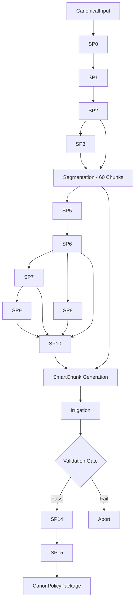

# Phase 1 Execution Flow

## Overview

Phase 1 (CPP Ingestion) transforms a validated input artifact (`CanonicalInput`) into a structured policy package (`CanonPolicyPackage`) containing exactly 60 SmartChunks.

## Sequential Execution Graph

The execution follows a strict linear sequence of 16 subphases (SP0-SP15), enforced by `phase1_13_00_cpp_ingestion.py`.

### 1. Initialization
- **Circuit Breaker**: Pre-flight checks (`phase1_09_00_circuit_breaker.py`)
- **Signal Enrichment**: Initialization of `SignalEnricher` (`phase1_11_00_signal_enrichment.py`)

### 2. Processing Subphases

| SP | Name | Description | Output |
|---|---|---|---|
| **SP0** | Language Detection | Detects primary/secondary languages | `LanguageData` |
| **SP1** | Preprocessing | Normalization, Tokenization, Segmentation | `PreprocessedDoc` |
| **SP2** | Structural Analysis | Hierarchical section extraction (PDM) | `StructureData` |
| **SP3** | Knowledge Graph | Entity extraction (Actor, Territory, Indicator) | `KnowledgeGraph` |
| **SP4** | **Segmentation** | **CONSTITUTIONAL INVARIANT**: Maps text to 60 chunks | `List[Chunk]` |
| **SP5** | Causal Extraction | Extracts causal chains (Beach method) | `CausalChains` |
| **SP6** | Causal Integration | Builds global causal graph | `IntegratedCausal` |
| **SP7** | Argumentation | Classifies arguments (Claim, Evidence, Warrant) | `Arguments` |
| **SP8** | Temporal Analysis | Extracts timeline and temporal markers | `Temporal` |
| **SP9** | Discourse Analysis | Classifies discourse modes | `Discourse` |
| **SP10** | Strategic Integration | Computes strategic priority scores | `Strategic` |
| **SP11** | **Smart Chunking** | **CONSTITUTIONAL INVARIANT**: Generates SmartChunks | `List[SmartChunk]` |
| **SP12** | Irrigation | Inter-chunk linking via SISAS signals | `List[SmartChunk]` |
| **SP13** | **Validation** | **CRITICAL GATE**: Verifies all invariants | `ValidationResult` |
| **SP14** | Deduplication | Ensures uniqueness (failsafe) | `List[SmartChunk]` |
| **SP15** | Ranking | Final strategic ranking (0-100) | `List[SmartChunk]` |

### 3. Finalization
- **CPP Construction**: Assembles `CanonPolicyPackage` using `phase1_01_00_cpp_models.py`.
- **Postcondition Verification**: Final check of 60-chunk invariant and schema version.

## Data Flow & Dependencies

