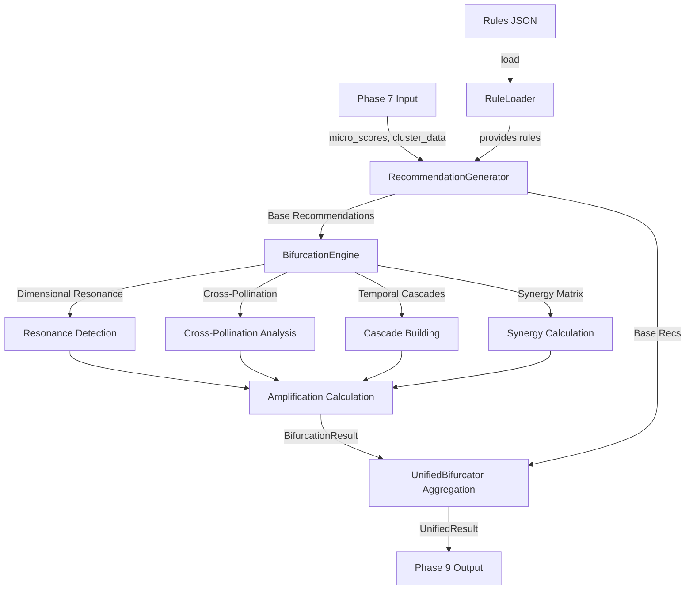

# Phase 8 Execution DAG: Unified Bifurcation Engine

This document describes the internal directed acyclic graph (DAG) of Phase 8 execution, now consolidated into the **Unified Bifurcator**.

## 1. High-Level Flow

## 2. Component Details

### 2.1 RuleLoader
- **Input**: `recommendation_rules_enhanced.json`
- **Responsibility**: Validation and loading of heuristic rules.
- **Output**: Validated ruleset.

### 2.2 RecommendationGenerator
- **Input**: Rules, Score Data (Micro/Meso/Macro).
- **Responsibility**: Matches conditions against data to generate initial recommendation objects.
- **Output**: List of `Recommendation` objects (Base Set).

### 2.3 BifurcationEngine
- **Input**: Base Set of Recommendations.
- **Responsibility**: Calculates exponential value multipliers.
    - **Dimensional Resonance**: Checks for inter-dimension feedback loops.
    - **Cross-Pollination**: Identifies multi-PA benefits.
    - **Temporal Cascades**: Maps short-term actions to long-term enabling.
    - **Synergy Matrix**: Calculates value of combined interventions.
- **Output**: `BifurcationResult` (Amplification factors, hidden value scores).

### 2.4 UnifiedBifurcator
- **Input**: Generator and Bifurcator outputs.
- **Responsibility**: Orchestration and packaging.
- **Output**: `UnifiedRecommendationResult` containing both base recommendations and bifurcation analysis.

## 3. Sequentiality Enforced

The execution order is strictly enforced by code structure in `phase8_25_00_recommendation_bifurcator.py`:

1.  **Rule Loading** (Must happen first)
2.  **Generation** (Dependent on Rules)
3.  **Bifurcation** (Dependent on Generation)
4.  **Result Assembly** (Dependent on both)

This ensures topological ordering is maintained within the unified module.
