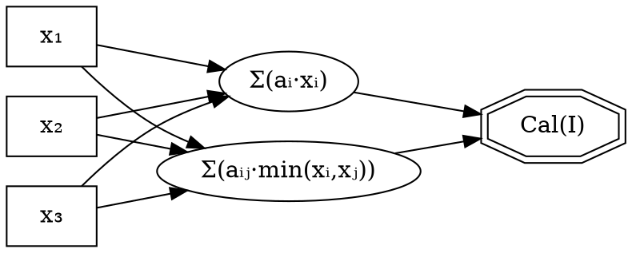

<<<<<<< Updated upstream
# Phase 4: Dimension Aggregation

## A Formal Framework for Multi-Criteria Score Synthesis via Choquet Integral and Weighted Aggregation

---
=======
# Phase 4-7: Aggregation Pipeline
>>>>>>> Stashed changes

## Document Control

| Attribute | Value |
|-----------|-------|
<<<<<<< Updated upstream
| **Phase ID** | `PHASE-4-DIMENSION-AGGREGATION` |
| **Canonical Name** | `phase_4_dimension_aggregation` |
| **Status** | `CANONICAL` |
| **Version** | `3.0.0` |
| **Effective Date** | 2026-01-11 |
| **Pipeline Position** | Phase 3 (Scoring) → **Phase 4** → Phase 5 (Area) |
| **Criticality** | `CRITICAL` |
| **Certification** | [CERTIFICATE_01_PHASE4_COUNT_60](contracts/certificates/CERTIFICATE_01_PHASE4_COUNT_60.md) |

---

## Abstract

Phase 4 constitutes the foundational aggregation tier in the F.A.R.F.A.N hierarchical scoring pipeline, responsible for synthesizing **300 ScoredMicroQuestion** objects into **60 DimensionScore** objects through mathematically rigorous weighted aggregation processes. This phase implements both classical weighted averaging and advanced Choquet integral aggregation, enabling the capture of synergistic and substitutive interactions between evaluation criteria. The framework enforces strict cardinality invariants, maintains complete provenance tracking, and provides comprehensive uncertainty quantification through bootstrap resampling methods. Operating under Design by Contract (DbC) principles, Phase 4 guarantees deterministic, reproducible results with formal boundedness and monotonicity properties.

**Keywords**: Dimension Aggregation, Choquet Integral, Multi-Criteria Decision Analysis, Weighted Average, Uncertainty Quantification, Provenance Tracking, Fuzzy Measures

---

## Table of Contents

1. [Introduction and Theoretical Foundation](#1-introduction-and-theoretical-foundation)
2. [Formal Input/Output Specification](#2-formal-inputoutput-specification)
3. [Mathematical Framework](#3-mathematical-framework)
4. [Choquet Integral Theory](#4-choquet-integral-theory)
5. [Aggregation Algorithm Specification](#5-aggregation-algorithm-specification)
6. [Weight Resolution and Normalization](#6-weight-resolution-and-normalization)
7. [Uncertainty Quantification](#7-uncertainty-quantification)
8. [Design by Contract Specification](#8-design-by-contract-specification)
9. [Data Structures and Type Definitions](#9-data-structures-and-type-definitions)
10. [Provenance and Traceability](#10-provenance-and-traceability)
11. [Implementation Architecture](#11-implementation-architecture)
12. [Validation and Testing Framework](#12-validation-and-testing-framework)
13. [Performance Characteristics](#13-performance-characteristics)
14. [Error Taxonomy and Recovery](#14-error-taxonomy-and-recovery)
15. [References and Related Documentation](#15-references-and-related-documentation)

---

## 1. Introduction and Theoretical Foundation

### 1.1 Phase Mission Statement

Phase 4 implements the **Dimension Aggregation** tier within the F.A.R.F.A.N multi-level evaluation framework. Its primary responsibility is the transformation of granular micro-question assessments into coherent dimensional scores that capture the quality of policy implementation across distinct evaluation dimensions within each policy area.

The phase addresses a fundamental challenge in multi-criteria decision analysis (MCDA): how to synthesize heterogeneous quality signals from individual questions into meaningful dimensional composites while capturing interactions between criteria, preserving information about variance and uncertainty, and maintaining complete audit traceability.

### 1.2 Position in the Aggregation Hierarchy

```
┌─────────────────────────────────────────────────────────────────────────────┐
│                    F.A.R.F.A.N AGGREGATION HIERARCHY                        │
├─────────────────────────────────────────────────────────────────────────────┤
│                                                                             │
│  PHASE 3: Micro-Question Scoring                                           │
│  ════════════════════════════════                                           │
│  300 × ScoredMicroQuestion (5 questions × 6 dimensions × 10 policy areas)  │
│       │                                                                     │
│       │ ╔═══════════════════════════════════════════════════════════════╗  │
│       │ ║ PHASE 4: DIMENSION AGGREGATION (THIS DOCUMENT)                ║  │
│       │ ║ ═════════════════════════════════════════════════════════════ ║  │
│       │ ║ Group by (policy_area, dimension)                             ║  │
│       │ ║ Apply dimension weights from signal registry                  ║  │
│       │ ║ Compute weighted average OR Choquet integral                  ║  │
│       │ ║ Quantify uncertainty via bootstrap resampling                 ║  │
│       │ ║ 5 micro-questions → 1 DimensionScore                         ║  │
│       │ ╚═══════════════════════════════════════════════════════════════╝  │
│       ▼                                                                     │
│  60 × DimensionScore (6 dimensions × 10 policy areas)                      │
│       │                                                                     │
│       │ PHASE 5: Policy Area Aggregation                                   │
│       │ ═════════════════════════════════                                  │
│       │ 6 DimensionScores → 1 AreaScore                                   │
│       ▼                                                                     │
│  10 × AreaScore (PA01–PA10)                                                │
│       │                                                                     │
│       │ PHASE 6: Cluster Aggregation (MESO)                                │
│       │ ═══════════════════════════════════                                │
│       ▼                                                                     │
│  4 × ClusterScore                                                          │
│       │                                                                     │
│       │ PHASE 7: Macro Evaluation                                          │
│       │ ═════════════════════════════                                      │
│       ▼                                                                     │
│  1 × MacroScore (holistic evaluation)                                      │
│                                                                             │
└─────────────────────────────────────────────────────────────────────────────┘
```

### 1.3 Theoretical Foundations

Phase 4 draws on established principles from:

1. **Multi-Criteria Decision Analysis (MCDA)**: The aggregation of multiple evaluation criteria into composite scores follows the axiomatic framework established by Keeney &amp; Raiffa (1976) for multi-attribute utility theory.

2. **Fuzzy Measure Theory**: The Choquet integral implementation builds on Sugeno's (1974) fuzzy measure theory and Choquet's (1954) capacity theory, enabling non-additive aggregation that captures criteria interactions.

3. **Shapley Value Attribution**: Feature importance decomposition uses cooperative game theory principles (Shapley, 1953) for interpretable contribution analysis.

4. **Bootstrap Uncertainty Quantification**: Statistical uncertainty estimation follows Efron's (1979) bootstrap methodology for confidence interval construction.

5. **Provenance-Aware Computation**: Following W3C PROV-DM standards, all aggregation operations maintain explicit lineage relationships enabling full audit reconstruction.

---

## 2. Formal Input/Output Specification

### 2.1 Input Contract

**Contract ID**: `CONTRACT-P4-INPUT`

| Precondition | Specification | Validation Method |
|--------------|---------------|-------------------|
| **PRE-P4-01** | `len(scored_results) == 300` | Count validation |
| **PRE-P4-02** | `∀ sr ∈ scored_results: sr.score ∈ [0.0, 1.0]` | Bounds check |
| **PRE-P4-03** | `∀ sr ∈ scored_results: sr.dimension_id ∈ {DIM01..DIM06}` | Enum validation |
| **PRE-P4-04** | `∀ sr ∈ scored_results: sr.area_id ∈ {PA01..PA10}` | Enum validation |
| **PRE-P4-05** | `∀ sr ∈ scored_results: sr.question_id is not None` | Non-null check |
| **PRE-P4-06** | Signal registry available (optional, for SOTA features) | DI check |

**Input Schema (TypedDict)**:

```python
@dataclass
class ScoredMicroQuestion:
    """Input type for Phase 4 aggregation."""
    
    question_id: str            # Q001-Q300
    dimension_id: str           # DIM01-DIM06
    area_id: str                # PA01-PA10
    score: float                # [0.0, 1.0] (normalized)
    quality_level: str          # EXCELENTE|BUENO|ACEPTABLE|INSUFICIENTE
    evidence_summary: str       # Extracted evidence
    validation_passed: bool = True
    
    # SOTA: Extended metadata
    confidence: float = 1.0     # Extraction confidence
    source_chunks: list[str] = field(default_factory=list)
```

### 2.2 Output Contract

**Contract ID**: `CONTRACT-P4-OUTPUT`

| Postcondition | Specification | Validation Method |
|---------------|---------------|-------------------|
| **POST-P4-01** | `len(dimension_scores) == 60` | Count validation |
| **POST-P4-02** | `∀ ds ∈ dimension_scores: ds.score ∈ [0.0, 3.0]` | Bounds check |
| **POST-P4-03** | `∀ ds ∈ dimension_scores: ds.dimension_id ∈ {DIM01..DIM06}` | Enum validation |
| **POST-P4-04** | `∀ ds ∈ dimension_scores: ds.area_id ∈ {PA01..PA10}` | Enum validation |
| **POST-P4-05** | `∀ ds ∈ dimension_scores: len(ds.contributing_questions) == 5` | Hermeticity |
| **POST-P4-06** | `set((ds.area_id, ds.dimension_id) for ds in dimension_scores)` has 60 unique pairs | Uniqueness |

**Output Schema (TypedDict)**:

```python
@dataclass
class DimensionScore:
    """Output type for Phase 4 aggregation."""
    
    dimension_id: str           # DIM01-DIM06
    area_id: str                # PA01-PA10
    score: float                # [0.0, 3.0] (3-point scale)
    quality_level: str          # EXCELENTE|BUENO|ACEPTABLE|INSUFICIENTE
    contributing_questions: list[str]  # Exactly 5 question IDs
    validation_passed: bool = True
    validation_details: dict[str, Any] = field(default_factory=dict)
    
    # SOTA: Uncertainty quantification
    score_std: float = 0.0
    confidence_interval_95: tuple[float, float] = (0.0, 0.0)
    epistemic_uncertainty: float = 0.0
    aleatoric_uncertainty: float = 0.0
    
    # SOTA: Provenance tracking
    provenance_node_id: str = ""
    aggregation_method: str = "weighted_average"  # or "choquet"
    
    # SOTA: Choquet decomposition (if applicable)
    choquet_breakdown: dict[str, float] = field(default_factory=dict)
```

### 2.3 Cardinality Transformation

```
INPUT:  300 ScoredMicroQuestion = 5 questions × 6 dimensions × 10 policy areas
OUTPUT: 60 DimensionScore       = 6 dimensions × 10 policy areas

Compression Ratio: 5:1 (questions collapsed per dimension-area pair)
Information Preservation: Contributing question IDs retained in DimensionScore
=======
| **Phase ID** | `PHASE-4-7-AGGREGATION-PIPELINE` |
| **Canonical Name** | `phase_4_7_aggregation_pipeline` |
| **Acronym** | AP (Aggregation Pipeline) |
| **Status** | `CANONICAL` |
| **Version** | `2025-12-18` |
| **Pipeline Position** | Phase 3 (Scoring) → **Phase 4-7** → Final Output |

---

## 1. Phase Mission

The **Aggregation Pipeline** transforms **300 scored micro-questions from Phase 3** into a **single holistic MacroScore** through four sequential aggregation stages:

| Logical Phase | Responsibility | Input | Output | Invariant |
|---------------|----------------|-------|--------|-----------|
| **Phase 4** | Dimension Aggregation | 300 ScoredMicroQuestion | 60 DimensionScore (6 dims × 10 PAs) | `len(output) == 60` |
| **Phase 5** | Policy Area Aggregation | 60 DimensionScore | 10 AreaScore | `len(output) == 10` |
| **Phase 6** | Cluster Aggregation (MESO) | 10 AreaScore | 4 ClusterScore | `len(output) == 4` |
| **Phase 7** | Macro Evaluation | 4 ClusterScore | 1 MacroScore | `output is not None` |

---

## 2. Data Flow Architecture

```
┌─────────────────────────────────────────────────────────────────────────────────────────┐
│                    AGGREGATION PIPELINE DATA FLOW                                        │
├─────────────────────────────────────────────────────────────────────────────────────────┤
│                                                                                          │
│  Phase 3 Output                                                                          │
│  ══════════════                                                                          │
│  300 × ScoredMicroQuestion                                                               │
│       │                                                                                  │
│       │ PHASE 4: Dimension Aggregation                                                   │
│       │ ═══════════════════════════════                                                  │
│       │ Group by (policy_area, dimension)                                                │
│       │ Apply dimension weights from signal registry                                     │
│       │ Compute weighted average + uncertainty                                           │
│       ▼                                                                                  │
│  60 × DimensionScore (6 dimensions × 10 policy areas)                                    │
│       │                                                                                  │
│       │ PHASE 5: Policy Area Aggregation                                                 │
│       │ ═════════════════════════════════                                                │
│       │ Group by policy_area                                                             │
│       │ Validate hermeticity (all 6 dimensions present)                                  │
│       │ Apply area-dimension weights                                                     │
│       ▼                                                                                  │
│  10 × AreaScore (PA01–PA10)                                                              │
│       │                                                                                  │
│       │ PHASE 6: Cluster Aggregation (MESO)                                              │
│       │ ═══════════════════════════════════                                              │
│       │ Group by cluster (4 clusters)                                                    │
│       │ Apply adaptive penalty based on dispersion                                       │
│       │ Compute coherence metrics                                                        │
│       ▼                                                                                  │
│  4 × ClusterScore                                                                        │
│       │                                                                                  │
│       │ PHASE 7: Macro Evaluation                                                        │
│       │ ═════════════════════════════                                                    │
│       │ Aggregate all clusters                                                           │
│       │ Compute cross-cutting coherence                                                  │
│       │ Identify systemic gaps                                                           │
│       │ Assess strategic alignment                                                       │
│       ▼                                                                                  │
│  1 × MacroScore (holistic evaluation)                                                    │
│                                                                                          │
└─────────────────────────────────────────────────────────────────────────────────────────┘
```

---

## 3. Constitutional Invariants

| Invariant ID | Specification | Source | Enforcement |
|--------------|---------------|--------|-------------|
| **INV-P4-60** | Phase 4 produces exactly 60 DimensionScores | `aggregation.py::DimensionAggregator.run()` | `validate_phase4_output()` |
| **INV-P5-10** | Phase 5 produces exactly 10 AreaScores | `aggregation.py::AreaPolicyAggregator.run()` | `validate_phase5_output()` |
| **INV-P6-4** | Phase 6 produces exactly 4 ClusterScores | `aggregation.py::ClusterAggregator.run()` | `validate_phase6_output()` |
| **INV-P7-1** | Phase 7 produces exactly 1 MacroScore | `aggregation.py::MacroAggregator.evaluate_macro()` | `validate_phase7_output()` |
| **INV-P4-7-BOUNDS** | All scores ∈ [0.0, 3.0] (3-point scale) | `aggregation.py::AggregationSettings` | Score validation |
| **INV-P4-7-HERMETIC** | Each aggregation level is hermetic (all expected inputs present) | `aggregation_enhancements.py::HermeticityDiagnosis` | Hermeticity validation |
| **INV-P4-7-PROVENANCE** | Every aggregation operation creates provenance node | `aggregation_provenance.py::AggregationDAG` | DAG construction |
| **INV-P4-7-CHOQUET** | Choquet aggregation satisfies boundedness: 0 ≤ Cal(I) ≤ 1 | `choquet_aggregator.py::ChoquetAggregator` | `_validate_boundedness()` |

---

## 4. File Inventory

| File | Purpose | Module Type | Criticality |
|------|---------|-------------|-------------|
| `__init__.py` | Package façade with comprehensive exports | CORE | REQUIRED |
| `aggregation.py` | Core aggregators + dataclasses (98KB) | CORE | **CRITICAL** |
| `choquet_aggregator.py` | Choquet integral implementation | CORE | **CRITICAL** |
| `aggregation_enhancements.py` | Enhanced aggregators with CI, dispersion, hermeticity | ENHANCEMENT | HIGH |
| `aggregation_validation.py` | Phase-specific validation functions | VALIDATION | HIGH |
| `aggregation_provenance.py` | DAG-based provenance tracking, Shapley attribution | PROVENANCE | HIGH |
| `signal_enriched_aggregation.py` | SISAS-aware weight adjustment | SIGNAL | HIGH |
| `adaptive_meso_scoring.py` | Adaptive penalty computation for Phase 6 | ENHANCEMENT | STANDARD |

---

## 5. Orchestrator Execution Transcript

### Entry Point

```
orchestrator._aggregate_results_async(scored_results: list[ScoredMicroQuestion])
```

The orchestrator receives **300 ScoredMicroQuestion** objects from Phase 3 and invokes the aggregation pipeline through `aggregation_integration.py`.

---

### STEP 1: Load Aggregation Settings

```python
settings = AggregationSettings.from_signal_registry(
    signal_registry=self.signal_registry
)

# IF signal_registry is None:
settings = AggregationSettings.from_monolith(
    self.questionnaire_monolith
)

# LOG: "Aggregation settings loaded, source={settings.sisas_source}"
```

**Signal Sources:**
- `sisas_registry` — Signal-driven weights from SISAS registry (preferred)
- `legacy_monolith` — Weights from questionnaire monolith (fallback)

---

### STEP 2: Initialize Aggregators

```python
dimension_aggregator = DimensionAggregator(
    settings=settings,
    signal_registry=self.signal_registry,
    enable_sota_features=True,  # Choquet, UQ, provenance
)

area_aggregator = AreaPolicyAggregator(
    settings=settings,
    signal_registry=self.signal_registry,
)

cluster_aggregator = ClusterAggregator(
    settings=settings,
    signal_registry=self.signal_registry,
)

macro_aggregator = MacroAggregator(settings=settings)
>>>>>>> Stashed changes
```

---

<<<<<<< Updated upstream
## 3. Mathematical Framework

### 3.1 Weighted Average Aggregation (Default)

The core aggregation function implements a weighted arithmetic mean:

**Definition 3.1 (Dimension Score via Weighted Average)**:

Given a (policy_area, dimension) pair with question scores `{q₁, q₂, ..., q₅}` and corresponding weights `{w₁, w₂, ..., w₅}`:

```
                      Σᵢ₌₁⁵ (wᵢ · qᵢ.score)
DimensionScore = ──────────────────────────── × scale_factor
                          Σᵢ₌₁⁵ wᵢ

where scale_factor = 3.0 (to convert [0,1] → [0,3])
```

**Constraint**: Weights are normalized such that `Σᵢ wᵢ = 1.0 ± ε` where `ε = 10⁻⁶`.

### 3.2 Score Scale Transformation

Input scores are normalized to [0, 1], output scores use the 3-point scale:

| Domain | Range | Interpretation |
|--------|-------|----------------|
| Input | [0.0, 1.0] | Normalized extraction score |
| Output | [0.0, 3.0] | 3-point policy compliance scale |

**Transformation**: `output_score = input_score × 3.0`

### 3.3 Convexity Guarantee

**Theorem 3.1 (Convexity for Weighted Average)**:

The aggregated dimension score is bounded by the minimum and maximum input scores:

```
min(q₁.score, ..., q₅.score) × 3 ≤ DimensionScore ≤ max(q₁.score, ..., q₅.score) × 3
```

**Proof**: Follows directly from the properties of convex combinations with non-negative weights summing to unity. □

---

## 4. Choquet Integral Theory

### 4.1 Motivation

Standard weighted averages assume **preferential independence** between criteria—the contribution of one criterion is independent of the values of others. In policy evaluation, this assumption often fails:

- **Synergy**: Strong performance in both "Technical Capacity" AND "Institutional Framework" may be more valuable than the sum of their individual contributions
- **Substitution**: Excellent "Community Engagement" may partially compensate for weak "Budget Allocation"

The **Choquet integral** generalizes weighted averaging to capture these interactions.

### 4.2 Mathematical Definition

**Definition 4.1 (Choquet Integral)**:

For normalized inputs x₁, ..., xₙ ∈ [0,1] with linear weights {a₁, ..., aₙ} and interaction terms {aᵢⱼ}:

```
Cₐ(x) = Σᵢ₌₁ⁿ (aᵢ · xᵢ) + Σᵢ<ⱼ (aᵢⱼ · min(xᵢ, xⱼ))
=======
### STEP 3: Phase 4 — Dimension Aggregation

```python
dimension_scores = await aggregate_dimensions_async(
    scored_results=scored_results,
    aggregator=dimension_aggregator
)
```

**Internal Process:**
1. Convert `ScoredMicroQuestion` → `ScoredResult` (internal format)
2. Group by `(policy_area, dimension)` → 60 groups
3. For each group:
   - Resolve weights from settings
   - Calculate weighted average (or Choquet if SOTA enabled)
   - Compute uncertainty (std, CI)
   - Create `DimensionScore`
   - Add to provenance DAG

**Validation:**
```python
result = validate_phase4_output(dimension_scores, expected_count=60)
if not result.passed:
    raise AggregationValidationError(result.error_message)
```

**Invariant:** `len(dimension_scores) == 60`

---

### STEP 4: Phase 5 — Policy Area Aggregation

```python
area_scores = await aggregate_policy_areas_async(
    dimension_scores=dimension_scores,
    aggregator=area_aggregator
)
```

**Internal Process:**
1. Group by `policy_area` → 10 groups
2. For each group:
   - Validate hermeticity (all 6 dimensions present)
   - If NOT hermetic: `diagnosis = diagnose_hermeticity(...)`
   - Resolve area-dimension weights
   - Calculate weighted average
   - Create `AreaScore`
   - Add to provenance DAG with edges

**Validation:**
```python
result = validate_phase5_output(area_scores, expected_count=10)
if not result.passed:
    raise AggregationValidationError(result.error_message)
```

**Invariant:** `len(area_scores) == 10`

---

### STEP 5: Phase 6 — Cluster Aggregation (MESO)

```python
cluster_scores = aggregate_clusters(
    area_scores=area_scores,
    aggregator=cluster_aggregator
)
```

**Internal Process:**
1. Group by `cluster_id` → 4 groups
2. For each group:
   - Validate cluster hermeticity
   - Compute dispersion metrics (CV, DI, quartiles)
   - Classify scenario: `convergence | moderate | high | extreme`
   - Compute adaptive penalty factor
   - Apply cluster weights
   - Calculate weighted average WITH penalty
   - Analyze coherence
   - Identify weakest area
   - Create `ClusterScore`

**Adaptive Penalty Formula:**
```
penalty_factor = 1.0 - (normalized_std × PENALTY_WEIGHT)
adjusted_score = weighted_score × penalty_factor
```

**Validation:**
```python
result = validate_phase6_output(cluster_scores, expected_count=4)
if not result.passed:
    raise AggregationValidationError(result.error_message)
```

**Invariant:** `len(cluster_scores) == 4`

---

### STEP 6: Phase 7 — Macro Evaluation

```python
macro_score = evaluate_macro(
    cluster_scores=cluster_scores,
    aggregator=macro_aggregator
)
```

**Internal Process:**
1. Calculate macro score from cluster scores
2. Calculate cross-cutting coherence
3. Identify systemic gaps (areas with `INSUFICIENTE`)
4. Assess strategic alignment
5. Apply rubric thresholds for quality level
6. Create `MacroScore`

**Validation:**
```python
result = validate_phase7_output(macro_score)
if not result.passed:
    raise AggregationValidationError(result.error_message)
```

**Invariant:** `macro_score is not None`

---

### STEP 7: Full Pipeline Validation

```python
final_validation = validate_with_contracts(
    dimension_scores=dimension_scores,
    area_scores=area_scores,
    cluster_scores=cluster_scores,
    macro_score=macro_score
)

if not final_validation.passed:
    raise AggregationValidationError(final_validation.error_message)

# LOG: "Full aggregation pipeline validation: PASSED"
```

---

### STEP 8: Convert to Output Format

```python
evaluation_dict = macro_score_to_evaluation(macro_score)
```

**Output Format:**
```python
{
    "score": float,                         # [0.0, 3.0]
    "quality_level": str,                   # "EXCELENTE" | "BUENO" | "ACEPTABLE" | "INSUFICIENTE"
    "cross_cutting_coherence": float,       # [0.0, 1.0]
    "systemic_gaps": list[str],             # Identified gaps
    "strategic_alignment": float,           # [0.0, 1.0]
    "cluster_scores": [...],                # 4 cluster details
    "validation_passed": bool,
    "validation_details": {...}
}
```

---

## 6. Design by Contract

### 6.1 Philosophy

Phase 4-7 aggregation operates under **strict contract enforcement** (Design by Contract, Dura Lex Sed Lex):

1. **Preconditions:** Conditions that MUST hold before a method executes
2. **Postconditions:** Guarantees provided after successful execution
3. **Invariants:** Properties that MUST hold at all times
4. **Failure Modes:** Explicit exceptions for contract violations

### 6.2 Aggregator Contracts

#### DimensionAggregator

**Preconditions:**
- `len(scored_results) == 300` (or multiple of 60 for partial runs)
- `∀ sr: sr.score ∈ [0.0, 1.0]` (normalized Phase 3 output)
- `∀ sr: sr.policy_area, sr.dimension are valid identifiers`

**Postconditions:**
- `len(dimension_scores) == 60` (6 dimensions × 10 policy areas)
- `∀ ds: ds.score ∈ [0.0, 3.0]` (3-point scale)
- `∀ ds: len(ds.contributing_questions) > 0` (traceability)

**Invariants:**
- Weights sum to 1.0 (normalization)
- Provenance node created for each dimension score

**Failure Modes:**
- `AggregationValidationError`: Output count ≠ 60
- `ValueError`: Invalid score range
- `KeyError`: Missing dimension/policy area configuration

#### AreaPolicyAggregator

**Preconditions:**
- `len(dimension_scores) == 60`
- `∀ ds: ds.score ∈ [0.0, 3.0]`

**Postconditions:**
- `len(area_scores) == 10`
- `∀ as: as.score ∈ [0.0, 3.0]`
- `∀ as: as.is_hermetic == True` (all 6 dimensions present)

**Invariants:**
- Each area has exactly 6 dimension scores
- Hermeticity validated

**Failure Modes:**
- `AggregationValidationError`: Output count ≠ 10
- `HermeticityViolation`: Missing dimensions for area

#### ClusterAggregator

**Preconditions:**
- `len(area_scores) == 10`
- `∀ as: as.score ∈ [0.0, 3.0]`

**Postconditions:**
- `len(cluster_scores) == 4`
- `∀ cs: cs.score ∈ [0.0, 3.0]`
- `∀ cs: cs.dispersion_metrics computed`

**Invariants:**
- Adaptive penalty applied based on dispersion
- Coherence metrics computed

**Failure Modes:**
- `AggregationValidationError`: Output count ≠ 4
- `DispersionComputationError`: Invalid dispersion metrics

#### MacroAggregator

**Preconditions:**
- `len(cluster_scores) == 4`
- `∀ cs: cs.score ∈ [0.0, 3.0]`

**Postconditions:**
- `macro_score is not None`
- `macro_score.score ∈ [0.0, 3.0]`
- `macro_score.systemic_gaps identified`

**Invariants:**
- Cross-cutting coherence computed
- Strategic alignment assessed

**Failure Modes:**
- `AggregationValidationError`: Null macro score
- `ValueError`: Invalid score range

#### ChoquetAggregator

**Preconditions:**
- `inputs ∈ [0.0, 1.0]ⁿ` (normalized)
- `Σ(linear_weights) == 1.0`
- `Σ|interaction_terms| ≤ 0.5 × Σ(linear_weights)`

**Postconditions:**
- `result ∈ [min(inputs), max(inputs)]` (boundedness)
- `breakdown.sum() == result` (consistency)

**Invariants:**
- Monotonicity: increasing inputs → non-decreasing output
- Idempotence: all equal inputs → output equals input

**Failure Modes:**
- `CalibrationConfigError`: Invalid weight configuration
- `ValueError`: Input out of bounds

### 6.3 Exception Taxonomy

```
AggregationError (base)
├── AggregationValidationError
│   ├── CountMismatchError
│   ├── BoundsViolationError
│   └── TraceabilityError
├── HermeticityViolation
├── DispersionComputationError
├── CalibrationConfigError
└── ProvenanceConstructionError
```

### 6.4 Verification Strategy

**Unit Tests:** Verify individual aggregator contracts
**Integration Tests:** Verify phase sequencing and composition
**Property Tests:** Verify mathematical invariants (boundedness, monotonicity)
**Contract Tests:** Verify precondition/postcondition enforcement

**Test Coverage:**
- `tests/phase_4_7/test_orchestrator_integration.py` → Sequencing
- `tests/phase_4_7/test_counts_and_bounds.py` → Count contracts
- `tests/phase_4_7/test_choquet_properties.py` → Mathematical properties
- `tests/phase_4_7/test_signal_wiring.py` → Signal integration contracts
- `tests/phase_4_7/test_provenance_dag.py` → Provenance contracts

---

## 7. Contract Signatures

### 7.1 Entry Contract (Phase 3 → Phase 4)

**Contract ID:** `CONTRACT-P4-7-ENTRY`

| Precondition | Specification | Enforcement |
|--------------|---------------|-------------|
| PRE-P4-01 | `len(scored_results) == 300` | Count check |
| PRE-P4-02 | `∀ sr: sr.score ∈ [0.0, 1.0]` | Bounds check |
| PRE-P4-03 | `∀ sr: sr.quality_level ∈ VALID_QUALITY_LEVELS` | Enum check |
| PRE-P4-04 | Signal registry available (optional) | DI check |

### 7.2 Exit Contract (Phase 7 → Output)

**Contract ID:** `CONTRACT-P4-7-EXIT`

| Postcondition | Specification | Enforcement |
|---------------|---------------|-------------|
| POST-P4-01 | `len(dimension_scores) == 60` | `validate_phase4_output()` |
| POST-P4-02 | `len(area_scores) == 10` | `validate_phase5_output()` |
| POST-P4-03 | `len(cluster_scores) == 4` | `validate_phase6_output()` |
| POST-P4-04 | `macro_score is not None` | `validate_phase7_output()` |
| POST-P4-05 | `macro_score.score ∈ [0.0, 3.0]` | Bounds check |
| POST-P4-06 | `∀ cs: cs.coherence ∈ [0.0, 1.0]` | Coherence validation |

---

## 8. Signal Wiring

### 7.1 Signal Flow

```
QuestionnaireSignalRegistry (SISAS)
        │
        │ get_assembly_signals("meso")
        ▼
AggregationSettings.from_signal_registry()
        │
        │ Constructor DI
        ▼
SignalEnrichedAggregator
        │
        │ adjust_aggregation_weights()
        │ analyze_score_dispersion()
        │ select_aggregation_method()
        ▼
Core Aggregators (signal-adjusted weights)
```

### 7.2 Signal Consumption Points

| Module | Signal Source | Consumption Function |
|--------|---------------|---------------------|
| `aggregation.py` | `AggregationSettings` | `_resolve_dimension_weights()` |
| `aggregation.py` | `signal_registry` | `from_signal_registry()` |
| `signal_enriched_aggregation.py` | `QuestionnaireSignalRegistry` | `adjust_aggregation_weights()` |
| `signal_enriched_aggregation.py` | `SignalPack.patterns` | Pattern count check |

---

## 9. Provenance Tracking

### 9.1 DAG Structure

```
LEVEL: micro              LEVEL: dimension         LEVEL: area    LEVEL: cluster   LEVEL: macro
───────────              ────────────────         ───────────    ──────────────   ────────────

┌─────────┐              ┌──────────────┐         ┌────────┐     ┌─────────────┐  ┌───────────┐
│ Q001    │──────────────│ DIM01-PA01   │─────────│ PA01   │─────│ CLUSTER_1   │──│ MACRO     │
│ Q002    │              │              │         │        │     │             │  │           │
│ Q003    │              └──────────────┘         └────────┘     └─────────────┘  │ score     │
│ ...     │                                                                       │ coherence │
└─────────┘                                                                       │ gaps      │
(300)                    (60)                     (10)           (4)              └───────────┘
                                                                                  (1)
```

### 9.2 Attribution

Shapley values computed for feature attribution:
```python
shapley = dag.compute_shapley_attribution("MACRO")
critical_path = dag.get_critical_path("MACRO", top_k=5)
```

---

## 10. Quality Rubric

| Quality Level | Normalized Score Range | Description |
|---------------|------------------------|-------------|
| **EXCELENTE** | ≥ 0.85 | Outstanding policy compliance |
| **BUENO** | ≥ 0.70 | Good compliance with minor gaps |
| **ACEPTABLE** | ≥ 0.55 | Acceptable with improvement areas |
| **INSUFICIENTE** | < 0.55 | Insufficient, requires intervention |

---

## 10. Mathematical Foundations: Choquet Integral

### 10.1 Definition

The **Choquet integral** is a generalization of the weighted average that accounts for interaction between criteria. For normalized inputs x₁, ..., xₙ ∈ [0,1]:

```
Cal(I) = Σᵢ₌₁ⁿ (aᵢ · xᵢ) + Σᵢ<ⱼ (aᵢⱼ · min(xᵢ, xⱼ))
>>>>>>> Stashed changes
```

Where:
- **xᵢ**: Normalized score for criterion i ∈ [0,1]
<<<<<<< Updated upstream
- **aᵢ**: Linear weight for criterion i (Σaᵢ = 1)
- **aᵢⱼ**: Interaction weight for criteria pair (i,j)
- **Cₐ(x)**: Choquet-aggregated score ∈ [0,1]

### 4.3 Interaction Interpretation

| Interaction Type | Sign | Interpretation | Example |
|------------------|------|----------------|---------|
| **Positive synergy** | aᵢⱼ > 0 | Criteria reinforce each other | Technical + Institutional capacity |
| **Substitution** | aᵢⱼ < 0 | Criteria partially substitute | Community engagement compensates budget |
| **Independence** | aᵢⱼ = 0 | No interaction (weighted average) | Standard aggregation |

### 4.4 Formal Properties

**Theorem 4.1 (Boundedness)**:

For properly normalized weights:

```
min(x₁, ..., xₙ) ≤ Cₐ(x) ≤ max(x₁, ..., xₙ)
```

**Theorem 4.2 (Monotonicity)**:

If xᵢ ≤ yᵢ for all i, then Cₐ(x) ≤ Cₐ(y).

**Theorem 4.3 (Idempotence)**:

If x₁ = x₂ = ... = xₙ = c, then Cₐ(x) = c.

**Theorem 4.4 (Reduction to Weighted Average)**:

When all aᵢⱼ = 0:

```
Cₐ(x) = Σᵢ (aᵢ · xᵢ)  [standard weighted average]
```

### 4.5 Normalization Constraints

To guarantee boundedness:

1. **Linear weights normalized**: Σᵢ aᵢ = 1.0
2. **Interaction constraint**: Σᵢ<ⱼ |aᵢⱼ| ≤ 0.5 × Σᵢ aᵢ
3. **Final clamping**: Cₐ(x) ∈ [0, 1]

### 4.6 Implementation

**Code Location**: `phase4_10_00_choquet_aggregator.py`

```python
@dataclass
class ChoquetConfig:
    """Configuration for Choquet integral aggregation."""
    
    linear_weights: dict[str, float]     # aᵢ values
    interaction_terms: dict[tuple[str, str], float]  # aᵢⱼ values
    normalization: bool = True           # Enforce weight normalization
    
    def __post_init__(self):
        # Validate linear weights sum to 1.0
        weight_sum = sum(self.linear_weights.values())
        if not abs(weight_sum - 1.0) < 1e-6:
            raise CalibrationConfigError(
                f"Linear weights must sum to 1.0, got {weight_sum}"
            )
        
        # Validate interaction constraint
        interaction_sum = sum(abs(v) for v in self.interaction_terms.values())
        if interaction_sum > 0.5:
            raise CalibrationConfigError(
                f"Interaction terms exceed bound: {interaction_sum} > 0.5"
            )
```

### 4.7 Example Calculation

Given 5 question scores for (PA01, DIM01):
- q₁ = 0.8, q₂ = 0.7, q₃ = 0.6, q₄ = 0.9, q₅ = 0.5
- Linear weights: a₁=0.25, a₂=0.20, a₃=0.15, a₄=0.25, a₅=0.15
- Interactions: a₁₄ = 0.10 (Q1-Q4 synergy), a₃₅ = -0.05 (Q3-Q5 substitution)

```
Linear term:    0.25(0.8) + 0.20(0.7) + 0.15(0.6) + 0.25(0.9) + 0.15(0.5)
              = 0.20 + 0.14 + 0.09 + 0.225 + 0.075 = 0.73

Interactions:   0.10 × min(0.8, 0.9) + (-0.05) × min(0.6, 0.5)
              = 0.10(0.8) + (-0.05)(0.5)
              = 0.08 - 0.025 = 0.055

Choquet:        0.73 + 0.055 = 0.785

3-point scale:  0.785 × 3.0 = 2.355 → Quality: BUENO
```

### 4.8 Academic References

1. Choquet, G. (1954). "Theory of capacities". *Annales de l'institut Fourier*, 5, 131-295.
2. Sugeno, M. (1974). "Theory of fuzzy integrals and its applications". PhD thesis, Tokyo Institute of Technology.
3. Grabisch, M. (1997). "k-order additive discrete fuzzy measures and their representation". *Fuzzy Sets and Systems*, 92(2), 167-189.
4. Marichal, J.-L. (2000). "An axiomatic approach of the discrete Choquet integral as a tool to aggregate interacting criteria". *IEEE Transactions on Fuzzy Systems*, 8(6), 800-807.

---

## 5. Aggregation Algorithm Specification

### 5.1 Algorithm Overview

```
ALGORITHM: Phase4_DimensionAggregation
══════════════════════════════════════

INPUT:
  scored_results: list[ScoredMicroQuestion]  // |scored_results| = 300
  settings: AggregationSettings
  enable_sota_features: bool = True
  
OUTPUT:
  dimension_scores: list[DimensionScore]    // |dimension_scores| = 60

STEPS:
  1. CONVERT scored_results to internal ScoredResult format
  2. GROUP by (policy_area, dimension) → 60 groups of 5 questions each
  3. FOR EACH group (area_id, dimension_id, questions):
     a. RESOLVE weights from settings or use equal weights
     b. IF enable_sota_features AND choquet_config available:
        - COMPUTE Choquet integral
        - RECORD breakdown decomposition
     c. ELSE:
        - COMPUTE weighted average
     d. TRANSFORM score to 3-point scale
     e. APPLY rubric thresholds → quality_level
     f. IF enable_sota_features:
        - QUANTIFY uncertainty via bootstrap
        - CREATE provenance node
     g. CONSTRUCT DimensionScore
  4. VALIDATE |dimension_scores| == 60
  5. RETURN dimension_scores
```

### 5.2 Grouping Strategy

```python
def group_by_dimension_area(
    scored_results: list[ScoredMicroQuestion]
) -> dict[tuple[str, str], list[ScoredMicroQuestion]]:
    """
    Group micro-questions by (area_id, dimension_id).
    
    Time Complexity: O(n) where n = |scored_results|
    Space Complexity: O(n)
    
    Invariant: Each group has exactly 5 questions
    Expected: 60 groups (10 areas × 6 dimensions)
    """
    grouped = defaultdict(list)
    for sr in scored_results:
        key = (sr.area_id, sr.dimension_id)
        grouped[key].append(sr)
    return dict(grouped)
```

### 5.3 Aggregation Method Selection

```python
def select_aggregation_method(
    settings: AggregationSettings,
    dimension_id: str,
    area_id: str
) -> str:
    """
    Select aggregation method based on configuration.
    
    Priority:
    1. Explicit method in settings for (area, dimension)
    2. Signal registry recommendation (if SOTA enabled)
    3. Default: "weighted_average"
    
    Returns:
        "choquet" or "weighted_average"
    """
```

---

## 6. Weight Resolution and Normalization

### 6.1 Weight Source Hierarchy

Weights are resolved from multiple sources in priority order:

| Priority | Source | Description |
|----------|--------|-------------|
| 1 | `settings.dimension_question_weights` | Explicit configuration |
| 2 | Signal registry (SISAS) | Dynamic weights from signals |
| 3 | Questionnaire monolith | Legacy weight definitions |
| 4 | Equal weights | Fallback: wᵢ = 1/5 = 0.20 |

### 6.2 Normalization Process

```python
def normalize_weights(
    raw_weights: list[float],
    tolerance: float = 1e-6
) -> list[float]:
    """
    Normalize weights to sum to 1.0.
    
    Formula: wᵢ = raw_wᵢ / Σⱼ raw_wⱼ
    
    Raises:
        WeightNormalizationError if all weights are zero
    """
    total = sum(raw_weights)
    if total < tolerance:
        raise WeightNormalizationError("Cannot normalize: sum ≈ 0")
    return [w / total for w in raw_weights]
```

### 6.3 SISAS Integration

When the Signal Registry (SISAS) is available:

```python
def resolve_weights_from_sisas(
    signal_registry: QuestionnaireSignalRegistry,
    area_id: str,
    dimension_id: str
) -> list[float]:
    """
    Resolve weights from SISAS signal registry.
    
    Signal path: dimension_weights → {area_id} → {dimension_id} → weights
    """
    assembly_signals = signal_registry.get_assembly_signals("dimension")
    return assembly_signals.get_weights(area_id, dimension_id)
```

---

## 7. Uncertainty Quantification

### 7.1 Bootstrap Aggregation

Phase 4 uses bootstrap resampling for uncertainty estimation:

```python
def bootstrap_aggregate(
    scores: list[float],
    weights: list[float],
    n_bootstrap: int = 1000,
    confidence_level: float = 0.95
) -> UncertaintyMetrics:
    """
    Bootstrap resampling for confidence interval estimation.
    
    Process:
    1. Resample scores with replacement n_bootstrap times
    2. Compute weighted average for each resample
    3. Derive percentile-based confidence interval
    
    Returns:
        UncertaintyMetrics with mean, std, CI bounds
    """
```

### 7.2 Uncertainty Decomposition

**Epistemic Uncertainty**: Model/parameter uncertainty
- Source: Weight specification uncertainty
- Estimation: Bootstrap variance of weight-perturbed aggregations

**Aleatoric Uncertainty**: Inherent data variability
- Source: Variance in question scores
- Estimation: Weighted variance of input scores

```python
@dataclass
class UncertaintyMetrics:
    """Uncertainty quantification results."""
    
    mean: float                           # Point estimate
    std: float                            # Standard deviation
    confidence_interval_95: tuple[float, float]  # (lower, upper)
    epistemic_uncertainty: float          # Model uncertainty
    aleatoric_uncertainty: float          # Data uncertainty
    n_samples: int                        # Bootstrap samples used
```

---

## 8. Design by Contract Specification

### 8.1 DimensionAggregator Contract

```python
class DimensionAggregator:
    """
    Contract Specification for DimensionAggregator
    ═══════════════════════════════════════════════
    
    Class Invariants:
    - self.settings is not None
    - self.signal_registry may be None (graceful degradation)
    - If enable_sota_features, provenance DAG is maintained
    """
    
    def aggregate_dimension(
        self,
        questions: list[ScoredMicroQuestion],
        area_id: str,
        dimension_id: str,
        weights: list[float] | None = None
    ) -> DimensionScore:
        """
        Aggregate question scores into a single dimension score.
        
        PRECONDITIONS:
        - len(questions) == 5 (hermeticity)
        - ∀ q ∈ questions: q.score ∈ [0.0, 1.0]
        - ∀ q ∈ questions: q.area_id == area_id
        - ∀ q ∈ questions: q.dimension_id == dimension_id
        - If weights provided: len(weights) == len(questions)
        - If weights provided: all(w >= 0 for w in weights)
        
        POSTCONDITIONS:
        - result.score ∈ [0.0, 3.0]
        - result.area_id == area_id
        - result.dimension_id == dimension_id
        - result.quality_level ∈ {"EXCELENTE", "BUENO", "ACEPTABLE", "INSUFICIENTE"}
        - len(result.contributing_questions) == 5
        
        INVARIANTS:
        - Σ weights = 1.0 (after normalization)
        - Convexity: min(inputs) × 3 ≤ result.score ≤ max(inputs) × 3
        """
        ...
    
    def run(
        self,
        scored_results: list[ScoredMicroQuestion],
    ) -> list[DimensionScore]:
        """
        Execute full Phase 4 aggregation.
        
        PRECONDITIONS:
        - len(scored_results) == 300
        - ∀ sr ∈ scored_results: sr.score ∈ [0.0, 1.0]
        - Coverage: all (area, dimension) pairs represented
        
        POSTCONDITIONS:
        - len(result) == 60
        - set((ds.area_id, ds.dimension_id) for ds in result) has 60 unique pairs
        - ∀ ds ∈ result: ds.score ∈ [0.0, 3.0]
        - ∀ ds ∈ result: len(ds.contributing_questions) == 5
        """
        ...
```

### 8.2 Exception Taxonomy

```
AggregationError (base)
├── CountMismatchError
│   ├── InputCountError (≠ 300)
│   └── OutputCountError (≠ 60)
├── BoundsViolationError
│   ├── InputBoundsError (not in [0,1])
│   └── OutputBoundsError (not in [0,3])
├── WeightNormalizationError
├── HermeticityError (group size ≠ 5)
├── ChoquetConfigError
│   ├── WeightSumError
│   └── InteractionBoundError
└── ProvenanceConstructionError
```

---

## 9. Data Structures and Type Definitions

### 9.1 Core Constants Module

**Location**: `phase4_10_00_phase_4_7_constants.py`

```python
"""Phase 4 Constants - Dimension Aggregation"""

# Expected counts
EXPECTED_INPUT_COUNT = 300          # ScoredMicroQuestion
EXPECTED_OUTPUT_COUNT = 60          # DimensionScore
QUESTIONS_PER_DIMENSION = 5         # Questions per (area, dimension) pair

# Policy area and dimension identifiers
POLICY_AREAS = ["PA01", "PA02", "PA03", "PA04", "PA05",
                "PA06", "PA07", "PA08", "PA09", "PA10"]
DIMENSION_IDS = ["DIM01", "DIM02", "DIM03", "DIM04", "DIM05", "DIM06"]

# Score bounds
INPUT_MIN_SCORE = 0.0
INPUT_MAX_SCORE = 1.0
OUTPUT_MIN_SCORE = 0.0
OUTPUT_MAX_SCORE = 3.0
SCALE_FACTOR = 3.0  # [0,1] → [0,3]

# Quality thresholds (normalized to [0,1])
QUALITY_THRESHOLDS = {
    "EXCELENTE": 0.85,      # ≥ 85% → ≥ 2.55 on 3-point scale
    "BUENO": 0.70,          # ≥ 70% → ≥ 2.10
    "ACEPTABLE": 0.55,      # ≥ 55% → ≥ 1.65
    "INSUFICIENTE": 0.0     # < 55% → < 1.65
}

# Bootstrap configuration
DEFAULT_BOOTSTRAP_SAMPLES = 1000
DEFAULT_CONFIDENCE_LEVEL = 0.95

# Choquet constraints
MAX_INTERACTION_SUM = 0.5  # Σ|aᵢⱼ| ≤ 0.5
```

---

## 10. Provenance and Traceability

### 10.1 Provenance DAG Structure

Phase 4 creates the foundation of the aggregation provenance DAG:

```
LEVEL: micro                    LEVEL: dimension
────────────                    ────────────────

┌─────────────────┐             ┌──────────────────┐
│ Q001 (PA01,DIM01)│────────────│                  │
├─────────────────┤             │   DIM01-PA01     │
│ Q031 (PA01,DIM01)│────────────│   DimensionScore │
├─────────────────┤             │                  │
│ Q061 (PA01,DIM01)│────────────│   score: 2.35    │
├─────────────────┤             │   quality: BUENO │
│ Q091 (PA01,DIM01)│────────────│   method: choquet│
├─────────────────┤             │                  │
│ Q121 (PA01,DIM01)│────────────│                  │
└─────────────────┘             └──────────────────┘
(5 questions)                   (1 dimension score)
```

### 10.2 Provenance Node Schema

```python
@dataclass
class DimensionProvenanceNode:
    """Provenance node for dimension aggregation."""
    
    node_id: str                    # "DIM-{dimension_id}-{area_id}"
    node_type: str = "dimension"
    level: str = "MICRO"
    
    # Aggregation details
    score: float
    quality_level: str
    aggregation_method: str         # "weighted_average" or "choquet"
    
    # Input lineage
    contributing_question_ids: list[str]
    weights_used: dict[str, float]
    
    # Choquet-specific (if applicable)
    choquet_breakdown: dict[str, float] | None = None
    interaction_terms_applied: dict[str, float] | None = None
    
    # Metadata
    timestamp: str
    uncertainty_metrics: UncertaintyMetrics | None = None
```

### 10.3 DAG Export Formats

The provenance DAG supports export in multiple formats:

| Format | Use Case | Method |
|--------|----------|--------|
| **GraphML** | Graph visualization tools | `dag.to_graphml()` |
| **PROV-JSON** | W3C PROV compliance | `dag.to_prov_json()` |
| **DOT** | Graphviz rendering | `dag.to_dot()` |
| **NetworkX** | Python graph analysis | `dag.to_networkx()` |

---

## 11. Implementation Architecture

### 11.1 Module Inventory

| File | Purpose | Criticality |
|------|---------|-------------|
| `phase4_10_00_aggregation.py` | Core aggregators, DimensionAggregator class | **CRITICAL** |
| `phase4_10_00_phase_4_7_constants.py` | Constants and configuration | HIGH |
| `phase4_10_00_choquet_aggregator.py` | Choquet integral implementation | HIGH |
| `phase4_10_00_choquet_adapter.py` | Adapter for Choquet configuration | HIGH |
| `phase4_10_00_aggregation_provenance.py` | DAG-based provenance tracking | HIGH |
| `phase4_10_00_aggregation_validation.py` | Validation functions | HIGH |
| `phase4_10_00_uncertainty_quantification.py` | Bootstrap UQ | STANDARD |
| `phase4_10_00_signal_enriched_aggregation.py` | SISAS-aware aggregation | STANDARD |

### 11.2 Dependency Graph

```
┌─────────────────────────────────────────────────────────────────┐
│                  PHASE 4 MODULE DEPENDENCIES                    │
├─────────────────────────────────────────────────────────────────┤
│                                                                 │
│  phase4_10_00_aggregation.py (CORE)                            │
│       │                                                         │
│       ├── phase4_10_00_phase_4_7_constants.py                  │
│       │       └── EXPECTED_OUTPUT_COUNT = 60                   │
│       │                                                         │
│       ├── phase4_10_00_choquet_aggregator.py                   │
│       │       └── ChoquetAggregator.calibrate()                │
│       │                                                         │
│       ├── phase4_10_00_aggregation_provenance.py               │
│       │       └── AggregationDAG, ProvenanceNode               │
│       │                                                         │
│       └── phase4_10_00_uncertainty_quantification.py           │
│               └── BootstrapAggregator                          │
│                                                                 │
└─────────────────────────────────────────────────────────────────┘
```

---

## 12. Validation and Testing Framework

### 12.1 Test Categories

| Category | Purpose | Location |
|----------|---------|----------|
| **Unit Tests** | Individual function validation | `tests/phase_4/test_phase4_unit.py` |
| **Integration Tests** | Cross-module validation | `tests/phase_4/test_phase4_integration.py` |
| **Property Tests** | Mathematical invariant verification | `tests/phase_4/test_phase4_properties.py` |
| **Contract Tests** | DbC verification | `tests/phase_4/test_phase4_contracts.py` |
| **Choquet Tests** | Choquet-specific properties | `tests/phase_4/test_choquet_properties.py` |

### 12.2 Key Test Cases

```python
class TestPhase4Invariants:
    """Test Phase 4 mathematical invariants."""
    
    def test_output_count_exactly_60(self):
        result = aggregator.run(mock_300_inputs)
        assert len(result) == 60
    
    def test_convexity_property(self):
        """Score is bounded by input min/max."""
        for ds in result:
            input_scores = [q.score for q in ds.contributing_questions]
            assert min(input_scores) * 3 <= ds.score <= max(input_scores) * 3
    
    def test_choquet_boundedness(self):
        """Choquet integral satisfies boundedness theorem."""
        result = choquet_aggregator.calibrate(inputs, config)
        assert min(inputs) <= result.score <= max(inputs)
    
    def test_choquet_monotonicity(self):
        """Increasing inputs → non-decreasing output."""
        result_low = choquet_aggregator.calibrate([0.3, 0.4, 0.5], config)
        result_high = choquet_aggregator.calibrate([0.5, 0.6, 0.7], config)
        assert result_low.score <= result_high.score
```

### 12.3 Compliance Certificate

**Certificate ID**: [CERTIFICATE_01_PHASE4_COUNT_60](contracts/certificates/CERTIFICATE_01_PHASE4_COUNT_60.md)

| Requirement | Status |
|-------------|--------|
| Phase 4 Count = 60 | ✅ COMPLIANT |
| Validation Function | `validate_phase4_output()` |
| Test Coverage | Integration tests verify 60 dimension scores |

---

## 13. Performance Characteristics

### 13.1 Complexity Analysis

| Operation | Time Complexity | Space Complexity |
|-----------|-----------------|------------------|
| Grouping | O(n) | O(n) |
| Weight Resolution | O(1) per group | O(k) |
| Weighted Average | O(k) per group | O(1) |
| Choquet Integral | O(k²) per group | O(k²) |
| Bootstrap UQ | O(B × k) per group | O(B) |
| **Total Phase 4** | **O(n + g × k²)** | **O(n)** |

Where:
- `n = 300` (input micro-questions)
- `g = 60` (groups / output dimension scores)
- `k = 5` (questions per group)
- `B = 1000` (bootstrap samples)

### 13.2 Benchmarks

| Metric | Weighted Average | With Choquet | With UQ |
|--------|------------------|--------------|---------|
| Execution time | ~5ms | ~15ms | ~50ms |
| Memory overhead | ~2MB | ~3MB | ~10MB |
| DAG nodes created | 60 | 60 | 60 |

---

## 14. Error Taxonomy and Recovery

### 14.1 Error Handling Matrix

| Error | Condition | Default Behavior | Configurable |
|-------|-----------|------------------|--------------|
| Input count ≠ 300 | `len(input) != 300` | Raise `InputCountError` | No |
| Output count ≠ 60 | `len(output) != 60` | Raise `OutputCountError` | No |
| Group size ≠ 5 | Missing questions | Graceful degradation with warning | Yes |
| Score out of bounds | `score < 0` or `score > 1` | Clamp to [0, 1] | Yes |
| Weight sum ≠ 1 | Normalization needed | Auto-normalize | Yes |
| Choquet interaction overflow | `Σ|aᵢⱼ| > 0.5` | Raise `ChoquetConfigError` | No |

### 14.2 Graceful Degradation

When `abort_on_insufficient=False` and group size < 5:

```python
def aggregate_with_degradation(questions: list, expected: int = 5) -> float:
    """
    Aggregate with penalty for missing questions.
    
    penalty_factor = len(questions) / expected
    adjusted_score = raw_score × penalty_factor
    """
    if len(questions) < expected:
        logger.warning(f"Missing questions: {expected - len(questions)}")
        penalty = len(questions) / expected
        return raw_aggregate(questions) * penalty
    return raw_aggregate(questions)
```

---

## 15. References and Related Documentation

### 15.1 Internal Documentation

| Document | Description |
|----------|-------------|
| [Phase 5 README](../Phase_5/README.md) | Policy Area Aggregation |
| [Phase 6 README](../Phase_6/README.md) | Cluster Aggregation |
| [Phase 7 README](../Phase_7/README.md) | Macro Evaluation |
| [AGGREGATION_QUICK_REFERENCE](../../../../docs/AGGREGATION_QUICK_REFERENCE.md) | Quick reference guide |
| [CERTIFICATE_01](contracts/certificates/CERTIFICATE_01_PHASE4_COUNT_60.md) | Phase 4 compliance certificate |

### 15.2 Academic References

1. Choquet, G. (1954). "Theory of capacities". *Annales de l'institut Fourier*, 5, 131-295.
2. Sugeno, M. (1974). "Theory of fuzzy integrals and its applications". PhD thesis, Tokyo Institute of Technology.
3. Grabisch, M. (1997). "k-order additive discrete fuzzy measures and their representation". *Fuzzy Sets and Systems*, 92(2), 167-189.
4. Marichal, J.-L. (2000). "An axiomatic approach of the discrete Choquet integral". *IEEE Transactions on Fuzzy Systems*, 8(6), 800-807.
5. Keeney, R.L., & Raiffa, H. (1976). *Decisions with Multiple Objectives*. Cambridge University Press.
6. Efron, B. (1979). "Bootstrap methods: Another look at the jackknife". *The Annals of Statistics*, 7(1), 1-26.
7. Shapley, L.S. (1953). "A value for n-person games". *Contributions to the Theory of Games*, 2, 307-317.

---

## Appendix A: Quick Reference Card

```
╔═══════════════════════════════════════════════════════════════════════════╗
║                     PHASE 4: DIMENSION AGGREGATION                        ║
║                          QUICK REFERENCE CARD                             ║
╠═══════════════════════════════════════════════════════════════════════════╣
║                                                                           ║
║  INPUT:   300 ScoredMicroQuestion (5 × 6 × 10)                           ║
║  OUTPUT:  60 DimensionScore (6 dimensions × 10 policy areas)             ║
║                                                                           ║
║  SCALE TRANSFORMATION:                                                    ║
║    Input:  [0.0, 1.0] (normalized)                                       ║
║    Output: [0.0, 3.0] (3-point scale)                                    ║
║    Factor: × 3.0                                                         ║
║                                                                           ║
║  AGGREGATION METHODS:                                                     ║
║    • Weighted Average (default)                                          ║
║    • Choquet Integral (SOTA, captures interactions)                      ║
║                                                                           ║
║  INVARIANTS:                                                              ║
║    ✓ len(output) == 60                                                   ║
║    ✓ Each group has exactly 5 questions                                  ║
║    ✓ All scores in [0.0, 3.0]                                            ║
║    ✓ Convexity: min(inputs)×3 ≤ score ≤ max(inputs)×3                    ║
║                                                                           ║
║  QUALITY THRESHOLDS (normalized):                                         ║
║    EXCELENTE:    ≥ 0.85 (≥ 2.55 on 3-point scale)                        ║
║    BUENO:        ≥ 0.70 (≥ 2.10)                                         ║
║    ACEPTABLE:    ≥ 0.55 (≥ 1.65)                                         ║
║    INSUFICIENTE: < 0.55 (< 1.65)                                         ║
║                                                                           ║
║  KEY FILES:                                                               ║
║    Core:       phase4_10_00_aggregation.py                               ║
║    Constants:  phase4_10_00_phase_4_7_constants.py                       ║
║    Choquet:    phase4_10_00_choquet_aggregator.py                        ║
║    Validation: phase4_10_00_aggregation_validation.py                    ║
║                                                                           ║
╚═══════════════════════════════════════════════════════════════════════════╝
```

---

**Document Version**: 3.0.0  
**Last Updated**: 2026-01-11  
**Author**: F.A.R.F.A.N Core Team  
**Review Status**: CANONICAL
=======
- **aᵢ**: Linear weight for criterion i
- **aᵢⱼ**: Interaction weight for criteria pair (i,j)
- **Cal(I)**: Choquet-aggregated score ∈ [0,1]

### 10.2 Formal Properties

**Theorem 1 (Boundedness):** For inputs xᵢ ∈ [0,1] and properly normalized weights, the Choquet integral satisfies:

```
min(x₁, ..., xₙ) ≤ Cal(I) ≤ max(x₁, ..., xₙ)
```

**Proof sketch:** The Choquet integral is bounded by the minimum and maximum input values because it is a convex combination when weights are properly normalized.

**Theorem 2 (Monotonicity):** If xᵢ ≤ yᵢ for all i, then Cal(x) ≤ Cal(y).

**Theorem 3 (Idempotence):** If x₁ = x₂ = ... = xₙ = c, then Cal(I) = c.

### 10.3 Normalization Constraints

To guarantee boundedness:

1. **Linear weights normalized:** Σᵢ aᵢ = 1.0
2. **Interaction constraint:** Σᵢ<ⱼ |aᵢⱼ| ≤ 0.5 × Σᵢ aᵢ
3. **Final clamping:** Cal(I) ∈ [0, 1]

**Enforcement:**
```python
# In ChoquetAggregator.__post_init__
if not abs(sum(self.linear_weights.values()) - 1.0) < 1e-6:
    raise CalibrationConfigError("Linear weights must sum to 1.0")

if sum(abs(v) for v in self.interaction_terms.values()) > 0.5:
    raise CalibrationConfigError("Interaction terms exceed bound")
```

### 10.4 Interaction Interpretation

- **aᵢⱼ > 0**: Positive synergy (criteria reinforce each other)
- **aᵢⱼ < 0**: Negative interaction (criteria substitute)
- **aᵢⱼ = 0**: Independence (reduces to weighted average)

### 10.5 Comparison to Weighted Average

For the special case where all aᵢⱼ = 0:

```
Cal(I) = Σᵢ (aᵢ · xᵢ)  [reduces to weighted average]
```

The Choquet integral generalizes this by adding interaction terms.

### 10.6 Implementation

**Code Location:** `src/canonic_phases/phase_4_7_aggregation_pipeline/choquet_aggregator.py`

**Key Methods:**
- `ChoquetAggregator.calibrate()`: Computes Choquet integral
- `_validate_boundedness()`: Enforces mathematical properties
- `CalibrationResult.breakdown`: Decomposes result into components

**Configuration:**
```python
config = ChoquetConfig(
    interaction_terms={
        ('DIM01', 'DIM02'): 0.15,  # Positive synergy
        ('DIM03', 'DIM04'): -0.10,  # Substitution
    },
    normalization=True  # Enforce normalization
)
```

### 10.7 Academic References

1. Choquet, G. (1954). "Theory of capacities". *Annales de l'institut Fourier*, 5, 131-295.
2. Grabisch, M. (1997). "k-order additive discrete fuzzy measures and their representation". *Fuzzy Sets and Systems*, 92(2), 167-189.
3. Marichal, J.-L. (2000). "An axiomatic approach of the discrete Choquet integral as a tool to aggregate interacting criteria". *IEEE Transactions on Fuzzy Systems*, 8(6), 800-807.

### 10.8 Graphviz Visualization

Choquet aggregation structure can be visualized using Graphviz:



Render with: `dot -Tpng choquet.dot -o choquet.png`

### 10.9 Example Calculation

Given:
- x₁ = 0.7, x₂ = 0.8, x₃ = 0.6
- a₁ = 0.4, a₂ = 0.3, a₃ = 0.3
- a₁₂ = 0.1, a₁₃ = 0.0, a₂₃ = -0.05

Calculation:
```
Linear: 0.4(0.7) + 0.3(0.8) + 0.3(0.6) = 0.28 + 0.24 + 0.18 = 0.70
Interactions: 0.1·min(0.7,0.8) + 0.0·min(0.7,0.6) + (-0.05)·min(0.8,0.6)
            = 0.1(0.7) + 0.0 + (-0.05)(0.6)
            = 0.07 + 0.0 - 0.03 = 0.04
Cal(I) = 0.70 + 0.04 = 0.74
```

Result: 0.74 ∈ [min(0.6), max(0.8)] = [0.6, 0.8] ✓

---

## 12. Compliance Certificates

All requirements are documented and verified through 15 compliance certificates:

| Certificate | Requirement | Status |
|-------------|-------------|--------|
| [CERTIFICATE_01](contracts/certificates/CERTIFICATE_01_PHASE4_COUNT_60.md) | Phase 4 Count = 60 | ✅ ACTIVE |
| [CERTIFICATE_02](contracts/certificates/CERTIFICATE_02_PHASE5_COUNT_10.md) | Phase 5 Count = 10 | ✅ ACTIVE |
| [CERTIFICATE_03](contracts/certificates/CERTIFICATE_03_PHASE6_COUNT_4.md) | Phase 6 Count = 4 | ✅ ACTIVE |
| [CERTIFICATE_04](contracts/certificates/CERTIFICATE_04_PHASE7_COUNT_1.md) | Phase 7 Count = 1 | ✅ ACTIVE |
| [CERTIFICATE_05](contracts/certificates/CERTIFICATE_05_SCORE_BOUNDS.md) | Score Bounds [0.0, 3.0] | ✅ ACTIVE |
| [CERTIFICATE_06](contracts/certificates/CERTIFICATE_06_HERMETICITY.md) | Hermeticity Validation | ✅ ACTIVE |
| [CERTIFICATE_07](contracts/certificates/CERTIFICATE_07_PROVENANCE_DAG.md) | Provenance DAG Generation | ✅ ACTIVE |
| [CERTIFICATE_08](contracts/certificates/CERTIFICATE_08_CHOQUET_BOUNDEDNESS.md) | Choquet Boundedness | ✅ ACTIVE |
| [CERTIFICATE_09](contracts/certificates/CERTIFICATE_09_SIGNAL_INTEGRATION.md) | Signal Integration | ✅ ACTIVE |
| [CERTIFICATE_10](contracts/certificates/CERTIFICATE_10_VALIDATION_HOOKS.md) | Validation Hooks Execution | ✅ ACTIVE |
| [CERTIFICATE_11](contracts/certificates/CERTIFICATE_11_ADAPTIVE_PENALTY.md) | Adaptive Penalty Application | ✅ ACTIVE |
| [CERTIFICATE_12](contracts/certificates/CERTIFICATE_12_DISPERSION_ANALYSIS.md) | Dispersion Analysis | ✅ ACTIVE |
| [CERTIFICATE_13](contracts/certificates/CERTIFICATE_13_UNCERTAINTY_QUANTIFICATION.md) | Uncertainty Quantification | ✅ ACTIVE |
| [CERTIFICATE_14](contracts/certificates/CERTIFICATE_14_DAG_EXPORT.md) | DAG Export (GraphML/PROV-JSON) | ✅ ACTIVE |
| [CERTIFICATE_15](contracts/certificates/CERTIFICATE_15_ORCHESTRATOR_TRANSCRIPT.md) | Orchestrator Transcript Compliance | ✅ ACTIVE |

**Certification Authority:** F.A.R.F.A.N Canonical Phases  
**Next Review:** 2026-06-18

---

## 13. Related Documents

- [PHASE_4_7_RIA_2025-12-18.txt](./PHASE_4_7_RIA_2025-12-18.txt) — Repository Inventory Artifact
- [FORCING_ROUTE.md](./FORCING_ROUTE.md) — Execution constraints
- [../../../docs/choquet_examples/](../../../docs/choquet_examples/) — Choquet integral examples

---

## 14. Changelog

| Date | Version | Change |
|------|---------|--------|
| 2025-12-18 | 1.0.0 | Initial canonical documentation |
>>>>>>> Stashed changes
