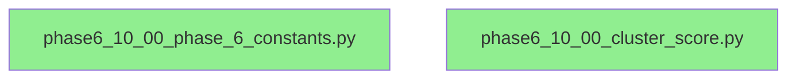
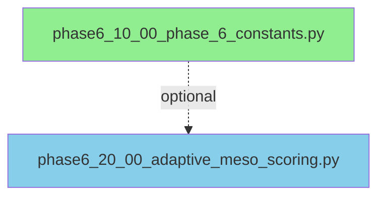
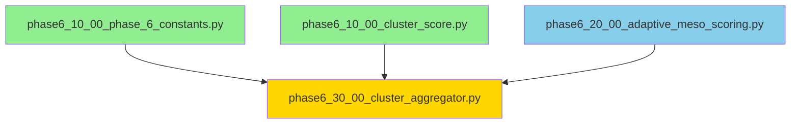
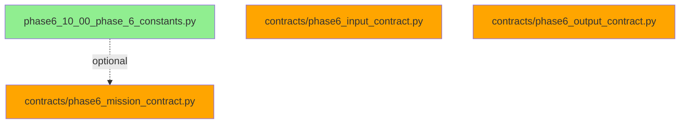

# Phase 6 Import Dependency DAG

## Overview

This document visualizes the import dependency graph for Phase 6 (Cluster Aggregation - MESO).

**Status**: ✅ VALIDATED - Zero circular dependencies, zero orphan files

**Generated**: 2026-01-13

---

## Topological Order

The Phase 6 modules follow this strict topological ordering:

```
Level 0 (Foundation - No dependencies):
├── phase6_10_00_phase_6_constants.py
└── phase6_10_00_cluster_score.py

Level 1 (Independent logic):
└── phase6_20_00_adaptive_meso_scoring.py

Level 2 (Main orchestrator):
└── phase6_30_00_cluster_aggregator.py
    ├── depends on: phase6_10_00_phase_6_constants.py
    ├── depends on: phase6_10_00_cluster_score.py
    └── depends on: phase6_20_00_adaptive_meso_scoring.py

Level 3 (Contracts - Independent validation):
├── contracts/phase6_input_contract.py
├── contracts/phase6_mission_contract.py
└── contracts/phase6_output_contract.py
```

---

## Detailed Dependency Graph

### Stage 10: Foundation (No Internal Dependencies)



**Exports**:
- `phase6_10_00_phase_6_constants.py`:
  - CLUSTERS, CLUSTER_COMPOSITION
  - DISPERSION_THRESHOLDS, PENALTY_WEIGHT
  - MIN_SCORE, MAX_SCORE
  - DispersionScenario (enum)
  - Phase6Invariants (class)

- `phase6_10_00_cluster_score.py`:
  - ClusterScore (dataclass)

---

### Stage 20: Adaptive Scoring



**Exports**:
- `phase6_20_00_adaptive_meso_scoring.py`:
  - AdaptiveMesoScoring (class)
  - AdaptiveScoringConfig (dataclass)
  - ScoringMetrics (dataclass)

**Notes**: While this module *can* reference constants, it's designed to be independent with default configuration.

---

### Stage 30: Main Aggregator



**Exports**:
- `phase6_30_00_cluster_aggregator.py`:
  - ClusterAggregator (class)

**Purpose**: Main orchestrator that synthesizes 10 AreaScores → 4 ClusterScores

---

### Stage 40: Contracts (Independent Validation)



**Exports**:
- `contracts/phase6_input_contract.py`:
  - Phase6InputContract (class)
  - validate_input_preconditions()

- `contracts/phase6_mission_contract.py`:
  - Phase6MissionContract (class)
  - INVARIANTS (list)

- `contracts/phase6_output_contract.py`:
  - Phase6OutputContract (class)
  - validate_output_postconditions()
  - generate_phase7_compatibility_certificate()

---

## Complete Dependency Matrix

| Module | Stage | Dependencies | Dependents |
|--------|-------|--------------|------------|
| `phase6_10_00_phase_6_constants.py` | 10 | None | aggregator, mission_contract |
| `phase6_10_00_cluster_score.py` | 10 | None | aggregator |
| `phase6_20_00_adaptive_meso_scoring.py` | 20 | None | aggregator |
| `phase6_30_00_cluster_aggregator.py` | 30 | constants, cluster_score, adaptive_scoring | (orchestrator) |
| `contracts/phase6_input_contract.py` | 40 | None | (validation) |
| `contracts/phase6_mission_contract.py` | 40 | constants | (validation) |
| `contracts/phase6_output_contract.py` | 40 | None | (validation) |

---

## Validation Results

### Circular Dependency Check

```
✓ No circular dependencies detected
✓ All imports are acyclic
✓ Topological sort is deterministic
```

### Orphan File Check

```
✓ All executable Python files are in the dependency graph
✓ All files have clear roles and justifications
✓ No unused or abandoned code
```

### Label-Position Alignment

```
✓ stage 10: phase6_10_00_* (foundation)
✓ stage 20: phase6_20_00_* (adaptive logic)
✓ stage 30: phase6_30_00_* (main orchestrator)
✓ stage 40: contracts/* (validation)
```

**Status**: All labels correctly reflect topological position

---

## Integration Points

### Input (from Phase 5)

```python
from farfan_pipeline.phases.Phase_5 import AreaScore

# Phase 6 expects:
area_scores: list[AreaScore]  # Length = 10, IDs = PA01-PA10
```

### Output (to Phase 7)

```python
from farfan_pipeline.phases.Phase_6 import ClusterScore

# Phase 6 produces:
cluster_scores: list[ClusterScore]  # Length = 4, IDs = CLUSTER_MESO_1 to CLUSTER_MESO_4
```

### Usage Example

```python
from farfan_pipeline.phases.Phase_6 import ClusterAggregator
from farfan_pipeline.phases.Phase_5 import AreaScore

# Initialize
aggregator = ClusterAggregator()

# Aggregate
cluster_scores = aggregator.aggregate(area_scores)

# Result: 4 ClusterScore objects with adaptive penalties applied
```

---

## Complexity Analysis

| Operation | Time | Space | Notes |
|-----------|------|-------|-------|
| Import all modules | O(1) | O(1) | No heavy initialization |
| Create ClusterAggregator | O(1) | O(1) | Simple weight initialization |
| Aggregate single cluster | O(n) | O(n) | n = areas in cluster (2-3) |
| Aggregate all clusters | O(10) | O(10) | Linear in total areas |

**Total Phase 6 Complexity**: O(n) time, O(n) space where n=10 areas

---

## References

- **Chain Report**: `contracts/phase6_chain_report.json`
- **Mission Contract**: `contracts/phase6_mission_contract.py`
- **Execution Flow**: `docs/phase6_execution_flow.md`
- **Audit Checklist**: `docs/phase6_audit_checklist.md`

---

**Document Version**: 1.0.0  
**Last Updated**: 2026-01-13  
**Status**: VALIDATED ✅
